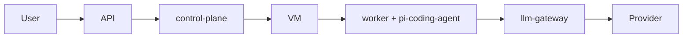

# neo-cloud-agent

对标 [Cursor Cloud Agent](https://cursor.com/docs/cloud-agent) 的云端 Agent 服务：LLM 推理在云端网关，任务在隔离 VM 里执行，Agent 内核使用 [pi-agent](https://github.com/earendil-works/pi)。

**设计见 [docs/architecture.md](docs/architecture.md)。**

## 怎么拆

**一个 monorepo，两个控制面进程，一张 worker 镜像。** 不要按模块开仓库。

```
neo-cloud-agent/
  packages/contracts        共享协议（库，不是服务）
  packages/control-plane    进程 1：api + 编排 + 环境 + SCM + 事件
  packages/llm-gateway      进程 2：唯一持有模型密钥
  packages/worker           打进 VM / 任务容器，不是集群 Deployment
  packages/extensions       打进同一张 worker 镜像
  packages/web              对话页，由 control-plane 托管
  infra/                    compose 与三份 Dockerfile
  .neo/environment.json     本仓库自己的环境描述
```



## 本地

需要 **Node 22.19+**（pi-coding-agent 的 engines）。用 pnpm：

```bash
pnpm install
pnpm typecheck
pnpm test
pnpm dev                 # control-plane :8080 + llm-gateway :8081
# 打开 http://localhost:8080 对话
```

默认 `WORKER_RUNTIME=local`：`POST /v1/runs` 会在本机拉起 worker，嵌入 `createAgentSession`，推理走 gateway。设 `WORKER_RUNTIME=docker`（或 `SPAWN_LOCAL_WORKER=0`）则 `docker run` 一张 worker 镜像，工作区 bind-mount 进容器；容器里只有 run JWT，没有 Provider Key。`repoUrls` 会在 spawn 前落到 Run 工作区：本地目录直接拷贝，`github.com/org/repo` 或 HTTPS 地址则 `git clone --depth 1`。工作区里的 `.neo/environment.json`（或 `.cursor/environment.json`）若有 `install`，会在起 worker 前执行；`start` / `terminals` 在 worker 冷启动时跑，不进 install。工具输出和 session JSONL 备份会把运行时密钥打成 `[REDACTED]`。落地后控制面会建 `neo/<slug>-<id>` 分支。受控 commit 和草稿 PR 走控制面（`POST /v1/runs/:id/commit`、`POST /v1/runs/:id/pull-request`）；worker 只能申请短寿命 `neo.git.*` token，长期 `GITHUB_TOKEN` 不会进 VM。没有 GitHub 远程时会记一条 `local://pr/...`。Run 和事件落在 `.neo/runs/.control`，刷新页面或重启控制面不会丢掉对话列表。仓库根目录的 `.env` 会被两个控制面进程自动加载（已有环境变量优先）。没配 `DEEPSEEK_API_KEY` / `OPENAI_API_KEY` 时 gateway 用 mock。

```bash
curl -s localhost:8080/health
curl -s -X POST localhost:8080/v1/runs \
  -H 'content-type: application/json' \
  -d '{"prompt":"Add a README.md and run sh test.sh","repoUrls":["fixtures/toy-repo"]}'
# 然后看 SSE / transcript
curl -s localhost:8080/v1/runs/<id>/transcript
```

接 DeepSeek（推荐，OpenAI 兼容）：把 key 写进仓库根目录 `.env`（已 gitignore），不要提交。

```bash
# .env
LLM_UPSTREAM=deepseek
LLM_UPSTREAM_BASE_URL=https://api.deepseek.com/v1
LLM_UPSTREAM_MODEL=deepseek-chat
DEFAULT_MODEL=neo/deepseek
DEEPSEEK_API_KEY=sk-...
```

`neo/deepseek`、`neo/ds`、`ds` 会路由到 `deepseek-chat`；要推理模型把 `LLM_UPSTREAM_MODEL` 改成 `deepseek-reasoner`，或直接请求 `deepseek-reasoner`。

也可以接其它 OpenAI 兼容上游：

```bash
export OPENAI_API_KEY=sk-...
export LLM_UPSTREAM=openai
export LLM_UPSTREAM_MODEL=gpt-4o-mini
pnpm dev
```

自动化测试：

```bash
pnpm test                 # 单测 + 进程内 mock e2e（clone + worker + IDLE）
pnpm test:e2e             # 打已经在跑的 :8080（mock 即可）
E2E_EXPECT_README=1 pnpm test:e2e:live   # 真模型：加 README 并跑 test.sh
pnpm build:worker-image && pnpm test:docker   # 容器里跑同一条 mock turn
```

Docker worker（控制面仍在宿主机时）：

```bash
docker compose -f infra/docker-compose.yml --profile worker build worker
export WORKER_RUNTIME=docker
export WORKER_IMAGE=neo-cloud-agent-worker:dev
# Linux 上 worker 通过 host.docker.internal 回连 :8080 / :8081
pnpm dev
```

Worker 也可以不由 control-plane 拉起，手动挂到一个 Run：

```bash
RUN_ID=<id> pnpm dev:worker
```

## 不要做的五件事

1. 不要 fork pi 加云功能——用 worker + extensions。
2. 不要把 Provider Key 写进 VM。
3. 不要在 `install` 里起长驻服务。
4. 不要让 bash 拿着长期 git token 去 push。
5. 不要为了「推理在云端」把 Agent loop 放到控制面。
