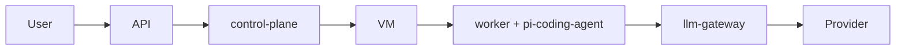

# neo-cloud-agent

对标 [Cursor Cloud Agent](https://cursor.com/docs/cloud-agent) 的云端 Agent 服务：LLM 推理在云端网关，任务在隔离 VM 里执行，Agent 内核使用 [pi-agent](https://github.com/earendil-works/pi)。

**设计见 [docs/architecture.md](docs/architecture.md)。**

## 怎么拆

**一个 monorepo，两个控制面进程，一张 worker 镜像。** 不要按模块开仓库。

```
neo-cloud-agent/
  packages/contracts        共享协议（库，不是服务）
  packages/control-plane    进程 1：api + 编排 + 环境 + SCM + 事件
  packages/llm-gateway      进程 2：唯一持有模型密钥
  packages/worker           打进 VM / 任务容器，不是集群 Deployment
  packages/extensions       打进同一张 worker 镜像
  infra/                    compose 与三份 Dockerfile
  .neo/environment.json     本仓库自己的环境描述
```



## 本地

Node 22+，用 pnpm：

需要 **Node 22.19+**（pi-coding-agent 的 engines）。用 pnpm：

```bash
pnpm install
pnpm typecheck
pnpm test
pnpm dev                 # control-plane :8080 + llm-gateway :8081
```

默认 `SPAWN_LOCAL_WORKER=1`：`POST /v1/runs` 会在本机拉起 worker，嵌入 `createAgentSession`，推理走 gateway。没配 `OPENAI_API_KEY` 时 gateway 用 mock。

```bash
curl -s localhost:8080/health
curl -s -X POST localhost:8080/v1/runs \
  -H 'content-type: application/json' \
  -d '{"prompt":"list files in the workspace","repoUrls":["github.com/acme/toy"]}'
# 然后看 SSE / transcript
curl -s localhost:8080/v1/runs/<id>/transcript
```

接真实 OpenAI 兼容上游：

```bash
export OPENAI_API_KEY=sk-...
export LLM_UPSTREAM=openai
export LLM_UPSTREAM_MODEL=gpt-4o-mini
pnpm dev
```

Worker 也可以不由 control-plane 拉起，手动挂到一个 Run：

```bash
RUN_ID=<id> pnpm dev:worker
```

## 不要做的五件事

1. 不要 fork pi 加云功能——用 worker + extensions。
2. 不要把 Provider Key 写进 VM。
3. 不要在 `install` 里起长驻服务。
4. 不要让 bash 拿着长期 git token 去 push。
5. 不要为了「推理在云端」把 Agent loop 放到控制面。
