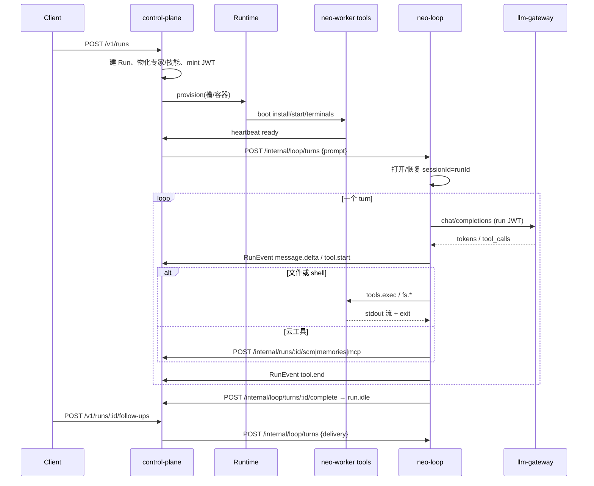

# Neo Loop 详细设计：Java + Cursor 三态

工程设计，不是再做一次选型。路径选择见 [agentscope-java-loop-plan.md](./agentscope-java-loop-plan.md)。基线 `main` `0bd20a1`。

对标 Cursor 现行形态：loop 在可恢复工作流里，机器单独租约，对话是 append-only 事件流。实现栈：AgentScope Java 2.0 `HarnessAgent` + 自建 `NeoSandbox` + 现有 TypeScript 控制面 / Gateway / 槽。

本文写到：**进程、接口、工作流、协议帧、Java 包、控制面改哪些函数**。按这份文档可以直接开第 1–2 期 PR。

---

## 0. 锁死的原则

1. **三态拆开，对标 Cursor。**
   - **Loop state**：这一回合想到哪、下一步调哪个工具。住在 `neo-loop`（Java）。
   - **Machine state**：槽 / 容器 / Desk 上的磁盘和进程。住在现有 `Runtime`。
   - **Conversation state**：用户和 UI 看见的 transcript。仍是控制面 `RunEvent`（Redis 热、MySQL / 对象存储冷）。
2. **一个用户回合 = 一条短工作流。** 不要一条 Run 一个永远活着的 workflow。Cursor 从 eternal workflow 退回来了，我们直接抄短 turn。
3. **控制面不跑 loop，loop 不碰磁盘，Gateway 不执行工具。**
4. **事件只由 loop 盖章。** 执行器可以推流式碎片，最终 `RunEvent` + `workerSeq` 由 `neo-loop` 写 `/internal/runs/:id/events`。
5. **现网默认 `AGENT_KERNEL=pi`。** Java 路径用显式开关，4C/4G 没加内存之前不切默认。
6. **Desk This Computer 本期不动。** `{ loop:"desk", tools:"desk" }` 继续本机 pi。`{ loop:"cloud", tools:"desk" }` 留第 4 期。

新原则（取代 `architecture.md` §2 那句「loop 必须在 VM 里」）：

> 推理在 Gateway。Loop 在 `neo-loop`。工具在执行面。三者不要住在同一个进程里。

---

## 1. 目标形态

### 1.1 进程

```
客户端（Web / CLI / Desk / Mobile / IM）
        │  /v1 不变
        ▼
control-plane :8080          编排、状态机、SCM、SSE、账号
        │                    provision 机器；派 turn 给 loop
        ├──────────────► llm-gateway :8081     唯一持钥
        │
        ├──────────────► neo-loop :8082        Java / AgentScope
        │                      │
        │                      │  OpenAI-compatible + run JWT
        │                      ▼
        │                 llm-gateway
        │
        └──────────────► Runtime
                              │
                              ▼
                         neo-worker（WORKER_ROLE=tools）
                              /workspace + tmux + 沙箱
```

| 进程 | 语言 | 端口 | 信任级 |
| --- | --- | --- | --- |
| `control-plane` | TS | 8080 | 高：账号、SCM、状态机 |
| `llm-gateway` | TS | 8081 | 高：Provider Key |
| `admin-api` | TS | 8090 | 高：后管 |
| **`neo-loop`** | **Java 21** | **8082 仅内网** | 高：能看 messages + tool schema，不能看盘、不能看 Provider Key |
| `neo-worker` | TS | 无入站（loop 连它，或它出向连 loop） | 低：按 Run 隔离 |

Caddy **不**把 `:8082` 暴露到公网。浏览器继续只打 `/v1`。

### 1.2 和 Cursor 的一一对应

| Cursor | Neo 设计 |
| --- | --- |
| Temporal workflow（短任务） | `TurnWorkflow`：先 JVM 内 Durable Log，后可换 Temporal Java SDK |
| Temporal activity：推理 | `InferActivity` → Gateway `POST /v1/chat/completions` |
| Temporal activity：工具 | `ToolActivity` → `NeoSandbox.exec` / 云工具 HTTP |
| VM / Self-Hosted worker | 现有 `Runtime` + `WORKER_ROLE=tools` |
| append-only conversation + rewind | 现有 `RunEvent` + `workerSeq`；重试时 loop 发 `turn.rewind` 再播新事件 |
| 机器租约独立于 loop | `Runtime.provision` / 空闲写回 / 卸槽，loop 只持 `toolsChannelUrl` |
| This Computer | 不变，`loop=desk` |
| Remote Control | 第 4 期，同一 `NeoSandbox`，执行器换 Desk |

### 1.3 一次 Run 的主路径（`AGENT_KERNEL=agentscope`）



对外 `/v1` **零变化**。Web / CLI / 手机不用知道内核换了。

---

## 2. 三份状态分别存哪

| 状态 | 存哪 | 生命周期 | 谁写 |
| --- | --- | --- | --- |
| Run 元数据（status、槽、分支、PR） | 控制面 MySQL / `.control` | Run 全程 | 控制面 |
| 跟进队列 | 控制面 `followUps` + Redis | 未投递给 loop 之前 | 控制面 |
| Transcript / SSE | 控制面 `RunEvent` | 按保留策略 | **loop** 经 `/internal/.../events` |
| AgentScope session（messages、plan、compaction） | `AgentStateStore`：Redis 热、MySQL 冷，key = `loop:session:{runId}` | 跟 Run，归档后按 TTL 删 | loop |
| 机器工作区 | 槽盘 / `RUNS_DIR/<runId>` | 空闲写回、TTL 见 workspace-persistence | Runtime + tools worker |
| Provider Key | Gateway 进程环境 | 与 Run 无关 | 人 / New API |
| run JWT | 控制面签发，loop 和 worker 各持一份 | 短寿命，重启轮换 | 控制面 |

IDLE 卸槽：**只丢机器，不丢 session，不丢 transcript。** 跟进时控制面重新 `provision`，loop 用同一个 `sessionId=runId` 恢复对话，sandbox 连到新 worker。

---

## 3. Durable Turn（Cursor Temporal 的 Java 落法）

### 3.1 为什么按 turn 切，不按 Run 切

Cursor：eternal workflow 升级痛苦，改成短任务。Neo 同样：

- 升级 `neo-loop` 时，IDLE Run 不受影响；RUNNING 最多重放当前 turn。
- 推理闪断只重放一个 `InferActivity`，不重跑整个对话。
- 子代理是另一条 turn（或嵌套 activity），可以活过父 turn。

### 3.2 工作流形状

```
TurnWorkflow(runId, turnId, delivery, userMessage)
  1. EnsureMachine          // 控制面已经 provision；这里只等 tools 通道 ready
  2. RestoreSession         // AgentStateStore
  3. loop:
       out = InferActivity(messages, tools, jwt)
       EmitEvents(out.deltas)          // 已发出的 delta 带 replyId
       if out.stop: break
       for call in out.toolCalls:
         if aborted: break
         result = ToolActivity(call)   // 沙箱或云工具
         EmitEvents(tool.*)
         messages += result
  4. PersistSession
  5. CompleteTurn → 控制面标 IDLE / ERROR / WAITING_FOR_BACKGROUND_WORK
```

Signal：

| Signal | 来源 | 行为 |
| --- | --- | --- |
| `Abort` | `POST /v1/runs/:id/abort` | 取消当前 Infer + 在途 Tool；turn 失败但不一定把 Run 标 ERROR（用户取消 → IDLE） |
| `Steer` | RUNNING 时跟进且 `delivery=steer` | 取消当前 tool/infer，把 steer 文本当作约束写进下一轮 user/hint，**同一 turnId 不新建工作流**（近似 pi.steer） |
| `QueueFollowUp` | 不进工作流 | 控制面队列；当前 turn complete 后再开下一条 workflow |

Query：`GetTurnStatus` → `{ phase, stepId, startedAt }`，给控制面心跳和诊断。

### 3.3 重试与 rewind

Activity 失败（Gateway 5xx、工具通道闪断）：

1. 按 activity 重试（推理 3 次、工具通道 5 次、云工具 2 次）。
2. 若该步已经往 SSE 推过半截 `message.delta`，loop 先发：

```json
{ "kind": "turn.rewind", "data": { "replyId": "…", "fromSeq": 120 } }
```

3. 控制面把该 `replyId` 在 `fromSeq` 之后的 delta **对后订阅者折叠掉**（先做：新 SSE 客户端拉 transcript 时丢掉被 rewind 的 seq；直播中的页用 `replyId` 覆盖）。第 2 期可以只保证 transcript snapshot 正确，直播 rewind 第 3 期补。

**InferActivity 必须幂等：** 同一 `stepId` 重试带 `X-Neo-Step-Id`，Gateway 若已有成功响应就回放，不二次扣费。第 2 期 Gateway 可以先不实现缓存，靠「失败才重试、成功不重放」。

### 3.4 两套引擎，同一接口

```java
public interface TurnWorkflowEngine {
  TurnHandle start(StartTurnCommand cmd);
  void signal(String turnId, TurnSignal signal);
  TurnSnapshot query(String turnId);
}
```

| 实现 | 何时用 | 怎么持久化 |
| --- | --- | --- |
| `LocalTurnEngine` | 第 2–3 期、现网单机 | 每步 append `loop_turn_steps`（MySQL）或 Redis Stream；进程重启从最后未完成 step 恢复 |
| `TemporalTurnEngine` | 第 5 期、多副本 | Temporal Java SDK；workflow/activity 与上面 1:1。**不要第 2 期就上 Temporal Server** |

`LocalTurnEngine` 不是「内存里 for 循环」。最低要求：

- 每步写盘后再执行副作用（先记 `INFER_STARTED`，再打 Gateway）。
- JVM 被杀后，控制面 `/health` 仍在、turn 未 complete：loop 启动时扫描 `status=RUNNING` 的 step 行，重入。
- 不在 workflow 函数里直接 `HttpClient.call`——必须进 Activity，否则将来换 Temporal 要重写。

---

## 4. 对外与对内接口

客户端 `/v1` 不动。下面都是**内网**。

### 4.1 控制面 → neo-loop

`NEO_LOOP_URL=http://127.0.0.1:8082`。鉴权：共享 `NEO_LOOP_TOKEN`（或 mTLS）。不要用用户 session。

```
POST /internal/loop/turns
POST /internal/loop/turns/{turnId}/signal
GET  /internal/loop/turns/{turnId}
GET  /health
```

`POST /internal/loop/turns` 体：

```json
{
  "runId": "uuid",
  "turnId": "uuid",
  "orgId": "…",
  "userId": "…",
  "delivery": "prompt",
  "text": "Add a README.md and run sh test.sh",
  "images": [],
  "model": "neo/deepseek",
  "jwt": "<run JWT>",
  "llmGatewayUrl": "http://127.0.0.1:8081",
  "controlPlaneUrl": "http://127.0.0.1:8080",
  "tools": {
    "mode": "worker_ws",
    "url": "ws://127.0.0.1:9xxx/tools",
    "leaseId": "…",
    "sandboxRoot": "/workspace"
  },
  "workspace": {
    "agentsMd": "…",
    "expertMd": "…",
    "skillRoots": [".neo/skills", ".cursor/skills", ".agents/skills"],
    "systemPromptExtra": "…"
  },
  "toolAllowlist": ["read_file", "write_file", "edit_file", "execute", "neo_git_commit"],
  "followUpId": null
}
```

`delivery`：`prompt | steer | follow_up`，与现有 `FollowUpDelivery` 同字。

`POST .../signal`：

```json
{ "type": "abort" }
{ "type": "steer", "text": "不要改测试，只改实现", "followUpId": "…" }
```

响应：`202 { "turnId", "runId", "accepted": true }`。loop 异步跑，结果靠 RunEvent + `POST /internal/runs/:id/turn-complete`。

### 4.2 neo-loop → 控制面（复用现有 + 两条新的）

复用（run JWT）：

```
POST /internal/runs/:id/events
POST /internal/runs/:id/scm/commit
POST /internal/runs/:id/scm/pull-request
POST /internal/runs/:id/mcp
POST /internal/runs/:id/memories
POST /internal/runs/:id/artifacts
GET  /internal/runs/:id/diagnostics
```

新增：

```
POST /internal/runs/:id/turn-complete
{
  "turnId": "uuid",
  "status": "idle" | "error" | "waiting_for_background",
  "errorMessage": null,
  "usage": { "inputTokens": 0, "outputTokens": 0 }
}

POST /internal/runs/:id/turn-heartbeat
{
  "turnId": "uuid",
  "phase": "infer" | "tool" | "persist",
  "stepId": "…"
}
```

控制面收到 `turn-complete`：

- `idle` → `run.status=IDLE`，发 `run.idle`，调度空闲卸槽（现有逻辑）。
- `waiting_for_background` → `WAITING_FOR_BACKGROUND_WORK`。
- `error` → `ERROR`（取消不算；取消走 `idle` + `data.cancelled=true`）。

loop **不要**再拉 `POST /internal/runs/:id/inbox`。inbox 对 `AGENT_KERNEL=agentscope` 只留给 tools worker 的 `shutdown`。

### 4.3 控制面怎么改派单

今天：`createRun` 把首条 prompt 推进 `inbound`，worker 轮询执行。

`kernel=agentscope` 时：

1. `inbound` **不再**放 `prompt` / `steer` / `follow_up`。
2. `provision` + tools worker `heartbeat.status=ready` 之后，控制面 `dispatchTurn(run, delivery, text)` → `POST /internal/loop/turns`。
3. `enqueueFollowUp`：
   - Run `RUNNING` 且 `delivery=steer` → `POST /internal/loop/turns/{currentTurnId}/signal`
   - Run `RUNNING` 且 `delivery=follow_up` → 仍进 `followUps` 队列；`turn-complete` 后再 `dispatchTurn`
   - Run `IDLE` / `ERROR` → 先 `resumeRun`（必要时重新 provision），再 `dispatchTurn`
4. `abortRun` → signal loop **且** 向 tools 通道发 `abort_all`。

钩子（现有函数）：

| 现有 | 改动 |
| --- | --- |
| `createRun` | 读 `input.kernel`；agentscope 不往 `inbound` 塞 prompt |
| `enqueueFollowUp` | 分支见上 |
| `resumeRun` | provision 之后 `dispatchTurn`，不是等 worker 自己拉 inbox |
| worker ready 回调（heartbeat / claim） | 触发首个 `dispatchTurn` |
| `assertColocatedTarget` | 第 2–3 期仍强制同址；第 4 期才开 |

`CreateRunRequest` 增：

```ts
kernel?: "pi" | "agentscope"; // 默认 process.env.AGENT_KERNEL ?? "pi"
```

写入 `Run`（`packages/contracts/src/run.ts` 给 `Run` 加 `kernel?: "pi" | "agentscope"`）。

### 4.4 tools 通道（loop ↔ worker）

现有 inbox 400ms 轮询 **禁止**当工具通道。

第 2 期（loop 和 worker 同机）：**WebSocket**。worker 启动后出向连：

```
GET ws://<NEO_LOOP_URL>/internal/tools/{runId}?lease=...
Authorization: Bearer <run JWT>
```

出向的原因：和 Desk / 槽防火墙一致——执行面不必对 loop 开入站。loop 侧按 `runId` 登记一条连接。控制面 `tools.url` 在第 2 期可以填 `inbound`（loop 等 worker 连上来），`StartTurn` 里 `EnsureMachine` 等到连接再跑 Infer。

帧（JSON text，一行一帧；大文件用 binary 帧 + 头）：

```json
{ "v": 1, "type": "hello", "runId": "…", "role": "tools", "sandboxRoot": "/workspace" }
{ "v": 1, "type": "exec", "callId": "c1", "command": "sed -n '1,20p' README.md", "timeoutMs": 30000, "cwd": "/workspace" }
{ "v": 1, "type": "exec.stdout", "callId": "c1", "seq": 1, "text": "…" }
{ "v": 1, "type": "exec.stderr", "callId": "c1", "seq": 2, "text": "…" }
{ "v": 1, "type": "exec.end", "callId": "c1", "exitCode": 0 }
{ "v": 1, "type": "fs.upload", "callId": "c2", "path": "AGENTS.md", "bytesB64": "…" }
{ "v": 1, "type": "fs.download", "callId": "c3", "path": ".neo/EXPERT.md" }
{ "v": 1, "type": "fs.list", "callId": "c4", "path": "." }
{ "v": 1, "type": "fs.exists", "callId": "c5", "path": "README.md" }
{ "v": 1, "type": "ok", "callId": "c2" }
{ "v": 1, "type": "err", "callId": "c3", "code": "not_found", "message": "…" }
{ "v": 1, "type": "abort", "callId": "c1" }
{ "v": 1, "type": "abort_all" }
{ "v": 1, "type": "ping" }
{ "v": 1, "type": "pong", "diskUsedBytes": 123 }
```

约束：

- 路径必须落在 `sandboxRoot` 内，由 **worker** 强制（现有 `packages/worker/src/sandbox.ts`）。
- `exec.command` 是 POSIX `sh -c` 字符串。AgentScope 的 `edit_file` / `grep_files` 都走这条，不要在 Java 里自己实现第二套文件系统。
- 同一 Run 允许多个在途 `callId`（pi 默认并行）。`abort` 只杀一个。
- stdout 建议 ≥50ms 或 ≥4KiB 刷一帧，对上现在的 `tool.update`。
- 单帧文本上限 256KiB；更大走 `fs.upload` / `fs.download`。

第 4 期 Desk 用同一套帧。多一个鉴权头：`X-Neo-Desk-Token`。run JWT 单独不够。

---

## 5. Java 进程设计

### 5.1 仓库位置

```
services/neo-loop/                 不进 pnpm workspace
  pom.xml                          Java 21, Spring Boot 3.4 WebFlux
  src/main/java/cloud/neorun/loop/
    LoopApplication.java
    api/
      TurnController.java          /internal/loop/turns
      ToolsSocketHandler.java      /internal/tools/{runId}
      HealthController.java
    turn/
      TurnWorkflowEngine.java
      LocalTurnEngine.java
      StartTurnCommand.java
      TurnSignal.java
      InferActivity.java
      ToolActivity.java
      EmitEventsActivity.java
    agent/
      NeoHarnessFactory.java       组装 HarnessAgent
      SystemPromptMiddleware.java
      ToolAllowlistMiddleware.java
      AgentEventMapper.java        AgentEvent → RunEvent
    sandbox/
      NeoSandbox.java              实现 Sandbox.exec / upload / download
      NeoSandboxFilesystemSpec.java
      ToolsChannel.java            按 runId 找 WS
    cloud/
      ControlPlaneClient.java      events / scm / memories / turn-complete
      GatewayModelFactory.java     OpenAI-compatible，Bearer=run JWT
      NeoCloudTools.java           neo_git_commit 等 @Tool
    store/
      RedisAgentStateStore.java
      MysqlStepLog.java
    config/
      LoopProperties.java
  src/test/java/…
```

依赖（方向，版本钉在实现 PR）：

- `io.agentscope:agentscope-core` / `agentscope-harness` **2.0.x**
- 不要引入 `agentscope-extensions-sandbox-docker` / `agentrun` / Channel（飞书）
- Spring Boot WebFlux + `spring-boot-starter-data-redis-reactive`
- MySQL：复用控制面同一 `DATABASE_URL`，表前缀 `loop_`
- 测试：JUnit 5 + WireMock（假 Gateway / 控制面）+ 内存 WS 执行器

### 5.2 Harness 怎么组装

每个 turn **不要** new 一个永远常驻的 Agent 再绑死线程。`ReActAgent` 无状态：工厂按请求建（或池化无状态实例），状态进 `RuntimeContext`。

```java
RuntimeContext ctx = RuntimeContext.builder()
    .userId(cmd.userId())
    .sessionId(cmd.runId())          // IsolationScope.SESSION
    .put(TurnBinding.class, binding)
    .build();

HarnessAgent agent = factory.create(cmd); // 注入 NeoSandbox + 云工具 + allowlist
agent.streamEvents(userMessage, ctx)
     .doOnNext(mapper::emit)
     .blockLast();
```

`filesystem` = `new NeoSandboxFilesystemSpec().isolationScope(IsolationScope.SESSION)`。  
`snapshotSpec` = `NoopSnapshotSpec`。整盘生命周期不归 AgentScope。  
`stateStore` = Redis。  
模型 = Gateway，`baseUrl=llmGatewayUrl+"/v1"`，`apiKey=jwt`。

`workspace/` 提示：控制面在 `StartTurnCommand.workspace` 里带 `agentsMd` / `expertMd` 文本，避免为了读提示先打一轮 RPC。技能目录仍经 sandbox `fs.list` 扫 `skillRoots`。

### 5.3 跟进三个动词

| 控制面 delivery | LocalTurnEngine |
| --- | --- |
| `prompt` | 新 turn；`streamEvents(UserMessage)` |
| `follow_up` | 等当前 turn complete，再新 turn |
| `steer` | signal 当前 turn：`abort` 在途 tool + 注入 Hint「停止原计划，改做：{text}」+ 继续同一 session；若当前 turn 已在 Infer 之前，直接改 user message |
| `abort` | signal；Run 回 IDLE |

没有 AgentScope 原语就不要假装有。第一期文档和 UI 都不写「steer 与 pi 字节级一致」。

### 5.4 云工具

`NeoCloudTools` 用 `@Tool`，名字保持 `neo_git_commit` / `neo_pr_open` / `neo_diag` / `neo_browse` / `neo_mcp_list` / `neo_mcp_call` / `neo_artifact_upload` / `neo_memory_add` / `neo_memory_search` / `neo_subscribe`。

实现：`ControlPlaneClient` 打现有 `/internal`。bash 里的 `git push` 仍然禁止（系统提示 + 执行器 hook）。

子代理：`agent_spawn` 共享同一 `NeoSandbox`（同一 WS）。禁止为子代理再 `provision` 第二槽，除非显式 `neo_subagent` 且配额允许——第 2 期直接禁用跨槽。

### 5.5 事件映射

`AgentEventMapper` 必须复用 `packages/worker/src/events.ts` 的语义，尤其：

- pi 的中间 `agent_end`（每一轮 LLM）**不是** `RunEvent.agent.end`
- 只有 turn 工作流结束才发 `agent.end` + `run.idle`（idle 由控制面因 `turn-complete` 发）
- 子代理事件带 `data.subagentId`，父层不发 `message.*`

| AgentScope | RunEvent.kind |
| --- | --- |
| `AgentStartEvent` | `agent.start` |
| 文本块开/增量/闭 | `message.start` / `message.delta` / `message.end` |
| `ToolCallStartEvent` | `tool.start` |
| `exec.stdout` 刷帧 | `tool.update` |
| `ToolResultEndEvent` | `tool.end` |
| token | `llm.usage`（若与 Gateway 重复，控制面按 turnId 去重，信 Gateway） |
| 空回合 | 现有 `emptyAgentTurnEvent` 语义，loop 侧复刻 |
| 本设计新增 | `turn.rewind`（先加 `RunEventKind`，UI 第 3 期再消费） |

`workerSeq` / `workerEpoch` 改由 loop 生成。字段名保持 `workerSeq`，避免改对话页。`workerEpoch` = `turnId`。

---

## 6. tools worker 怎么瘦身

`packages/worker` 加 `WORKER_ROLE=all|tools`（默认 `all`，现网 pi 不变）。

`tools` 模式：

1. 仍 `fetchBootstrap`、egress、`runWorkspaceBoot`、heartbeat。
2. **不** `openPiSession`，不拉 prompt inbox。
3. 连 `NEO_LOOP_URL/internal/tools/{runId}`。
4. 实现 §4.4 帧；`exec` 走现有 sandbox + `bash -lc`。
5. inbox 只处理 `shutdown`（以及将来的 `abort_all` 若走 inbox 兜底）。
6. session JSONL 备份关闭（会话在 loop）。

`all` 模式 = 今天的代码。第 1 期可以先在 `all` 里把 exec 抽成 `ToolsServer`，pi 的 `bash`/`read` 走内存同一接口，便于单测协议。

镜像契约（AgentScope 用 POSIX 实现 file tools）：槽里要有 `sh`、`python3`、GNU `stat -c`、`tar`、`base64`、`sed`、`grep`。Ubuntu 24.04 槽合格；Build 加一条 conformance：

```
sh -c 'echo ok' && python3 --version && tar --version \
  && printf x | base64 | base64 -d && stat -c %Y /tmp
```

---

## 7. 数据表（loop_ 前缀）

控制面库复用，loop 自己建表，不改 `runs` 以外的现有表。`runs` 只加列：

```sql
ALTER TABLE runs ADD COLUMN kernel VARCHAR(16) NOT NULL DEFAULT 'pi';
ALTER TABLE runs ADD COLUMN current_turn_id VARCHAR(36) NULL;
```

loop 表：

```sql
CREATE TABLE loop_sessions (
  run_id VARCHAR(36) PRIMARY KEY,
  user_id VARCHAR(64) NOT NULL,
  state_json JSON NOT NULL,
  updated_at DATETIME(3) NOT NULL
);

CREATE TABLE loop_turn_steps (
  turn_id VARCHAR(36) NOT NULL,
  step_seq INT NOT NULL,
  run_id VARCHAR(36) NOT NULL,
  kind VARCHAR(32) NOT NULL,          -- infer_started / infer_done / tool_started / tool_done
  status VARCHAR(16) NOT NULL,        -- started / done / failed
  request_json JSON NULL,
  result_json JSON NULL,
  reply_id VARCHAR(64) NULL,
  created_at DATETIME(3) NOT NULL,
  PRIMARY KEY (turn_id, step_seq),
  KEY idx_loop_turn_run (run_id)
);
```

没 `DATABASE_URL` 时：`.neo/runs/.loop/` JSON，和 `.control` 一样开发可跑。

Redis：

- `loop:session:{runId}` 热会话
- `loop:tools:{runId}` 连接存在标记
- `loop:turn:{turnId}` 短 TTL 锁，防双派同一 turn

---

## 8. 安全

| 威胁 | 对策 |
| --- | --- |
| 偷 Provider Key | loop 只有 run JWT；和今天 worker 一样 |
| loop 被 prompt injection | 它本来就会发 tool call；伤害面是「对已租约的机器发 exec」。执行器沙箱 + allowlist 是安全边界 |
| 伪造 turn | `NEO_LOOP_TOKEN` + runId 校验；loop 调 `/internal` 必须带该 Run 的 JWT |
| 横向 Run | tools WS 绑定 `runId`+lease；帧里的 path/runId 对不上就断 |
| Desk 任意命令 | 第 4 期：desk token + 目录授权 + 本机沙箱。第 2 期不开 |
| rewind 泄露半截秘密 | 事件打码仍在控制面 `redactRunEvent`；loop 推事件前也跑一份同样的 redact 列表 |

`:8082` 只绑 `127.0.0.1` 或 systemd 私有网络。现网 Caddy 不反代 loop。

---

## 9. 现网与本地

### 9.1 环境变量

```
AGENT_KERNEL=pi|agentscope          # 控制面默认内核
NEO_LOOP_URL=http://127.0.0.1:8082
NEO_LOOP_TOKEN=…
NEO_LOOP_JAVA_XMX=512m
WORKER_ROLE=all|tools               # worker 镜像
```

### 9.2 systemd（可装，默认不 Enable）

现网轻量用 [.cursor/skills/tencent-lighthouse-deploy/units/neo-loop.service](../.cursor/skills/tencent-lighthouse-deploy/units/neo-loop.service)（`WorkingDirectory=/home/ubuntu/neo-cloud-agent`）。通用模板在 [infra/neo-loop.service](../infra/neo-loop.service)。`User=` 与 control-plane 同级，读同一份 `.env`，但 **忽略** `DEEPSEEK_API_KEY` / `OPENAI_API_KEY`。`MemoryMax=768M`。`deploy.sh` 会拷 unit 和 jar，**不会** `enable --now`。

4C/4G 账：2×512MiB worker + 512MiB loop + control-plane + gateway。余量不够就 **不要**在现网 Enable。开发机 `pnpm dev` 增加可选 `pnpm dev:loop`（`mvn -f services/neo-loop spring-boot:run`）。操作步骤见 [tencent-lighthouse-deploy SKILL](../.cursor/skills/tencent-lighthouse-deploy/SKILL.md)「可选：neo-loop」。

### 9.3 CI

```
pnpm typecheck && pnpm test
./mvnw -f services/neo-loop -q test
```

第 2 期再加一条 e2e：控制面 `WORKER_RUNTIME=local` + `AGENT_KERNEL=agentscope` + mock Gateway + toy-repo。

---

## 10. 分期与文件级改动

### 第 1 期 — 协议先落地，内核仍是 pi

目标：工具通道存在，pi 仍同进程消费它。

| 文件 | 做什么 |
| --- | --- |
| `packages/contracts/src/tools-channel.ts` | 帧类型（与 §4.4 一致） |
| `packages/contracts/src/run.ts` | `kernel?`、`RunEventKind` 加 `turn.rewind`（可先不用） |
| `packages/worker/src/tools-server.ts` | exec/fs/abort 实现 |
| `packages/worker/src/session.ts` | bash/read/edit 改走 `ToolsServer` 本地调用 |
| `packages/worker/src/tools-server.test.ts` | 逃逸、abort、流式 |

验收：`pnpm test` 全绿；现网行为不变。

### 第 2 期 — `neo-loop` 最小闭环

| 文件 | 做什么 |
| --- | --- |
| `services/neo-loop/**` | 本文 §5，`LocalTurnEngine` + mock 可跑 |
| `packages/control-plane/src/loop/client.ts` | `dispatchTurn` / `signalTurn` |
| `packages/control-plane/src/orchestrator/orchestrator.ts` | `createRun` / `enqueueFollowUp` / ready 回调分支 |
| `packages/control-plane/src/api/server.ts` | `turn-complete` / `turn-heartbeat` |
| `packages/worker/src/index.ts` | `WORKER_ROLE=tools` 跳过 pi |
| `infra/neo-loop.service` | unit 文件，默认 disabled |
| `package.json` | `dev:loop` / `test:loop` |

验收：

- `AGENT_KERNEL=agentscope` + mock Gateway + `fixtures/toy-repo` → IDLE
- 对话页工具在最终答复上面，`workerSeq` 不乱
- `AGENT_KERNEL=pi` 的 `pnpm test` 全绿
- Gateway 日志无 Provider Key
- 逃逸路径被 worker 拒绝

### 第 3 期 — 跟进、卸槽、恢复

- steer / follow_up / abort 按 §5.3
- `AgentStateStore` 接 Redis/MySQL
- IDLE 卸槽后跟进：重新 provision + 同一 sessionId
- 心跳拆 `loop` / `tools` 两路
- transcript 消费 `turn.rewind`

### 第 4 期 — Desk Remote = 真云 loop

- 解开 `assertColocatedTarget`
- Desk 执行器讲同一套 WS 帧
- 权限按 [desk-phase2-tool-rpc.md](./desk-phase2-tool-rpc.md) §4.3

### 第 5 期 — Temporal（可选）

- `TemporalTurnEngine` 实现同一接口
- Temporal Server 另机，不进 4C/4G 应用机
- 一个 turn 一个 workflow；升级只影响新 turn

---

## 11. 明确不写进实现的东西

1. 不在 `packages/control-plane` 里嵌 Harness / JNI。
2. 不把 JVM 打进 worker 镜像。
3. 不用 `AgentRunFilesystemSpec`、E2B、Daytona 当执行面。
4. 不接 AgentScope IM Channel。
5. 不改 `/v1` 给客户端看 `turnId`（诊断接口可以以后再加）。
6. 第 2 期不做 Temporal、不做 `loop !== tools`、不切现网默认内核。
7. 不为 Java 另开 Git 仓库。

---

## 12. 第 2 期开工顺序（给实现 PR）

1. contracts：`kernel` + tools 帧类型。
2. worker：`ToolsServer` + `WORKER_ROLE=tools`。
3. `services/neo-loop`：Health + TurnController + 假沙箱（内存 exec）+ mock Gateway，单测 turn 到 complete。
4. `NeoSandbox` 接真 WS。
5. 控制面 `dispatchTurn`，e2e 一条 toy-repo。
6. 事件映射对齐对话页。
7. 文档：overview 进程表加 `neo-loop`（仅当默认仍是 pi 时写「可选进程」）。

选型理由和「为什么不嵌控制面」仍看 [agentscope-java-loop-plan.md](./agentscope-java-loop-plan.md)。本文之后的实现 PR 以本文的接口名为准；要改接口，先改本文。
