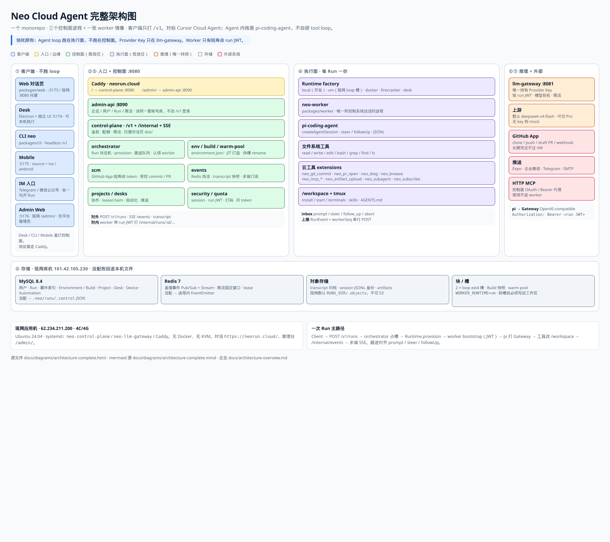
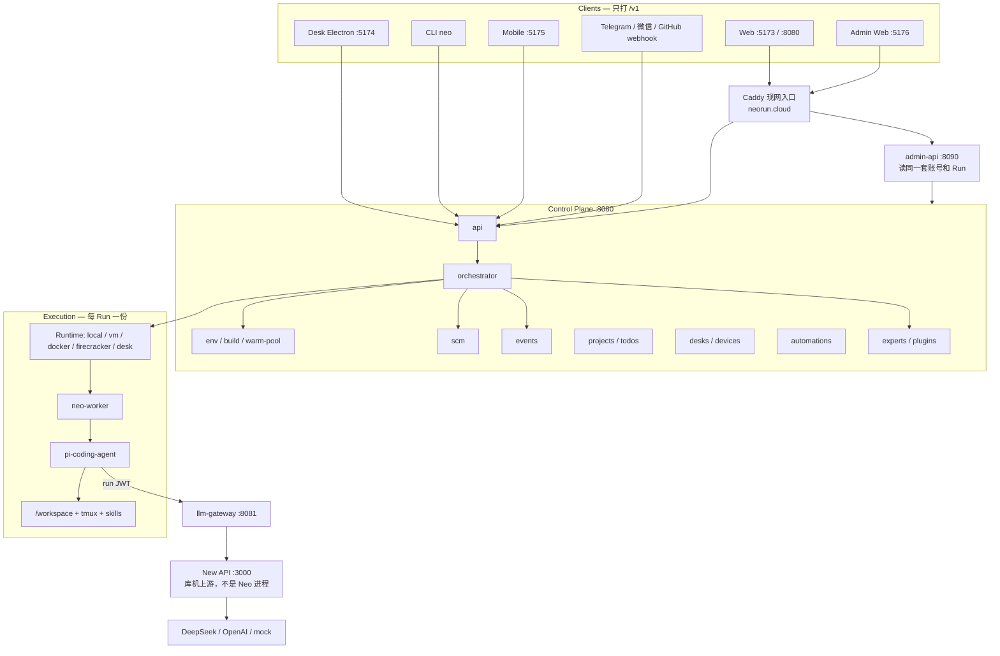
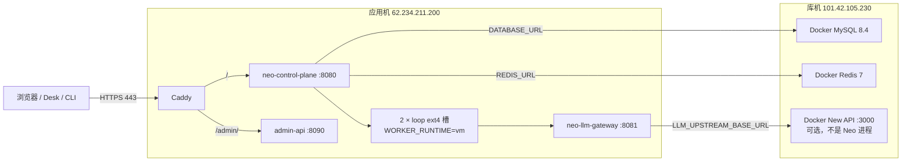
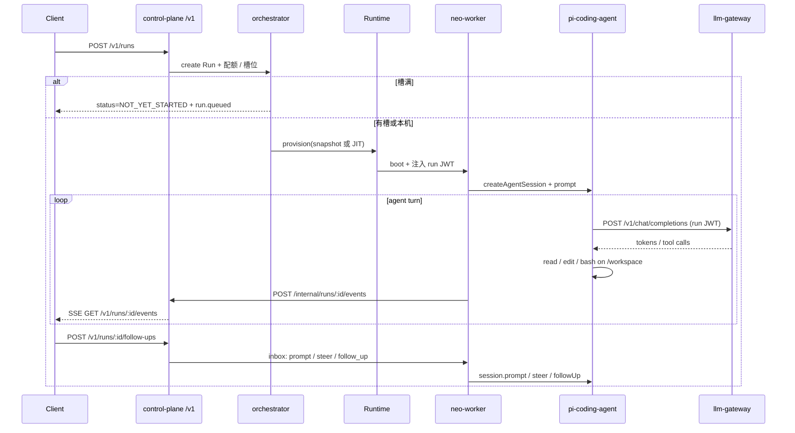

# Neo Cloud Agent 架构总览（现状）

本文是**现在仓库里实际长什么样**的完整地图：包怎么拆、进程怎么跑、一次 Run 怎么走、现网怎么叠。设计原则、分阶段蓝图、以及「为什么这样拆」仍以 [architecture.md](./architecture.md) 为准。本文不重复那份蓝图的每一条落地笔记，只把**核心架构**和**当前实现边界**摊开。

对照 `origin/main` `c2fda3c`（2026-08-28）。锁死的分层没变；相对 2026-08-26 那版总览，main 上多了共享 UI 包、控制面 `experts/` / `plugins/`、库机 New API 上游、Desk inline/dispatch、空闲槽工作区写回，以及 Web 上的专家 / 技能 / 配方面。[workbuddy-experts.md](./workbuddy-experts.md) §4.4 缺口表写于 Expert 实体落地前，已经过时。

对标对象：[Cursor Cloud Agent](https://cursor.com/docs/cloud-agent)。Agent 内核是 [pi-agent](https://github.com/earendil-works/pi)（`@earendil-works/pi-coding-agent`），不自研 tool loop。

---

## 1. 一句话

**用户从任意客户端发任务 → 控制面编排一次隔离执行单元 → worker 在仓库旁边跑 pi → pi 用 run JWT 打 LLM Gateway → Gateway 持有 Provider Key 去推理。**

锁死的原则只有这一条：

> **Agent loop 跑在执行面（VM / 槽 / 容器 / 本机 Desk worker），不跑在控制面。**

「推理在云端」靠 Gateway，不靠把 `read` / `edit` / `bash` 做成跨网络 RPC。把 loop 放控制面会丢掉 cwd、进程组、tmux 和 pi 本身。

### 完整架构图

一张图把客户端、入口、控制面、执行面、推理、存储和外部依赖摊开。现网不用登录：

- https://neorun.cloud/architecture

源文件：[diagrams/architecture-complete.html](./diagrams/architecture-complete.html)（分层海报）、[diagrams/architecture-complete.mmd](./diagrams/architecture-complete.mmd)（带箭头的 mermaid）。



另外四条红线（和 [README](../README.md) 一致）：

1. 不要 fork pi 加云功能——用 worker + `packages/extensions`。
2. 不要把 Provider Key 写进 VM。
3. 不要在 `install` 里起长驻服务。
4. 不要让 bash 拿着长期 git token 去 push。

---

## 2. 核心分层

三层，信任级不同，进程也不同。

| 层 | 信任级 | 现在落在哪 | 干什么 |
| --- | --- | --- | --- |
| 控制面 | 高（账号体系） | `packages/control-plane` 一个进程 `:8080` | 鉴权、Run 状态机、环境 / Build、SCM、事件扇出、项目协作、专家 / 插件物化、配额、限流 |
| LLM Gateway | 高（唯一持钥） | `packages/llm-gateway` 一个进程 `:8081` | 验 run JWT、模型别名、`max_tokens` 封顶 16384、限流、打上游（New API / DeepSeek / OpenAI / mock） |
| 执行面 | 低（按 Run 隔离） | `packages/worker` + `packages/extensions`，**镜像不是长驻服务** | 嵌入 pi、操作磁盘和进程、遵守 egress、只拿短寿命 JWT |

客户端（Web / Desk / CLI / Mobile / IM）**都不是第四个控制面**。它们只打 `/v1`，不跑 loop，不持有 Provider Key。



---

## 3. 仓库、进程、服务：三件不同的事

**一个 monorepo，少数进程，一张 worker 镜像。** 不要按模块开仓库。

| 概念 | 现在的数量 | 是什么 |
| --- | --- | --- |
| Git 仓库 | 1（`neo-cloud-agent`） | 代码怎么管 |
| 可部署进程 | 3 + worker 镜像 | `control-plane`、`llm-gateway`、`admin-api`；worker 随 Run 生灭 |
| 可选上游 | 0 或 1 | 库机 Docker `calciumion/new-api` `:3000`。**不是** Neo 进程，只当 Gateway 上游 |
| 逻辑 package | 12 | 代码怎么分层（含共享 UI 包） |
| 客户端 | 5 | Web / Desk / CLI / Mobile / Admin Web——都不是 Deployment |

### 3.1 Package 地图

```
neo-cloud-agent/
  packages/
    contracts        共享协议（库，不是服务）。所有进程 import
    control-plane    进程 1：api + 编排 + 环境 + SCM + 事件 + 项目
    llm-gateway      进程 2：唯一持有模型密钥
    worker           打进 VM / 任务容器 / Desk 本机 fork，不是集群 Deployment
    extensions       云工具，打进同一张 worker 镜像
    ui               共享 Radix 控件（库，不是服务）。web / desk / admin-web / mobile 引用
    web              对话页 React，由 control-plane 托管 dist/
    admin-api        管理台后端，独立进程 :8090
    admin-web        管理台前端，独立 Vite :5176；现网挂 /admin/
    desk             Electron 壳 + 独立 UI + 本机 worker
    cli              终端客户端 neo，打 /v1
    mobile           手机客户端（Expo 壳 + Vite :5175 视觉实验室）
  infra/             compose 与三份 Dockerfile + Firecracker 配方
  docs/              架构、CLI、Desk、Mobile、域名、后管调研
  .neo/environment.json
```

| Package | 角色 | 本地端口 / 产物 |
| --- | --- | --- |
| `contracts` | 类型与协议 | 无进程 |
| `control-plane` | 对外 `/v1` + 内部 `/internal` + 托管 Web | `:8080` |
| `llm-gateway` | OpenAI-compatible 代理 | `:8081` |
| `worker` | 嵌入 pi 的执行进程 | 每 Run 一份 |
| `extensions` | `neo_*` 云工具 | 打进 worker |
| `ui` | 共享 Radix 控件 | 无进程；只被四个前端 import |
| `web` | 对话页 | 开发 `:5173`；生产由 `:8080` 托管 |
| `admin-api` + `admin-web` | 平台管理台 | `:8090` + `:5176`；现网 `/admin/` |
| `desk` | 桌面壳 + 本机执行目标 | UI `:5174` + Electron（无 `:8082` 浏览器预览） |
| `cli` | headless `/v1` 宿主 | `pnpm neo` |
| `mobile` | 手机 `/v1` 宿主 | Expo Go；实验室 `:5175` |

`orchestrator` / `scm` / `env` 是 `control-plane` 的目录，不是新仓库，也不是新 Deployment。

### 3.2 为什么 Gateway 单独成进程

P0 唯一值得拆进程的边界是**密钥隔离**：Provider Key 不能和编排、工作区、SCM 私钥住在同一个进程里。Gateway 按 token 扩缩、单独审计。env / scm / event 此时是函数调用，不是网络 hop。

`admin-api` 是后来加上的第三个进程：只给平台管理员看总览 / 用户 / Run / 内置专家配置与下发，读同一套账号库和持久化，**不改**控制面 `/v1` 登录语义。New API（开源模型网关）如果接入，只能当 Gateway 的上游，不能替换 `llm-gateway`，也不能接管 Agent 用户表。见 [admin-platform-research.md](./admin-platform-research.md)。

---

## 4. 现网拓扑

两台腾讯云轻量，**不要混**。域名 `neorun.cloud`。



| 项 | 值 |
| --- | --- |
| 对话页 | `https://neorun.cloud/` → Caddy → `:8080` |
| 管理台 | `https://neorun.cloud/admin/` → Caddy `handle_path` → `:8090` |
| IP 入口 | `http://62.234.211.200/` 仍听 `:80`，只做运维兜底。产品入口是 HTTPS |
| 应用机 | 4C / 4G Ubuntu 24.04；**无 Docker、无 KVM** |
| 执行面 | `WORKER_RUNTIME=vm`：2 个 loop 挂 ext4 槽，不是真 VM |
| 元数据 | 库机 MySQL |
| 直播事件 | 库机 Redis Pub/Sub + Stream |
| 模型渠道 | 库机 New API `:3000`；Gateway 打 `http://101.42.105.230:3000/v1` |
| 对象存储 | 应用机 `RUNS_DIR/.objects`，现网不切 S3 |
| systemd | `neo-control-plane`、`neo-llm-gateway`、Caddy |

操作手册：[.cursor/skills/tencent-lighthouse-deploy/SKILL.md](../.cursor/skills/tencent-lighthouse-deploy/SKILL.md)、[.cursor/skills/tencent-lighthouse-db/SKILL.md](../.cursor/skills/tencent-lighthouse-db/SKILL.md)、[production-domain.md](./production-domain.md)。

本地默认另一套：`WORKER_RUNTIME=local`（本机进程）、没配 `DATABASE_URL` / `REDIS_URL` 则用 `.neo/runs/.control` JSON + 进程内 EventEmitter。`infra/docker-compose.yml` 是「控制面 + Gateway + Postgres + Redis、worker 按 Run 起容器」的开发拓扑。

---

## 5. 一次 Run 的主路径



多端是**订阅制**：worker 只生产一次事件。浏览器多个标签、CLI、Desk、手机都订控制面同一条 SSE。晚到的端先拉 `GET /v1/runs/:id/transcript` 压缩快照，再带 `after` / `Last-Event-ID` 跟直播。

---

## 6. Run 状态机

```
NOT_YET_STARTED
        │ provision
        ▼
   PROVISIONING ──► INSTALLING ──► RUNNING
                        │              │
                        │              ├── 本轮还在跑 → RUNNING
                        │              ├── 本轮结束等用户 → IDLE
                        │              ├── 子任务未完成 → WAITING_FOR_BACKGROUND_WORK
                        │              └── 失败 → ERROR
                        ▼
                   INSTALL_FAILED → ERROR

RUNNING / IDLE ──► ARCHIVED（用户结束）
               ──► EXPIRED（TTL / 磁盘回收）
```

| 状态 | 含义 |
| --- | --- |
| `NOT_YET_STARTED` | 已创建；槽满则排队，记 `run.queued`，**不要标 ERROR** |
| `PROVISIONING` | Runtime 占槽 / 起进程 / 起容器 / 等 Desk claim |
| `INSTALLING` | 冷启动跑 `install`；从 active Build 启动则跳过 |
| `RUNNING` | pi 正在 turn |
| `IDLE` | 本轮结束、会话还在，可跟进。`vm` 运行时超过 `WORKER_IDLE_RELEASE_MS`（默认 15 分钟）先把工作区写回再卸槽；写回失败则留下槽。工作区预算与回收见 [workspace-persistence.md](./workspace-persistence.md) |
| `WAITING_FOR_BACKGROUND_WORK` | 子任务 / 后台工作未完 |
| `ERROR` | 失败；跟进仍可从 session 备份恢复 |
| `ARCHIVED` / `EXPIRED` | 释放计算；transcript 按保留策略另存 |

跟进语义对齐 pi，不要再写第二套队列执行器：

| 用户动作 | 控制面 | worker → pi |
| --- | --- | --- |
| IDLE 时发消息 | 直接下发 | `session.prompt` |
| RUNNING 时改方向 | `steer` | `session.steer` |
| RUNNING 时「做完再做」 | 入队 | `session.followUp` |
| 取消 | abort | `session.abort` |

控制面队列只解决：**worker 还没 ready 或暂时断线时把消息存住**。当前正在执行的消息不算 queued。

`source` 区分来源：`web | cli | slack | github | api | automation | telegram | wechat | desk | ios | android`。

`ExecutionTarget` 两轴分开：`{ loop, tools }`。P0–P2 **只允许同址**（都是 `cloud` 或都是 `desk`）。跨址「云 loop + 本机工具」还没做。

---

## 7. 控制面内部模块

`packages/control-plane/src/` 按职责分目录，全部进同一个进程。

| 目录 | 职责 |
| --- | --- |
| `api/server.ts` | 对外 REST / SSE / webhook / 静态对话页 |
| `orchestrator/` | Run 状态机；provision / inbox / 跟进 / 认领 worker / 恢复 |
| `runtime/` | `local` / `docker` / `vm` / `firecracker` / `desk` / `none` |
| `env/` | Environment、Build、fingerprint、warm pool、install |
| `scm/` | clone、分支、受控 commit、短寿命 token、开 PR |
| `events/` | 进程内总线或 Redis；transcript 快照；SSE |
| `store/` | `.control` JSON，或 MySQL / Postgres 镜像 |
| `objects/` | transcript / session 归档（fs / s3 / memory / none） |
| `artifacts/` | Run 产物 + 签名下载 URL |
| `security/` | session、API token、run JWT、限流、打码 |
| `accounts/` | 账号与默认 admin |
| `experts/` | 专家 / 专家团目录、bundled 覆盖、创建 Run 时写 `.neo/EXPERT.md` |
| `plugins/` | 插件安装记录、创建 Run 时物化 `.neo/skills/<slug>/SKILL.md` |
| `projects/` | 项目、成员、邀请、看板 todo、资产、消息、inbox、HANDOFF.md |
| `desks/` | Desk 登记、lease、claim、inbox SSE、工作区绑定（name + repoKey） |
| `devices/` | 手机推送 token |
| `automations/` | 定时任务（`source: automation`） |
| `subscriptions/` | GitHub webhook、CI autofix |
| `ingress/` | Telegram / 微信开对话 |
| `notify/` | Expo / 企微 / Telegram / SMTP |
| `mcp/` | HTTP MCP 代理与 OAuth（密钥不进 worker） |
| `quota/` | 同时跑的对话、本月 token |
| `scheduler/` | 每 30s：补 warm pool、触发到期 automation |
| `admin/` | 给 `admin-api` 用的总览 / 用户 / Run 聚合 |
| `platform.ts` | 启动时接数据库、Redis、把各 store 的 persist hook 挂上 |

启动顺序（`index.ts`）：`startScheduler()` → `startPlatform()` → `listen(:8080)`。平台初始化失败也会听端口，避免健康检查把进程判死。

---

## 8. 执行面：Runtime + Worker + pi

### 8.1 Runtime 接口

对外都叫「VM」。对内 `getRuntime(WORKER_RUNTIME)`：

```
provision(spec) → handle
destroy(handle)
adopt(runId, lease) → handle | null   // 控制面重启后认领还在的进程/容器
```

| `WORKER_RUNTIME` | 实现 | 谁在用 |
| --- | --- | --- |
| `local`（默认） | 本机 `fork` worker 进程 | 开发、单测 |
| `vm` | 有 `/dev/kvm` 走 Firecracker，否则 **loop 挂 ext4 槽** 再跑本地 worker | **现网轻量**（无 KVM → 2×4GiB 槽） |
| `docker` | 一容器一 Run，工作区 bind-mount | compose / `pnpm test:docker` |
| `firecracker` | 真微 VM：kernel + rootfs + tap | 有 KVM 的宿主；嵌套 AMX 会 skip |
| `desk` | 不在云端起进程也不发信号；等 Desk `claim`，取消走 inbox | `target.loop === "desk"` |
| `none` | 不拉起 worker | 测编排 |

`vm` 槽满时新 Run 停在 `NOT_YET_STARTED`。空闲超时必须先把工作区写回 `hostRunsDir/<runId>`（跳过 `node_modules` 等缓存）再 `releaseVmSlot`（卸槽会擦盘）。写回失败则留下槽。持久化工作区有全站预算和 TTL 回收，见 [workspace-persistence.md](./workspace-persistence.md)。`WORKER_MEMORY_MIB` 打进 V8 堆上限；control-plane unit 开了 cgroup `Delegate=` 时再套 RSS。

块设备克隆顺序：`cp --reflink=always` → 工作区整树 `copy` / 生产 rootfs 只读 `shared` → warm slot `rename`。不是 live-fork。

### 8.2 Worker 启动顺序

worker 是执行单元里**唯一和控制系统说话的进程**。它嵌入 `createAgentSession`，不是让用户 SSH 进 TUI。

1. `GET /internal/runs/:id/bootstrap`（或环境变量里已有 JWT）
2. 装 egress 守卫（拦 `fetch` / 远程 clone）
3. `install`（仅冷启动）→ `start` → `terminals`（tmux）
4. 从控制面下载 session JSONL 备份
5. 打开 pi session，注册文件系统工具 + 云工具
6. 拉 inbox：`prompt` / `steer` / `follow_up` / `abort` / `set_model` / `shutdown`
7. 把 pi 事件翻译成 `RunEvent`，按 `workerSeq` **串行** `POST /internal/runs/:id/events`
8. 按策略把 session 备份回控制面

机器里的路径约定：

```
/workspace               仓库工作区（多仓时 /workspace/<name>）
/var/neo/sessions        pi SessionManager JSONL
/var/neo/logs            setup / start / agent 日志
/opt/neo/worker          镜像内 worker（容器 / Firecracker）
```

`install` / `start` / `terminals` 不能混：

| 字段 | 何时跑 | 放什么 |
| --- | --- | --- |
| `install` | Build 时，或冷启动时 | 装依赖、codegen。必须退出。禁止起长驻服务 |
| `start` | 每个 boot | 守护进程。要幂等。失败默认不挡住 Agent（`startMustSucceed: true` 才挡） |
| `terminals` | boot 之后 | agent 看得见、能重启的前台进程 |

### 8.3 为什么内核是 pi

```
neo-worker / extensions     你们写：控制通道、Git/PR、MCP、egress
        │
pi-coding-agent             会话、read/write/edit/bash、skills、compaction
        │
pi-agent-core               loop、tool execution、steer/followUp
        │
pi-ai                       多 Provider 流式；baseUrl 指到 Gateway
```

直接复用：loop、工具、`steer` / `followUp`、JSONL、`compact()`、Extensions / Skills、`ModelRuntime` + 内存凭证。

必须自建：VM / 槽、多租户、Gateway、SCM、Builds、客户端、egress、审计。

工作区 loader 读 `AGENTS.md` / `CLAUDE.md` 以及 `.pi/skills`、`.cursor/skills`、`.claude/skills`、`.codex/skills`、`.neo/skills`、`.agents/skills`。**不**加载宿主机 `~/.pi` / `~/.cursor`。`.cursor/hooks.json` / `.neo/hooks.json` 的 command hooks 走 pi 的 inline 钩子。

### 8.4 云工具（`packages/extensions`）

全部用 `pi.registerTool` / `customTools`，不改 pi 源码。

| 工具 | 作用 |
| --- | --- |
| `neo_git_commit` | `POST /internal/runs/:id/scm/commit`；签名和 push 走控制面 |
| `neo_pr_open` | `POST /internal/runs/:id/scm/pull-request` |
| `neo_diag` | setup / egress / environment 诊断 |
| `neo_browse` | 抓公开 http(s) 页的 title + 可见文本。**不是** headed browser |
| `neo_mcp_list` / `neo_mcp_call` | HTTP MCP 先走控制面代理（密钥不进 worker），失败再直连；stdio 仍在 worker |
| `neo_artifact_upload` | 工作区文件上传，对话页用签名 URL 下载 |
| `neo_subagent` | worker **内**嵌套 `createAgentSession`，不占第二槽，不把 loop 打回控制面 |
| `neo_subscribe` | GitHub 评论 / Actions → 跟进队列；开 PR 自动订阅；CI 失败默认 autofix（最多 3 次） |
| `neo_memory_add` / `neo_memory_search` | `POST /internal/runs/:id/memories`；按 run.userId 写/搜 Mem0。密钥不进 worker |

文件系统工具仍是 pi 自带的 `read` / `write` / `edit` / `bash` / `grep` / `find` / `ls`。

---

## 9. LLM Gateway

Gateway 是「推理在云端」的落点。VM 把它当成 OpenAI-compatible `baseUrl`。

```
pi-ai streamSimple
  → http://llm-gateway:8081/v1/chat/completions
  → Authorization: Bearer <run JWT>
  → 验 JWT、按 run/org 限流、别名改写、打点
  → DeepSeek / OpenAI / mock
```

| 能力 | 现状 |
| --- | --- |
| Run-scoped JWT | `runId` / `orgId` / `model` / 过期；VM 重启轮换 |
| 模型目录 | 对外 `neo/deepseek`、`ds` 等；对内默认 `deepseek-v4-flash`；设置里可切 Pro；退役的 `deepseek-chat` / `deepseek-reasoner` 改写成 flash |
| 用量 | input / output 按 Run 聚合；对话页另有 context window 填充 |
| 上游 | `.env` / `.neo/llm-upstream.env`；现网 `LLM_UPSTREAM_BASE_URL` 指向库机 New API；没 key 且没上游则 `upstream=mock` |
| 输出封顶 | `MAX_REQUEST_OUTPUT_TOKENS = 16384`（`packages/contracts/src/models.ts`）；`capUpstreamMaxTokens()` 在打上游前截断，避免 New API 钱包预扣爆掉 |
| 不做 | 不执行工具、不看见磁盘、不持有 SCM 私钥。New API **不是**第四个 Neo 进程 |

对话页 `POST /v1/settings/llm` 在未接 New API 时写 key 到本机文件；**响应永不回传明文**。现网 Gateway 上游是库机 New API `http://101.42.105.230:3000/v1`，对话页 / Desk 只选型号，渠道和 Provider Key 在 New API 控制台。New API 只能接在 Gateway **后面**，worker 不拿 `sk-`。

---

## 10. 环境、Build、Warm pool

环境是「这台开发机应该长什么样」，Run 是「在某个环境版本上执行一次任务」。

配置源（高到低）：仓库 `.neo/environment.json`（兼容 `.cursor/environment.json`）→ 用户保存的 Environment → 团队默认。`environmentJsonPath` 有值 = repo-managed；为空 = DB-managed。不要两种同时改还指望合并。

核心字段：`snapshot`、`install`、`start`、`startMustSucceed`、`terminals`、`repos`、`egress`、`mcp`。

```
触发 Build（保存环境 / 手动 / JIT 成功后打盘）
  → clone + install 至结束
  → 打盘 snapshot
  → 非 draft 的 SUCCEEDED latest 标为 active
  → warm pool 按 active 预热 N 台（默认 WARM_POOL_SIZE=1）
```

新 Run：先 claim warm slot（`rename`）→ 否则 reflink / 拷贝 snapshot（不再跑 `install`）→ 否则 JIT 冷装。draft Build 永不自动激活。`BUILD_CAPTURE=0` 关闭 JIT 打盘。

用户 secrets **不**进 Build；runtime secrets 在 agent boot 时注入，并在 transcript / 工具输出里打成 `[REDACTED]`。

Egress 三模式（应用层，还不是 VM iptables）：

| 模式 | 行为 |
| --- | --- |
| `allow_all` | 开发默认 |
| `default_plus_allowlist` | 系统域名（Gateway、GitHub、npm）+ 用户名单 |
| `allowlist_only` | 仅名单；Gateway / GitHub 仍放行 |

控制面 clone / 开 PR 前用同一套 `evaluateEgress`；worker 给 `fetch` 加守卫并上报 `egress.denied`。

---

## 11. 会话、事件、Transcript

两份日志，不要混：

| 日志 | 位置 | 用途 |
| --- | --- | --- |
| pi session JSONL | worker `SESSION_DIR` | pi 恢复上下文、compaction |
| `RunEvent` | 控制面（Redis 热、对象存储冷、MySQL 索引） | UI、审计、跨设备打开 |

worker 在 `message_end` / `tool_execution_end` / `agent_end` 时推规范化事件。UI **不**直接读 VM 磁盘。

`GET /v1/runs/:id/transcript` 用 `buildTranscriptSnapshot` 把事件收成消息。同一轮里：`message.end` 之后的工具单独成组，下一句模型文字再开一条气泡。对话页按 `transcriptGroups` 渲染——**工具调研在最终答复上面**。事件带 `data.workerSeq`，快照按它还原顺序，避免 HTTP 乱序把工具挤到回复后面。

归档后控制面丢掉内存里的事件树；补播从 persist 读并折叠 `message.delta`。

---

## 12. SCM 与交付

```
创建 Run
  → 控制面用 GitHub App（或 PAT 回退）签短寿命 token
  → 落到工作区：本地目录拷贝，或 git clone --depth 1
  → 建分支 neo/<slug>-<shortid>
  → agent 改代码
  → neo_git_commit → 控制面 commit / push
  → neo_pr_open → 控制面开 draft PR
```

长期 SCM 凭证不过 VM 磁盘、不进环境变量明文。Worker 只申请 `neo.git.*`。没有 GitHub 远程时记 `local://pr/...`。多仓环境每个被改的 repo 各自开 PR，Run 上记一组 `PullRequestRef`。

GitHub PR 评论和 Actions 经 `POST /webhooks/github`（HMAC）进跟进队列。人跟进或人 push 分支后停 autofix。

---

## 13. 客户端族

所有客户端共用 `/v1`。差别只在「人怎么看、执行目标在哪」。

| 宿主 | Package | 执行面 | 现状 |
| --- | --- | --- | --- |
| 对话页 | `packages/web` | 云端 | 登录、流式、Markdown、Diff、文件树、粘贴图片、产物预览、项目、专家 / 技能目录、自动化、Flash/Pro |
| 管理台 | `admin-web` + `admin-api` | 无 | 总览 / 用户 / Run / 内置专家配置与下发 / 限流；仅平台管理员 |
| Desk | `packages/desk` | 云或本机 | Electron + 独立 UI；This Computer（默认）vs Remote control；inline 直接带 assignment，dispatch 走 inbox SSE |
| CLI | `packages/cli` | 云端 | `pnpm neo`：创建、SSE、跟进、归档、diff、PR；headless |
| Mobile | `packages/mobile` | 云端 + Desk Remote | Expo 壳：新开只 cloud；列表 / 跟进含 Desk Remote；`source` ios/android；推送 `/v1/devices`；记忆 / Inbox / 产物 / 诊断 / 技能启停 / Recipe 与对话页同一套 `/v1` |
| Telegram / 微信 | `ingress/` | 云端 | 发一句开新对话；做完 / 开 PR 可推回来 |
| Slack | — | — | `source` 预留，未做 |

Desk 本机路径（已落地）。`start` 分开「谁起这个 worker」：

**A `inline`（你就在这台 Desk 前面）**

1. 登录后 `POST /v1/desks`，拿 `deskId` + desk token；绑定的文件夹上报机器名 + repoKey，绝对路径留本机。
2. `POST /v1/runs { source:"desk", start:"inline", target:{ loop:"desk", tools:"desk", deskId } }`，**响应直接带 assignment**。
3. Desk 用**用户选的那个文件夹本身**当工作区（不开 worktree），把 bootstrap 写进 `userData`，fork `packages/worker`，再 `claim`。

**B `dispatch`（缺省：Web / handoff / 控制面恢复）**

1. Desk 常驻 `GET /v1/desks/:id/inbox`（SSE，出向）。控制面打不进 NAT 后面的笔记本。
2. 控制面严格匹配 user + 机器在线且允许远程 + 仓库对得上，然后往 inbox 推 assignment；对不上就明确报错，不回落云端。
3. Desk 用已绑定的工作区 spawn，再 `claim`。

两条路径之后完全一样。共同约束：`online` 就是「正握着 inbox」；控制面**不**杀笔记本 pid（取消走 inbox，活着靠 worker 心跳）；本机 Run 的文件工具和 bash 写操作锁在工作区根内；掉线走 `detachOrQueue`，不标 ERROR；handoff 到云要可 clone 的远端，切回本机要求该仓库已有绑定，未提交改动都不跟随。Desk 本机 worker 默认 `WORKER_EXIT_AFTER_TURN=1`（一轮退出，跟进再起进程）。每轮划痕在 `<workspace>/.neo/runs/<runId>/`。打包产物是 `pnpm pack:desk` → `packages/desk/release/*.zip`，没有 `/v1/downloads`。跨址「云 loop + 本机工具」见 [desk-phase2-tool-rpc.md](./desk-phase2-tool-rpc.md)，**还没做**。

设计细节：[cli.md](./cli.md)、[desk.md](./desk.md)、[mobile.md](./mobile.md)。

---

## 14. 协作面与产品层

对话是一次 Run。项目是共享上下文 + 看板 + 成员。专家切父 Run 人格；插件把 Skill 物化进工作区；配方只是客户端预填。分层对齐 WorkBuddy 调研，见 [workbuddy-project-collaboration.md](./workbuddy-project-collaboration.md)、[workbuddy-experts.md](./workbuddy-experts.md)、[skill-plugin-marketplace.md](./skill-plugin-marketplace.md)、[workbuddy-feature-gap-2026-08.md](./workbuddy-feature-gap-2026-08.md)。

### 14.1 项目协作

| 实体 | 作用 |
| --- | --- |
| `Project` | 名称、项目指令（注入 Run）、默认仓库、邀请策略、成员、动态 |
| `ProjectTodo` | 看板上的任务；可绑一条 Run |
| `ProjectAsset` | 用户手动上云；工作区不会自动进来 |
| `ProjectMessage` | 项目内消息 |
| Inbox | `GET /v1/inbox`、`POST /v1/inbox/:id/read`：邀请、转交、评论 |
| `Automation` | 每天 / 每小时按调度 `POST /v1/runs`，`source: automation` |
| Collaborator / Transfer | 单条 Run 可邀请 editor，或 reassign / fork 给别人 |
| Handoff pack | `projects/handoff.ts` 写 `HANDOFF.md` |

Desk UI 是 Agents Window：transcript + composer，右上角可开 Files / Terminal 右侧栏，项目工作台默认停在任务（任务 / 对话 / 资产 / 动态 / 设置）。Web 另有 `#/projects`、`#/experts`、`#/skills`。

### 14.2 专家 / 专家团（控制面对象）

合约在 `packages/contracts/src/expert.ts`。内置 5 个编码向专家（侦察 / 规划 / 审查 / 实现 / 安全）和 2 个专家团（交付改动 chain、调查收口 parallel）。

| 层 | 行为 |
| --- | --- |
| 持久化 | `.control/experts.json` + `bundled-expert-policy.json`；有 `DATABASE_URL` 则 `experts` / `expert_policies` |
| 创建 Run | `expertId` xor `expertTeamId`；控制面写 `.neo/expert.json`、`EXPERT.md` / `EXPERT_TEAM.md` |
| worker | `packages/worker/src/expert-workspace.ts` 读角色覆盖，工具白名单与专家 `tools` 求交 |
| 专家团 | 团长 = 带编排手册的父会话；团员物化成 `.neo/agents/*.md` 后走现有 `neo_subagent` |
| API | `GET\|POST /v1/experts`、`GET\|PATCH\|DELETE /v1/experts/:id`、`GET /v1/expert-teams` |
| 后管 | `GET/POST /v1/admin/experts` 配置 / 下发 / 恢复默认 |

专家跟 Run 绑定，不中途换人格；要换就新开 Run。没有专家市场、没有积分倍率。

### 14.3 插件 / 技能（控制面目录 + 工作区物化）

合约在 `packages/contracts/src/plugin.ts`。内置 4 个 skill 包：`pr-review`、`release-notes`、`repo-scout`、`incident-brief`。

| 层 | 行为 |
| --- | --- |
| 持久化 | `.control/plugin-installs.json`；有库则 `plugin_installs` |
| 物化 | 创建 Run 时写 `.neo/skills/<slug>/SKILL.md` + `.neo/plugins.json`（`plugins/materialize.ts`） |
| worker | 继续只扫工作区 skill 目录，不另造运行时 |
| API | `GET /v1/plugins`、`GET /v1/plugins/:id`、`POST\|DELETE …/install`、`POST …/enable` |

**还没有：** git marketplace、zip 上传、插件带 MCP/hooks、`GET /v1/search`、`GET /v1/recipes`。

### 14.4 配方 / 模板 / 意图胶囊（仅客户端）

`packages/contracts/src/recipe.ts` 有类型和内置目录。Web 空状态配方、项目模板、Composer 关键词胶囊只是预填 `POST /v1/runs` / `POST /v1/projects` 的 `prompt` / `expertId` / `expertTeamId`。**没有** HTTP 路由。

### 14.5 Web 已落地的 WorkBuddy 面

| 面 | 实际落点 |
| --- | --- |
| Inbox | `GET /v1/inbox` + 已读 |
| `@` 提及 | Composer 客户端拼专家 / 团 / 插件 / 资产，不是服务端解析 |
| 搜索 | 已加载 transcript / 目录上的 `?q=`，**没有** `GET /v1/search` |
| 产物 | 检查器 iframe/img 预览（签名 `?token=`）+ `POST /v1/runs/:id/artifacts/:name/save-to-project`；存完跳 `#/projects/:id/assets/:assetId` |
| 目录页 | `#/experts`、`#/skills`、`#/projects`、`#/projects/:id/assets` |

---

## 15. 管理台

独立应用，不嵌进对话页。

| | 本地 | 现网 |
| --- | --- | --- |
| API | `admin-api` `:8090` | 同一域名 `/admin/` → `:8090` |
| UI | `admin-web` `:5176` | 由 admin-api 托管 dist |
| 登录 | 仍是 `admin` / `123456` 或 `ADMIN_EMAILS` | 只认平台管理员 / 服务令牌 |

接口：`/v1/auth/login|logout`、`/v1/me`、`/v1/admin/overview`、`/v1/admin/users`、`/v1/admin/runs`、`/v1/admin/experts`（配置 / 下发 / 恢复默认）、`/v1/rate-limits`。复用 control-plane 的账号与聚合函数，**不**另建用户表。内置专家覆盖写在 `expert_policies`。

---

## 16. 存储与回退

控制面是**少数几个无状态进程** + 可替换存储。没配托管存储时，开发机照样能跑。

| 存储 | 内容 | 没配时 |
| --- | --- | --- |
| MySQL 或 Postgres（`DATABASE_URL` scheme 决定） | 用户、Run、事件、Environment、Build、Project、Desk、Device、Automation、`experts`、`expert_policies`、`plugin_installs` | `.neo/runs/.control` JSON |
| Redis | 直播事件 Pub/Sub + Stream、限流固定窗口、lease | 进程内 EventEmitter + token bucket |
| 对象存储（默认 fs） | transcript 归档、artifacts、session JSONL 备份 | `RUNS_DIR/.objects` |
| 块存储 | Build 快照、warm slot、loop 盘 | `RUNS_DIR/.builds` |
| 密钥文件 | LLM / SCM / notify（gitignore） | `.env`、`.neo/*.env` |

`platform.ts` 在启动时：**先接 Redis，再 hydrate MySQL**，避免登录 / 限流卡在库同步上。有 `DATABASE_URL` 就 `connectDatabase` 并挂 persist hook（含 experts / plugins / expert_policies）；有 `REDIS_URL` 就接热总线和限流。刷新页面或重启控制面：先从 persist 把 Run 拉回内存，再 `recoverLiveWorkers`——认领得到的 handle 以进程/容器退出为准，认领不到就等心跳，超时才标 ERROR。

---

## 17. 安全模型

假设 VM 会被 prompt injection 拿下。

| 威胁 | 对策 |
| --- | --- |
| 偷 Provider Key | Key 只在 Gateway；VM 只有 JWT |
| 外带源代码 | Egress allowlist；禁止宽泛 S3 wildcard |
| 密钥进 transcript / commit | Runtime secret 打成 `[REDACTED]` |
| 逃逸到宿主机 | 现网是 loop 槽（弱隔离）；真隔离走 Firecracker + jailer |
| 横向访问其他 Run | `/internal` 按 `runId` + run JWT；对象路径隔离；用户只能看自己的 Run（协作者除外） |
| 身份冒用 | 对外 session 或 `CONTROL_PLANE_TOKEN`；worker 不能打用户 `/v1` 写接口 |

密钥分三级：

1. **Environment variable**：agent 可以看见（feature flag、公共 URL）
2. **Runtime secret**：进程环境里有，模型看见的输出被打码
3. **Build secret**：只在 `install`，不进正式 Run

鉴权：

- 默认必须登录（`ACCOUNTS_REQUIRED=0` 才允许匿名）。对话页不预填、不跳过。
- 默认管理员 `admin` / `123456`；可再 `BOOTSTRAP_EMAIL`。公开注册：用户名 + 手机号 + 密码（无验证码，手机号唯一），待管理员审核后才能登录，起步额度 ¥5。
- Worker 只带 run JWT 打 `/internal`。
- `/health`、静态页、公开 webhook 不需要用户令牌。
- 限流：IP / 登录 / 建 Run / 用户写操作 / SSE 并发 / Gateway QPS。听写 `POST /v1/speech/iat` 走单独的 `speech` 桶，不占 write / llm_run。`GET /v1/rate-limits` 看桶。`RATE_LIMIT=0` 关闭。网页 / 手机麦克风必须走 `https://neorun.cloud`；浏览器只打本站，讯飞密钥留在 gateway。
- 配额：`GET /v1/quota` 同时跑的对话和本月 token。完整账务未做。

---

## 18. 对外 API 地图

权威实现是 `packages/control-plane/src/api/server.ts`。下面按域分组，不是逐路由抄文件。

### 公开 / 入口

```
GET    /health
GET    /architecture  /architecture.html  /architecture-complete.html
POST   /webhooks/github
POST   /webhooks/telegram
GET|POST /webhooks/wechat
GET    /oauth/callback/mcp
GET    /v1/runs/:id/artifacts/:name?token=   签名下载
```

### 账号与设置

```
POST   /v1/auth/login|logout|bootstrap
POST   /v1/auth/register                 用户名 + 手机号 + 密码，无验证码；手机号唯一；待管理员审核后才能登录，起步额度 ¥5
GET    /v1/me
GET    /v1/vms
GET    /v1/rate-limits
GET    /v1/quota
GET|POST /v1/settings/llm|scm|notify|quota|mcp
GET|POST /v1/speech/iat                  讯飞听写代理；GET 只回 `{ configured }`
GET|POST /v1/memories                    记忆页看/记；PATCH|DELETE /v1/memories/:id；POST /v1/memories/search
```

### Run

```
POST   /v1/runs
GET    /v1/runs
GET    /v1/runs/:id
POST   /v1/runs/:id/follow-ups
POST   /v1/runs/:id/abort
POST   /v1/runs/:id/archive
DELETE /v1/runs/:id                    仅已归档；MySQL 写 deleted_at，列表不再返回
GET    /v1/runs/:id/events          SSE
GET    /v1/runs/:id/transcript
GET    /v1/runs/:id/fs
GET|POST /v1/runs/:id/term
GET    /v1/runs/:id/term/:id/events
POST|DELETE /v1/runs/:id/term/:id
GET    /v1/runs/:id/diff
GET    /v1/runs/:id/diagnostics
GET|POST /v1/runs/:id/artifacts
POST   /v1/runs/:id/artifacts/:name/save-to-project
POST   /v1/runs/:id/commit
POST   /v1/runs/:id/pull-request
GET|POST /v1/runs/:id/subscriptions
POST   /v1/runs/:id/handoff
GET|POST /v1/runs/:id/collaborators
POST   /v1/runs/:id/transfer
```

### 专家、插件、环境、Desk、设备、项目、自动化

```
GET|POST /v1/experts     GET|PATCH|DELETE /v1/experts/:id
GET    /v1/expert-teams
GET    /v1/plugins       GET /v1/plugins/:id
POST|DELETE /v1/plugins/:id/install
POST   /v1/plugins/:id/enable
CRUD   /v1/environments  /v1/builds  /v1/builds/:id/logs
CRUD   /v1/desks
GET    /v1/desks/:id/inbox               Desk token SSE
POST   /v1/desks/:id/lease|claim|reject|release|workspaces
DELETE /v1/desks/:id/workspaces/:wsId
CRUD   /v1/devices
CRUD   /v1/projects      成员 / 邀请 / todos / assets / messages
GET    /v1/inbox
POST   /v1/inbox/:id/read
CRUD   /v1/automations
```

没有 `GET /v1/search`，也没有 `GET /v1/recipes`。

### Worker 内部（run JWT）

```
GET    /internal/runs/:id/bootstrap
POST   /internal/runs/:id/inbox
POST   /internal/runs/:id/events
GET|POST /internal/runs/:id/session
POST   /internal/runs/:id/egress-check
GET    /internal/runs/:id/diagnostics
POST   /internal/runs/:id/scm/commit|pull-request|token
POST   /internal/runs/:id/artifacts
POST   /internal/runs/:id/mcp
```

管理台自己的 `/v1/admin/*` 在 `admin-api`，不进控制面路由表。

---

## 19. 核心数据模型

```
Org 1──* User 1──* Run
                 └── FollowUp / RunEvent / Artifact / PullRequestRef / Subscription
                 └── Collaborator / Transfer

User 1──* Project 1──* Member / Invite / Event
                    └── Todo / Asset / Message
                    └── Run (projectId)

User 1──* Expert (visibility=user|project)     bundled 另存
User 1──* PluginInstall → Plugin (bundled 目录)
Run ── expertId xor expertTeamId
Run ── plugins[]  { slug, version, digest }

Environment 1──* EnvironmentVersion 1──* Build
                                      └── snapshotPath, fingerprint, draft?

Desk 1──* Assignment / Lease / WorkspaceBinding
Device   （Expo push token）
Automation  （调度 → 创建 Run）
```

`CreateRunRequest` 接受 `expertId` 或 `expertTeamId`（互斥），以及启用中的插件快照。`Recipe` / `ProjectTemplate` / `IntentCapsule` 只在合约和客户端，不进这张表。

`Build.status`: `IN_PROGRESS | SUCCEEDED | FAILED | CANCELLED | SKIPPED`  
`Run.setupStatus`: `INSTALL_*` / `START_*` / `null`

合约类型的唯一来源是 [`packages/contracts`](../packages/contracts)。Web / Desk 不要 import 主桶里会拖进 Node 的模块；对话页只用 `./transcript`、`./events`、`./run` 等子路径。

---

## 20. 本地怎么对上这张图

```bash
export PATH="$HOME/.nvm/versions/node/v$(cat .nvmrc)/bin:$PATH"   # 必须，见 AGENTS.md

pnpm dev                 # control-plane :8080 + llm-gateway :8081
pnpm dev:web             # 对话页 :5173（后端已在则复用）
pnpm dev:admin           # 管理台 :8090 + :5176
pnpm dev:desk            # Desk UI :5174 + Electron
pnpm dev:mobile          # 手机 :5175
pnpm neo -p "…"          # CLI 打同一套 /v1
pnpm typecheck && pnpm test
```

默认 mock 上游就能把 Run 跑到 IDLE。真模型把 `DEEPSEEK_API_KEY` 写进根目录 `.env`。现网部署用 `pnpm deploy:lighthouse`，不要手搓 tar。

---

## 21. 现在有、明确没有

**已经落地、文档必须对得上的：** P0 主路径（创建 Run → worker + pi → Gateway → SSE → IDLE → 跟进）；账号；MySQL / Redis 回退（Redis 先于 MySQL hydrate）；Environment Builds / warm pool；`vm` loop 槽与空闲写回；受控 git / PR；云工具；多端 SSE；Desk This Computer / Remote（inline assignment + inbox dispatch）；项目协作骨架；专家 / 专家团（含后管下发）；内置插件物化进 `.neo/skills`；Web 配方 / 模板 / `@` / 目录页（客户端预填）；产物保存到项目；自动化；IM 入口；管理台；CLI；Mobile P0；共享 `packages/ui`；限流与配额打点；公开 `/architecture` 海报；库机 New API 作为 Gateway 上游。

**还没有、不要假装有的：**

- 把 Agent loop 放控制面，或 CLI / 手机在本机跑 pi。若要把 loop 从槽里拆出来（Cursor 现行形态），见 [agentscope-java-loop-plan.md](./agentscope-java-loop-plan.md)，不要嵌进 `control-plane`
- 云 loop + 本机工具 RPC（`loop !== tools`），见 [desk-phase2-tool-rpc.md](./desk-phase2-tool-rpc.md)
- 插件 git marketplace、zip 上传、插件自带 MCP / hooks
- `GET /v1/search`、`GET /v1/recipes`（配方只在客户端）
- Firecracker live-fork、headed browser / computer-use（分期见 [browser-computer-use.md](./browser-computer-use.md)）
- Egress 从应用层升到 iptables / 出站代理
- 跨 Run 的用户 / 项目语义记忆（选型见 [agent-memory-research.md](./agent-memory-research.md)）
- 完整多租户账务（只有配额打点）；专家团积分倍率
- Slack 宿主
- 免审即用的开放注册、第二套用户表；New API 不是 Neo 进程，也不接管用户表

---

## 22. 文档索引

| 文档 | 读什么 |
| --- | --- |
| [architecture.md](./architecture.md) | 设计蓝图、原则、分阶段、与 Cursor 对照 |
| [agentscope-java-loop-plan.md](./agentscope-java-loop-plan.md) | 对照 Cursor 现行「loop 与机器拆开」，用 AgentScope Java 做独立 loop 进程的路径选择；未落地 |
| [agentscope-java-loop-design.md](./agentscope-java-loop-design.md) | 上一份的工程设计：三态、Turn 工作流、内外接口、Java 包、tools WS、分期文件清单 |
| 本文 | 现状总览：包、进程、现网、数据流 |
| [cli.md](./cli.md) | `neo` 命令面；明确不做本机 Agent |
| [desk.md](./desk.md) / [desk-this-computer.md](./desk-this-computer.md) / [desk-project-design.md](./desk-project-design.md) | Desk 已落地行为、This Computer 工作区一期、项目工作台 |
| [desk-phase2-tool-rpc.md](./desk-phase2-tool-rpc.md) | 云 loop + 本机工具，尚未做 |
| [workspace-persistence.md](./workspace-persistence.md) | 空闲槽写回、预算、TTL |
| [mobile.md](./mobile.md) | 手机端蓝图与 P0 |
| [admin-platform-research.md](./admin-platform-research.md) | 后管 vs New API 怎么拆 |
| [nginx-research.md](./nginx-research.md) | 现网入口是 Caddy；不要再引入 Nginx |
| [workbuddy-project-collaboration.md](./workbuddy-project-collaboration.md) | 项目协作对标 |
| [workbuddy-experts.md](./workbuddy-experts.md) | WorkBuddy 专家 / 专家团调研与落地顺序 |
| [skill-plugin-marketplace.md](./skill-plugin-marketplace.md) | Codex / WorkBuddy 技能与插件市场调研与复刻顺序 |
| [workbuddy-feature-gap-2026-08.md](./workbuddy-feature-gap-2026-08.md) | 2026-08-28 再对标：骨架已齐之后还值得跟什么 |
| [agent-memory-research.md](./agent-memory-research.md) | 跨 Run 记忆：第 0 期文件，第 1 期 Mem0，不换 pi |
| [memory-edit-analysis.md](./memory-edit-analysis.md) | 记忆现在怎么跑、要不要让用户改、先补归属校验 |
| [memory-edit-plan.md](./memory-edit-plan.md) | 记忆编辑技术方案：归属校验、PATCH、Service 层、Web / Desk / mobile 适配 |
| [browser-computer-use.md](./browser-computer-use.md) | 先做 Playwright a11y browser-use；桌面和远程接管后置 |
| [production-domain.md](./production-domain.md) | `neorun.cloud` / HTTPS / Caddy |
| [README.md](../README.md) | 命令、环境变量、不要做的五件事 |
| `packages/contracts` | 类型的权威来源 |
