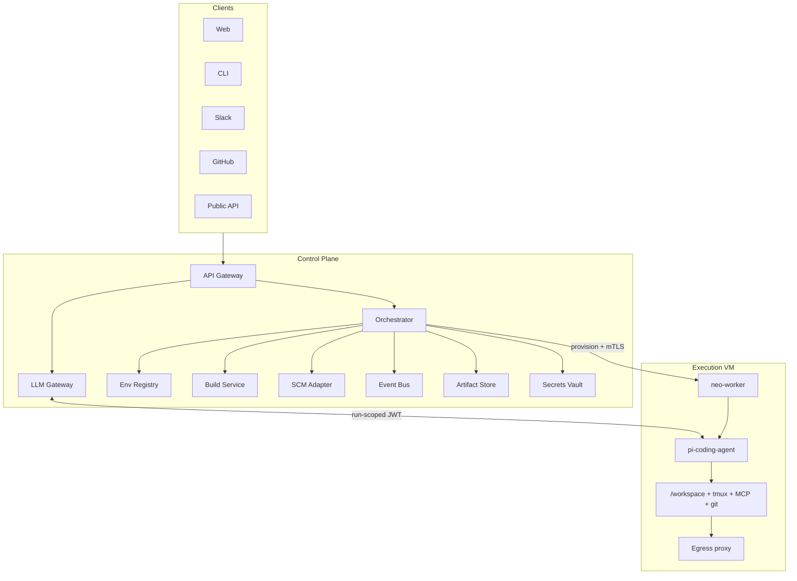
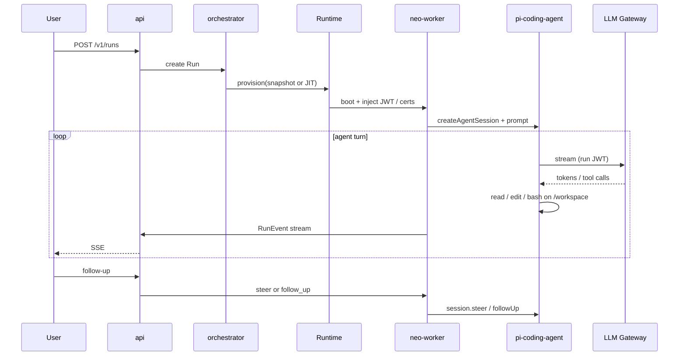

# Neo Cloud Agent 架构

对标 Cursor Cloud Agent：用户从 Web / CLI / Slack / GitHub 发起任务，控制面在云端编排一次隔离 VM 运行；**LLM 推理走云端网关**；**Agent 循环和工具执行在 VM 内**；Agent 内核使用 [pi-agent](https://github.com/earendil-works/pi)（`@earendil-works/pi-coding-agent` + `@earendil-works/pi-agent-core` + `@earendil-works/pi-ai`）。

本文是实现蓝图，不是产品文案。合约类型见 [`packages/contracts`](../packages/contracts)。

---

## 1. 目标与非目标

### 目标

| 能力 | 含义 |
| --- | --- |
| 云端推理 | Provider API Key / 自建推理集群只存在于 LLM Gateway，VM 看不到明文密钥 |
| 隔离执行 | 每个 Run 独占一台短暂 VM（或等价隔离单元），可编译、跑测试、开服务、操作浏览器 |
| pi 内核 | 不自研 Agent loop。用 pi 的 `createAgentSession`、工具、session、compaction、steer / follow-up、extensions |
| 可恢复 | Run 可跟进、可空闲挂起、可在快照上恢复；会话以 JSONL 持久化 |
| 可交付 | 在独立分支上改代码，push，开 PR，附带 artifacts |
| 可加速 | Environment Builds：后台预装依赖并打盘，新 Run 从热快照启动，而不是每次冷装 |

### 非目标（第一期不做）

- 复刻 Cursor 的 IDE、Tab、本地 sandbox
- 多租户计费的完整账务系统（先打点，后对账）
- 在控制面远程 RPC 每一个 `read` / `edit` / `bash`（延迟和带宽都会毁掉 coding agent）
- 让 VM 直连 Anthropic / OpenAI / 自建 GPU（密钥与配额会泄漏到不可信环境）

---

## 2. 一条必须先锁死的原则

**Agent loop 跑在 VM 里，不跑在控制面。**

pi-coding-agent 的默认工具是本地文件系统工具：`read` / `write` / `edit` / `bash`（可加 `grep` / `find` / `ls`）。这些调用必须在仓库旁边执行。如果把 loop 放在控制面、把工具做成跨网络 RPC：

- 每次读文件都要走控制面 ↔ VM
- bash 的交互、cwd、进程组、tmux 全部失真
- 你等于丢掉 pi，自己重写一个远程执行器

Cursor 的形态也是这个：控制面管生命周期、鉴权、模型和环境；**真正写代码、跑命令的进程在隔离机里**。

LLM「在云端」通过 **LLM Gateway** 实现，而不是把 loop 搬出 VM：

```
VM 内 pi  ──streamFn / OpenAI-compatible──►  LLM Gateway  ──►  Provider / vLLM
                 (run-scoped JWT)              (持有密钥)
```

---

## 3. 总览



三层职责：

| 层 | 信任级 | 职责 |
| --- | --- | --- |
| 控制面 | 高（你的账号体系） | 鉴权、Run 状态机、环境/Build、密钥、模型路由、SCM、事件扇出 |
| LLM Gateway | 高 | 唯一持有 Provider / GPU 凭证；计费、限流、审计、prompt cache |
| 执行面 VM | 低（按 Run 隔离） | 跑 pi、操作磁盘和进程、遵守 egress；只拿短寿命 JWT |

一次 Run 的主路径：



---

## 4. 控制面

控制面是 **少数几个无状态进程** + 托管存储（Postgres / Redis / 对象存储）。职责可以很多，Deployment 不要很多。

### 4.1 职责（先当模块，不要当仓库）

下表是控制面内部的职责边界。P0 除 LLM Gateway 外都进同一个 `control-plane` 进程；拆进程和拆仓库的规则见 [§14](#14-服务进程仓库三件不同的事)。

| 职责 | 干什么 | P0 部署在 |
| --- | --- | --- |
| `api` | 对外 REST / SSE。创建 Run、跟进、取消、拉 transcript、artifacts | `control-plane` 模块 |
| `orchestrator` | Run 状态机；向 VM 调度器下发 provision / stop / snapshot | `control-plane` 模块 |
| `env` | Environment 版本、`environment.json`、密钥绑定、egress 策略 | `control-plane` 模块 |
| `build` | 后台 Build：clone + `install` + 打盘；维护 active / draft 快照 | P0 不做；P2 先当模块 |
| `llm-gateway` | 模型代理，OpenAI-compatible + 原生 Anthropic 透传 | **独立进程** |
| `scm` | GitHub App / GitLab；短寿命 clone/push token；开 PR | `control-plane` 模块 |
| `events` | 把 VM 上报的 AgentEvent 写成 RunEvent，SSE / WS 推给客户端 | `control-plane` 模块 |
| `artifacts` | 签上传 URL；文件直传对象存储 | `control-plane` 模块 |
| `scheduler` | 空闲回收、过期、warm pool 补货、定时 Build | `control-plane` 模块 |

### 4.2 Run 状态机

```
NOT_YET_STARTED
        │ provision
        ▼
   PROVISIONING ──► INSTALLING ──► RUNNING
                        │              │
                        │              ├── follow-up 仍在跑 → RUNNING
                        │              ├── 本轮结束等用户 → IDLE
                        │              ├── 子任务未完成 → WAITING_FOR_BACKGROUND_WORK
                        │              └── 失败 → ERROR
                        ▼
                   INSTALL_FAILED → ERROR

RUNNING / IDLE ──► ARCHIVED（用户结束）
               ──► EXPIRED（TTL / 磁盘回收）
```

和 Cursor 对齐的几个语义必须保留：

- **跟进队列**：用户在 RUNNING 时发的消息进入 queue；当前 turn 仍在跑时用 pi 的 `steer` 或 `followUp`，不要另起一个 Agent 进程。
- **当前正在执行的消息不再算 queued**。
- **IDLE** 表示 VM 还在（或可从快照秒级恢复），会话文件还在，可以继续 prompt。
- **ARCHIVED / EXPIRED** 释放计算；transcript 按保留策略另存。

### 4.3 存储

| 存储 | 内容 |
| --- | --- |
| Postgres | 用户、环境、Run 元数据、Build、PR 链接、事件索引 |
| Redis | 跟进队列、live event stream、lease / lock、warm pool 索引 |
| 对象存储 | transcript 归档、artifacts、（可选）session JSONL 备份 |
| 密钥库 | SCM App 私钥、Provider Key、用户 secrets（KMS 加密） |
| 块存储 / 快照服务 | Environment Build 与 Run 磁盘快照 |

---

## 5. 执行面：VM 与 Worker

### 5.1 隔离单元

对外都叫 VM。对内用 `Runtime` 接口，方便换实现：

```
Runtime.provision(spec) → handle
Runtime.exec(handle, cmd)
Runtime.snapshot(handle) → snapshotId
Runtime.restore(snapshotId) → handle
Runtime.destroy(handle)
```

| 阶段 | 实现 | 用途 |
| --- | --- | --- |
| 开发 / 单机 | Docker / K8s Pod + gVisor | 迭代快，隔离一般 |
| 生产 | Firecracker 或 Cloud Hypervisor | 硬件级隔离，启动秒级 |
| 加速 | 块设备 CoW 快照 + warm pool | 对标 Cursor Builds：新 Run fork 热机器，而不是冷装 |

不要第一天就上 live-fork。先做「从成功 Build 的磁盘快照 boot」，再做「预热一台、clone 出多台」。接口先留好。

### 5.2 机器里有什么

```
/opt/neo/worker          neo-worker 守护进程（控制通道）
/usr/local/bin/pi        可选；生产用 SDK 嵌入，不走 CLI TUI
/workspace               仓库工作区（多仓时 /workspace/<name>）
/var/neo/sessions        pi SessionManager 的 JSONL
/var/neo/logs            setup / start / agent 日志
```

启动顺序：

1. 从 base image 或 **active Build 快照** boot
2. 注入 Run 身份：`runId`、短寿命 **control-plane mTLS cert**、**LLM Gateway JWT**、SCM token、secrets
3. 若不是 Build 启动：checkout 指定 ref，跑 `install`（必须可结束、可幂等）
4. 每次 boot 跑 `start`（Docker daemon、DB、tunnel）
5. 拉起 `terminals`（tmux 里的 dev server，agent 看得到日志）
6. 启动 `neo-worker` → 创建 `AgentSession` → 处理首条 prompt

`install` / `start` / `terminals` 的划分与 Cursor 相同，不能混：

| 字段 | 何时跑 | 放什么 |
| --- | --- | --- |
| `install` | Build 时，或冷启动时 | 装依赖、codegen、编译。必须退出。禁止在这里起长驻服务 |
| `start` | 每个 VM boot | 守护进程、Docker、恢复 ephemeral 状态。要幂等 |
| `terminals` | boot 之后 | 需要 agent 看见、能重启的前台进程 |

### 5.3 neo-worker

`neo-worker` 是 VM 内唯一和控制系统说话的进程。它**嵌入** pi，而不是让用户 SSH 进 TUI。

职责：

1. 维护到 orchestrator 的双向通道（gRPC 或 WebSocket + mTLS）
2. 用 SDK 创建 / 恢复 `AgentSession`
3. 把 pi 的 `AgentSessionEvent` 翻译成 `RunEvent` 上报
4. 接收 `prompt` / `steer` / `follow_up` / `abort` / `set_model`
5. 心跳、磁盘用量、egress 拒绝计数
6. 在策略允许时：commit、请求 scm-service 开 PR、上传 artifacts

**嵌入方式：优先 SDK，RPC 作备选。**

| 方式 | 何时用 |
| --- | --- |
| `createAgentSession()` 同进程 | TypeScript worker。类型安全，能改 `streamFn`、工具、extensions |
| `pi --mode rpc` JSONL stdin/stdout | Worker 是 Go / Rust。用 LF 分帧，不要用 Node `readline`（它会按 Unicode 分隔符切行） |

SDK 骨架：

```typescript
import {
  createAgentSession,
  ModelRuntime,
  SessionManager,
} from "@earendil-works/pi-coding-agent";

const modelRuntime = await ModelRuntime.create({
  credentials: inMemoryStore, // 禁止把 Provider Key 写到 VM 磁盘
});
await modelRuntime.setRuntimeApiKey("neo-gateway", runJwt);

const { session } = await createAgentSession({
  cwd: "/workspace",
  sessionManager: SessionManager.open(`/var/neo/sessions/${runId}.jsonl`),
  modelRuntime,
  model: gatewayModel, // api: "openai-completions", baseUrl: LLM_GATEWAY_URL
  tools: ["read", "write", "edit", "bash", "grep", "find", "ls"],
});

session.subscribe((event) => controlChannel.send(toRunEvent(event)));
await session.prompt(firstUserMessage);

// 用户跟进
channel.on("follow_up", (text) => session.followUp(text));
channel.on("steer", (text) => session.steer(text));
```

`streamFn` 可再包一层，加上 `X-Neo-Run-Id`、超时和重试。密钥仍然只出现在 Gateway。

### 5.4 网络

VM **没有**公网入站。出站全部经过 egress proxy：

| 模式 | 行为 |
| --- | --- |
| allow-all | 开发默认 |
| default + allowlist | 系统域名（Gateway、SCM、npm 等）+ 用户名单 |
| allowlist-only | 仅名单；Gateway / SCM 仍放行，否则 Run 无法推理或 push |

Git 走独立 **git egress proxy**（固定出口 IP），方便客户做 IP allowlist。Artifacts 只允许精确 bucket host，禁止 `*.s3.amazonaws.com` 这种会变成数据外带通道的通配。

---

## 6. 为什么内核是 pi，以及怎么用

pi 的分层正好对应我们要外包和要自建的边界：

```
neo-worker / 云扩展          ← 你写：控制通道、Git/PR、MCP、egress 感知
        │
pi-coding-agent              ← 会话、read/write/edit/bash、skills、extensions、compaction
        │
pi-agent-core                ← loop、tool execution、steer/followUp、事件
        │
pi-ai                        ← 多 Provider 流式、用量、自定义 baseUrl
```

### 6.1 直接复用

- Agent loop、工具执行、streaming 事件
- `steer` / `followUp`（对标云端跟进队列）
- `SessionManager` JSONL（可分支、可恢复）
- `compact()` 与自动重试
- Extensions / Skills / Prompt Templates（团队能力用包分发，不改 fork pi）
- `ModelRuntime` + `InMemoryCredentialStore`（运行时 JWT，不落盘）

### 6.2 你们必须自建（pi 不管）

- VM 供给、快照、warm pool
- 多租户鉴权、配额
- LLM Gateway 与账单
- SCM / PR
- 环境 Builds
- 客户端与 transcript 存储
- Egress、密钥分级、审计

### 6.3 云扩展（pi Package，装在 VM 镜像里）

用 `pi.registerTool` / hooks，不要改 pi 源码：

| 扩展 | 作用 |
| --- | --- |
| `neo-git` | 受控 commit；签名和 push 走 scm-service，不把长期 token 给 bash |
| `neo-pr` | 请求控制面开/更新 PR |
| `neo-mcp` | 按环境配置拉起 HTTP/stdio MCP；OAuth token 由控制面注入 |
| `neo-browser` | 可选：headed browser / computer-use sidecar |
| `neo-artifact` | 截图、录屏上传 artifact-service |
| `neo-diag` | 给 agent 看本 Run 的 setup 日志、egress 拒绝、环境版本（对标 Cursor Cloud MCP） |

策略类拦截（禁止 `curl` 外带、禁止读 `/opt/neo/worker` 证书）用 extension 的 tool hook，而不是改 `bash` 实现。

### 6.4 系统提示

用 `DefaultResourceLoader` 的 `systemPromptOverride` 注入云端约束：工作区路径、分支命名、禁止交互式 sudo、密钥重写规则、完成后必须验证。仓库里的 `AGENTS.md` / `.pi/skills` 仍然由 loader 发现，这样本地 pi 和云端行为接近。

---

## 7. LLM Gateway

Gateway 是「推理在云端」的落点。VM 把它当成一个 OpenAI-compatible（或 Anthropic-compatible）的 `baseUrl`。

```
pi-ai streamSimple
    → https://llm.<cluster>/v1/chat/completions
    → Authorization: Bearer <run JWT>
    → Gateway: 验 JWT、配额、选路由、打点
    → Provider SDK / 内部 vLLM
```

必须具备：

1. **Run-scoped JWT**：`runId`、`orgId`、`model`、过期时间；VM 重启就轮换
2. **模型目录**：对外稳定 id（`neo/sonnet`），对内映射到 Claude / GPT / 自建
3. **Prompt cache**：把 pi 的 `sessionId` 映射到 Anthropic cache / OpenAI cached input
4. **用量**：input / output / cache read-write，按 Run 聚合
5. **审计**：可选存 prompt/response（隐私模式关闭）；隐私模式只存 token 计数
6. **熔断**：Provider 挂了按策略换模型，并写成 RunEvent
7. **自建推理**：同一接口后面可以是 vLLM / SGLang，不必改 worker

Gateway **不**执行工具，**不**看见整个磁盘。它只看见 pi 送出的 messages + tool schemas。

---

## 8. 环境与 Builds

环境是「这台开发机应该长什么样」，Run 是「在某个环境版本上执行一次任务」。

### 8.1 配置源（优先级从高到低）

1. 仓库 `.neo/environment.json`（或兼容读取 `.cursor/environment.json`）
2. 用户保存的 Environment
3. 团队默认 Environment

`environmentJsonPath` 有值 = repo-managed；为空 = DB-managed。不要两种同时改还指望合并。

### 8.2 Schema（核心字段）

```json
{
  "snapshot": "snap_base_ubuntu_node22",
  "install": "pnpm install --frozen-lockfile",
  "start": "sudo dockerd >/var/neo/logs/docker.log 2>&1 &",
  "terminals": [
    { "name": "web", "command": "pnpm dev" }
  ],
  "repos": ["github.com/acme/app", "github.com/acme/lib"],
  "egress": { "mode": "allowlist", "domains": ["registry.npmjs.org"] }
}
```

### 8.3 Build 流水线

```
trigger (保存环境 / 定时 / 手动 / agent 请求)
    → 从 base snapshot 开一台 Build VM
    → clone 环境内每个 repo 的 default branch（或 refs 覆盖）
    → 跑 install 至结束
    → 打盘 → snapshotId
    → SUCCEEDED 的 latest 标为 active（draft 永不自动激活）
    → warm pool 按 active 预热 N 台
```

新 Run：

1. 有 active Build：从快照（或热机器 fork）启动，**不再跑 install**
2. 没有：JIT：base + clone + install（慢，仅兜底）

失败的新 Build 不影响正在用的 active。这是 fleets 能扛住「有人提交了坏 lockfile」的原因。

用户 secrets **不**进 Build；只有 build secrets（私有 npm）进。Runtime secrets 在 agent boot 时注入，并在 transcript / 工具输出里打码。

---

## 9. 会话、跟进、事件

### 9.1 两份日志

| 日志 | 位置 | 用途 |
| --- | --- | --- |
| pi session JSONL | VM `/var/neo/sessions/<runId>.jsonl` | pi 恢复上下文、compaction、树分叉 |
| RunEvent / transcript | 控制面（Redis 热、对象存储冷） | UI、审计、跨设备打开 |

worker 在 `message_end` / `tool_execution_end` / `agent_end` 时把规范化事件推上去。不要让 UI 直接读 VM 磁盘。

### 9.2 跟进如何接到 pi

| 用户动作 | 控制面 | worker → pi |
| --- | --- | --- |
| Run 空闲时发消息 | 直接下发 | `session.prompt(text)` |
| Run 正在流式，用户要改方向 | 标记 steer | `session.steer(text)` 或 `prompt(..., { streamingBehavior: "steer" })` |
| Run 正在流式，用户要「做完再做」 | 入 follow-up 队列 | `session.followUp(text)` |
| 取消 | abort | `session.abort()` |

这和 pi SDK 的语义一一对应，不要再写第二套队列执行器。控制面队列只解决：**VM 还没 ready、或 worker 暂时断线时把用户消息存住**。

### 9.3 事件（给 UI / 仪表盘）

规范化事件见 `packages/contracts` 的 `RunEvent`。至少覆盖：

- 生命周期：`run.provisioning` / `run.install_*` / `run.running` / `run.idle` / `run.error`
- Agent：`agent.start` / `message.delta` / `message.end` / `tool.start` / `tool.update` / `tool.end`
- 系统：`mcp.auth_error`、`egress.denied`、`build.used`、`followup.queued`

---

## 10. SCM 与交付

```
创建 Run
  → scm-service 用 GitHub App 签短寿命 token
  → VM clone（Build 已带代码则 fetch + checkout）
  → neo-worker 建分支  neo/<slug>-<shortid>
  → agent 改代码、自测
  → 受控 git commit（可选 HSM / 服务端签名）
  → push
  → scm-service 开 draft PR，正文由 agent 写，元数据由控制面附加
```

原则：

- 长期 SCM 凭证不过 VM 磁盘、不进环境变量明文（用文件描述符或 localhost token broker，用完即废）
- 用户在 UI 上看到的 diff 以 `git diff` + 控制面缓存为准
- 多仓环境：每个被改的 repo 各自开 PR，Run 上记一组 `PullRequestRef`

---

## 11. 安全模型

假设 VM 会被 prompt injection 拿下。设计按这个前提做。

| 威胁 | 对策 |
| --- | --- |
| 偷 Provider Key | Key 只在 Gateway；VM 只有 JWT |
| 外带源代码 | Egress allowlist；禁止宽泛 S3 wildcard；git 只走 proxy |
| 密钥进 transcript / commit | Runtime secret 在工具输出和 git hook 里替换为 `[REDACTED]` |
| 逃逸到宿主机 | Firecracker + jailer；每个 Run 独立网桥和盘 |
| 横向访问其他 Run | 控制通道按 `runId` 鉴权；对象存储路径隔离 |
| 供应链 | Worker 与 pi 版本钉死在镜像；extensions 只装签名/内部 registry |
| 身份冒用云资源 | 短寿命 OIDC（VM 本地 socket 签发），不要长期云 AK |

密钥分三级，对齐 Cursor：

1. **Environment variable**：agent 可以看见（feature flag、公共 URL）
2. **Runtime secret**：进程环境里有，模型看见的输出被打码
3. **Build secret**：只在 Build 的 `install` / Docker build，不进正式 Run

---

## 12. 核心数据模型

```
Org 1──* Environment 1──* EnvironmentVersion 1──* Build
                                              └── snapshotId, status
User 1──* Run
Run
  id, orgId, envId, envVersionId, buildId?
  status, setupStatus
  source: web | cli | slack | github | api | automation
  model, branchName, repoUrls[]
  workerHandle, llmJwtJti
  createdAt, idleAt, expiresAt
Run 1──* FollowUp (queued | delivered | cancelled)
Run 1──* RunEvent
Run 1──* Artifact
Run 1──* PullRequestRef
```

`Build.status`: `IN_PROGRESS | SUCCEEDED | FAILED | CANCELLED | SKIPPED`  
`Run.setupStatus`: `INSTALL_STARTED | INSTALL_SUCCEEDED | INSTALL_FAILED | null`

---

## 13. 对外 API（最小集）

```
POST   /v1/runs                  创建并开始
GET    /v1/runs/:id
POST   /v1/runs/:id/follow-ups   空闲 prompt / 运行中 steer|follow_up
POST   /v1/runs/:id/abort
POST   /v1/runs/:id/archive
GET    /v1/runs/:id/events       SSE
GET    /v1/runs/:id/transcript
GET    /v1/runs/:id/artifacts

GET    /v1/environments
POST   /v1/environments/:id/builds
GET    /v1/builds/:id
GET    /v1/builds/:id/logs
```

内部（VM → 控制面，mTLS）：

```
Worker.Register / Heartbeat / PushEvents
Worker.FetchSecrets
Worker.MintLlmToken          轮换 JWT
Worker.RequestGitToken
Worker.OpenPullRequest
Worker.UploadArtifact
```

内部（控制面 → VM）：

```
Worker.Prompt / Steer / FollowUp / Abort / SetModel / Shutdown
```

---

## 14. 服务、进程、仓库：三件不同的事

**模块 ≠ 进程 ≠ 仓库。** 上一节列的 `env-service` / `scm-service` 是职责边界，不是「开 8 个 GitHub repo、8 个 Deployment」。

| 概念 | 数量（P0） | 数量（成熟期） | 是什么 |
| --- | --- | --- | --- |
| Git 仓库 | **1** | 1，偶尔 2 | 代码怎么管 |
| 可部署进程 | **2 + worker 镜像** | 3～4 + worker 镜像 | 运行时怎么扩 |
| 逻辑模块 | 4～6 个 package | 8～10 个 package | 代码怎么分层 |

### 14.1 用一个 monorepo

就用本仓库 `neo-cloud-agent`。pnpm / npm workspaces 管 package。

理由：

1. **合约会一起变。** `RunEvent`、Worker RPC、LLM JWT 一改，api / gateway / worker 必须同 PR 升级，多仓会先出现协议漂移。
2. **worker 不是独立产品。** 它随控制面版本发布，打进 VM 镜像；单独仓库只会让「控制面 v12 配 worker v7」成为常态。
3. **pi 本身就是 monorepo。** 你们的差异化在编排，不在再发明一套跨仓发布。

不要为「微服务干净」拆仓。以后只有两类东西才值得考虑第二个仓库：

| 第二个仓 | 何时才拆 | 为什么 |
| --- | --- | --- |
| `neo-vm-images` | 镜像构建（Packer / Firecracker rootfs）把应用 CI 拖到 30 分钟以上 | 构建节奏和权限与应用不同 |
| 公开 extension 注册表 | 第三方要独立发 pi package | 那是生态，不是内核 |

**永远不要拆出去的：** `packages/contracts`。它是协议，不是服务。

### 14.2 可部署进程只要这些

控制面里的「服务」先当 **同一个进程里的模块**。真正需要单独进程的，只有密钥边界和重活。

```
P0（先上这 3 个部署物）

  ┌─────────────────────────────┐
  │  control-plane  (1 进程)    │  api + orchestrator + env + events
  │                             │  + scm + artifacts + scheduler（都是模块）
  └──────────────┬──────────────┘
                 │
  ┌──────────────┴──────────────┐
  │  llm-gateway  (1 进程)      │  唯一持有 Provider Key；独立扩缩、独立审计
  └─────────────────────────────┘

  ┌─────────────────────────────┐
  │  worker 镜像                │  不是集群里的长驻服务
  │  neo-worker + pi + 扩展     │  每个 Run 起一份，随 VM 生灭
  └─────────────────────────────┘
```

| 部署物 | 为什么独立 | 为什么不要再拆 |
| --- | --- | --- |
| `control-plane` | 对外 API、状态机、调度 | env / scm / event 此时是函数调用，不是网络 hop |
| `llm-gateway` | **密钥隔离** + 按 token 扩缩 + 审计面单独 | 这是唯一值得 P0 就拆进程的服务 |
| `worker` 镜像 | 跑在不可信 VM，攻击面不同 | 每个 Run 一份，不要做成集群 Deployment |

P2 以后，**最多再拆 1 个进程**：

| 部署物 | 何时拆出去 | 信号 |
| --- | --- | --- |
| `build-worker` | Build 开始抢 control-plane CPU / 磁盘 | `install` 跑十几分钟、队列堵了创建 Run |

再往后才考虑把 webhook 量大的 `scm-ingress` 或对象上传的 `artifact-service` 拆出去。那是流量问题，不是架构正确性问题。

**不要做成独立进程的：** Postgres、Redis、对象存储用托管。egress proxy / git proxy 是基础设施（Envoy / squid / 自建小代理），不是业务仓库。

### 14.3 monorepo 目录（模块，不是服务）

```
neo-cloud-agent/                  ← 唯一应用仓库
  docs/
  packages/
    contracts/                    类型与协议（被所有进程 import）
    control-plane/                打成一个二进制 / 一个容器
      src/api/
      src/orchestrator/
      src/env/
      src/scm/
      src/events/
      src/runtime/                Docker 先，Firecracker 后
    llm-gateway/                  打成第二个容器
    worker/                       打进 VM / 任务容器镜像
    extensions/                   打进同一张 worker 镜像
  infra/                          compose、helm、镜像配方（先放这里）
  .neo/environment.json
```

P0 只写四个 package：`contracts`、`control-plane`、`llm-gateway`、`worker`。`orchestrator` / `scm` 是 `control-plane` 的目录，不是新仓库，也不是新 Deployment。

### 14.4 和「微服务清单」的对照

| 架构里的职责 | P0 落在哪 | 以后 |
| --- | --- | --- |
| api | `control-plane` 模块 | 仍在这里 |
| orchestrator | `control-plane` 模块 | 仍在这里 |
| env-service | `control-plane` 模块 | 仍在这里 |
| event-service | `control-plane` + Redis | 仍在这里 |
| scm-service | `control-plane` 模块 | webhook 爆炸再拆 ingress |
| artifact-service | `control-plane` 签 URL，上传直传对象存储 | 几乎永远不必成服务 |
| scheduler | `control-plane` 里的 cron 协程 | 仍在这里 |
| build-service | P0 不做；P2 先当模块 | 变重再拆 `build-worker` |
| llm-gateway | **独立进程** | 一直独立 |
| neo-worker | **镜像，不是服务** | 一直是镜像 |

### 14.5 版本怎么发

一个 git SHA 产出三件东西，一起打 tag（例如 `2026.08.21+2e5ceab`）：

1. `control-plane` 镜像
2. `llm-gateway` 镜像
3. `worker` 镜像（或 Firecracker rootfs）

Orchestrator 创建 Run 时写下 `workerImageDigest`。不要让「控制面最新、worker 随便」组合上线。合约变更必须同版本滚动。

---

## 15. 分阶段落地

按依赖排序，不按日历估时。

### P0 — 能跑通一个任务

- 仍是 **1 个仓库**；只发 **2 个控制面容器 + 1 张 worker 镜像**
- Docker Runtime，一容器 = 一 Run
- `packages/worker` 嵌入 `createAgentSession`
- `packages/llm-gateway`（先只接一个 Provider，JWT 鉴权）
- `packages/control-plane`：`POST /v1/runs` + SSE，并托管 `packages/web` 对话页
- 手工 mount 一个 git repo，不做 PR

验收：对一个玩具仓库说「加个 README 并跑测试」，UI 能流式看到 bash / edit。

### P1 — 像云端 Agent

- SCM clone + 分支 + commit + draft PR
- 跟进队列 ↔ `steer` / `followUp`
- `environment.json` 的 `install` / `start` / `terminals`
- Secrets + transcript 打码
- Session JSONL 备份到对象存储，IDLE 后可恢复

### P2 — 像 Cursor 的环境系统

- Build 流水线 + 磁盘快照 + active/draft
- Egress 三模式
- Warm pool（先「预创建容器」，再上 Firecracker）
- MCP 扩展、artifacts

### P3 — 生产隔离与规模

- Firecracker / Cloud Hypervisor
- 块设备 CoW、失败 Build 不影响 fleets
- 多仓、自动化（cron / GitHub webhook）、OIDC
- 子 Agent：用 pi 的自定义 tool 再开一个同镜像 worker（不要让 loop 回控制面）

---

## 16. 与 Cursor Cloud Agent 的对照

| Cursor | Neo | 实现要点 |
| --- | --- | --- |
| 隔离 Linux VM | Execution Runtime | 先 Docker，后 Firecracker |
| `.cursor/environment.json` | `.neo/environment.json` | 字段兼容，便于迁移 |
| Builds + warm fork | `build-service` + snapshot | 先冷快照，后热 fork |
| 模型在云端 | LLM Gateway | VM 无 Provider Key |
| 跟进队列 | Redis + pi `steer`/`followUp` | 不要自研第二套 loop |
| Cloud MCP | `neo-diag` extension | 动态工具，不必改 pi |
| MCP / Hooks | pi extensions + 可选 hooks 目录 | |
| Artifacts / 远程桌面 | artifact-service + 可选 sidecar | 桌面可后置 |
| GitHub / Slack / API | `api` + `scm` + 适配器 | 同一 Orchestrator |
| Agent 内核（自研） | **pi-coding-agent** | 这是唯一故意不对齐的地方 |

不对齐是优点：pi 已经有 SDK、RPC、session、extensions。你们的差异化在 **编排、环境和安全**，不在再写一遍 tool loop。

---

## 17. 明确不做什么

1. **不要 fork pi 来加云功能。** 云功能全部走 worker + extension。
2. **不要把 Provider Key 写进 VM 的 `auth.json`。** 只用 `InMemoryCredentialStore` + 运行时 JWT。
3. **不要在 `install` 里起 dev server。** 快照不会保存进程。
4. **不要让 bash 直接 `git push` 带长期 token。** push 经 scm-service。
5. **不要为了「推理在云端」把 Agent 放控制面。** 推理走 Gateway 即可。

---

## 18. 建议的下一步实现顺序

合约已经放在 `packages/contracts`。下一刀代码建议是（仍在本 monorepo）：

1. `packages/llm-gateway`：JWT + 单一 Provider 的流式代理（独立进程）
2. `packages/worker`：上述 `createAgentSession` 骨架 + 事件上报（打进任务镜像）
3. `packages/control-plane` + `docker compose`：一个进程对外 `POST /v1/runs`，SSE 看输出

这三块通了，后面换 Firecracker 只换 Runtime，不换 Agent，也不拆仓。
