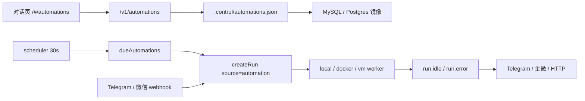

# 定时任务：现状

对话页顶栏「定时任务」（`/#/automations`）背后的能力。到期后控制面开一条**新** Run，`source` 为 `automation`。不是跟进旧对话，也不是项目看板。

调研对照见 [workbuddy-project-collaboration.md](./workbuddy-project-collaboration.md)。本文只写**已经落地的行为**。

---

## 1. 一句话

整站一份 cron 列表。控制面每 30 秒扫到期项，调用 `createRun({ prompt, repoUrls, source: "automation" })`。做完可推 Telegram / 企微 / HTTP；微信公众号和 Telegram 反过来也能不登录就开对话。



---

## 2. 现在能做什么

| 能 | 不能 |
| --- | --- |
| 每 N 分钟 / 每天 / 每周到点开**新**对话 | 跟进上一次那条 Run |
| 暂停、删除、看上次 Run | 按用户或项目隔离任务 |
| 任务自己带 `repoUrls`；空则用通知里的默认仓库 | 挂到某个 `projectId` |
| 上一轮还在 `PROVISIONING` / `INSTALLING` / `RUNNING` 就跳过，只把 `nextRunAt` 往后推 | 并发队列、失败重试策略 |
| 做完通知（站点级，不是按任务配） | 每个任务不同的通知人 |
| Telegram / 微信公众号发一句开新 Run（免登录） | 企微收任务（企微只出站） |

上限 **20** 条。列表是**整站一份**：登录用户都能 `GET /v1/automations`，没有 `userId`。

定时任务跑出来的 Run 走 `createRun` 的默认 owner（`DEFAULT_USER_ID` / `org_local`），**不记是谁建的任务**。账号隔离打开时，这些对话通常只出现在默认用户名下。

---

## 3. 数据

类型在 [`packages/contracts/src/automation.ts`](../packages/contracts/src/automation.ts)。

```ts
type Automation = {
  id: string;                 // auto_<8 hex>
  name: string;               // 空则截 prompt 前 24 字
  enabled: boolean;
  prompt: string;
  repoUrls: string[];
  schedule: AutomationSchedule;
  nextRunAt: string;          // ISO
  lastRunAt: string | null;
  lastRunId: string | null;
  lastError: string | null;
  createdAt: string;
  updatedAt: string;
};

type AutomationSchedule =
  | { kind: "every"; minutes: number }                    // 5 … 43200
  | { kind: "daily"; hour: number; minute?: number }      // 上海墙钟
  | { kind: "weekly"; weekday: number; hour: number; minute?: number }; // 1=周一 … 7=周日
```

每天 / 每周按 **UTC+8 墙钟**算下次时间，不用宿主本地时区。`every` 是「从现在起再过 N 分钟」，不是对齐整点。

对话页四个预设，写死在 [`AutomationsPage.tsx`](../packages/web/src/components/AutomationsPage.tsx)：

| 文案 | schedule |
| --- | --- |
| 每小时 | `{ kind: "every", minutes: 60 }` |
| 每 6 小时 | `{ kind: "every", minutes: 360 }` |
| 每天上午 9 点 | `{ kind: "daily", hour: 9 }` |
| 每周一上午 9 点 | `{ kind: "weekly", weekday: 1, hour: 9 }` |

API 仍接受任意合法 schedule；UI 没有自定义分钟/钟点。

---

## 4. 调度

[`startScheduler`](../packages/control-plane/src/scheduler/scheduler.ts) 在控制面进程里 `setInterval(30_000)`，同时补 Environment 热池。`NODE_TEST_CONTEXT` 下不跑自动化。

[`fireDueAutomations`](../packages/control-plane/src/automations/runner.ts)：

1. `enabled && nextRunAt <= now`
2. 若 `lastRunId` 仍在 provision / install / running：只改 `nextRunAt`，本轮不新建
3. 否则 `createRun`；成功写 `lastRunId` / `lastRunAt`，清空 `lastError`
4. 失败把错误写进 `lastError`，**仍然**把 `nextRunAt` 推到下一拍，避免死循环打满槽

没有分布式锁。多实例控制面会重复开火。现网是单进程 systemd，开发是单份 `pnpm dev`。

---

## 5. 持久化

热路径是文件，SQL 是镜像，重启先灌 SQL：

| 层 | 位置 |
| --- | --- |
| 权威热数据 | `$RUNS_DIR/.control/automations.json`（`version: 1`） |
| 镜像 | `automations(id, body JSON, updated_at)`，MySQL / Postgres 同形 |
| 启动 | `hydrateAutomationsFromStore`：库里有记录则 `replaceAutomations`（不再回写）；库空则把文件灌进库 |

写入走 `automationPersistHooks().onWrite`，在 [`platform.ts`](../packages/control-plane/src/platform.ts) 里挂上 `mirrorAutomations`（增删按 id 对齐）。

没设 `DATABASE_URL` 时只靠 JSON，进程重启不丢，换机就丢。

---

## 6. HTTP

都要登录（匿名 401）。`GET` 列表不按用户过滤。

| 方法 | 路径 | 作用 |
| --- | --- | --- |
| `GET` | `/v1/automations` | 全站列表 |
| `POST` | `/v1/automations` | 创建 |
| `POST` | `/v1/automations/:id` | 改 name / prompt / repoUrls / enabled / schedule |
| `POST` | `/v1/automations/:id` + `{ delete: true }` | 删除（没有 DELETE） |

`GET /health` 带 `automations` 计数，以及 `notify` 各通道是否已配。

---

## 7. 通知和 IM 入口（同页、另一条线）

定时任务页下半是「做完通知 / 发任务」。密钥在 `.neo/notify.env`（gitignore），环境变量优先，见 [`notify/settings.ts`](../packages/control-plane/src/notify/settings.ts)。

| 通道 | 进站（开 Run） | 出站（做完推） |
| --- | --- | --- |
| Telegram | `POST /webhooks/telegram`，`source: telegram` | Bot `sendMessage` |
| 微信公众号 | `GET/POST /webhooks/wechat`，`source: wechat` | 无（只回「已收到」XML） |
| 企业微信机器人 | 无 | webhook text |
| HTTP | 无 | JSON `{ text, runId, status, kind, prompt }` |

出站由 [`notifyRunFinished`](../packages/control-plane/src/notify/dispatch.ts) 在 Run 进 IDLE 或 ERROR 时触发，**所有** Run 共用，不限 `source: automation`。同一 Run 15 秒内合并。正文带 `PUBLIC_APP_URL/#/runs/:id`（没配公网 URL 就没有链接）。

Telegram 第一次私聊会记住 `chatId`。进站 Run 的仓库只有通知里的 `NOTIFY_DEFAULT_REPO`。

---

## 8. 代码入口

| 文件 | 职责 |
| --- | --- |
| `packages/contracts/src/automation.ts` | 类型、解析、上海墙钟、下次时间 |
| `packages/control-plane/src/automations/store.ts` | JSON 列表，上限 20 |
| `packages/control-plane/src/automations/runner.ts` | 到期开火 |
| `packages/control-plane/src/scheduler/scheduler.ts` | 30s tick |
| `packages/control-plane/src/api/server.ts` | `/v1/automations*`、`/webhooks/*` |
| `packages/control-plane/src/ingress/chat.ts` | Telegram / 微信进站 |
| `packages/web/src/components/AutomationsPage.tsx` | 顶栏页 |

---

## 9. 已知缺口

- 没有 `userId` / `projectId`：不能「这个项目每天巡检」，任务 Run 也不进项目空间。
- 没有 owner：任务 Run 落在默认用户上，和「谁点的添加」无关。
- 单进程假设：多副本会双发。
- UI 不能改自定义 cron，不能按任务选仓库（创建时拷当时的默认仓库）。
- 失败只记 `lastError`，下一拍照跑，没有 backoff。
