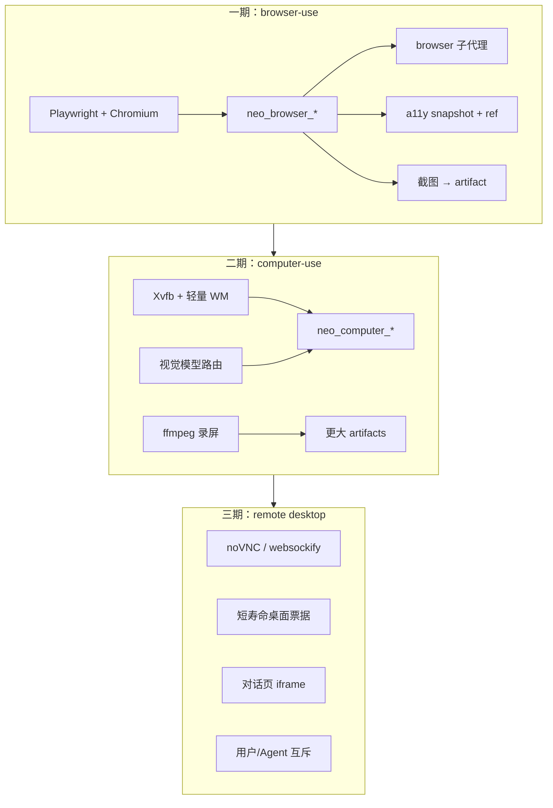

# Browser-use 与 Computer-use 调研

对标 Cursor Cloud Agent 的「自己开浏览器点 UI、自己操作桌面、交出截图/录屏、用户可接管远程桌面」。本文回答：**Neo 现在差什么、不要怎么做、按现网约束该怎么分期落地**。实现蓝图仍以 [architecture.md](./architecture.md) 为准：Agent loop 留在 worker，云功能走 `packages/extensions`，不 fork pi。

**结论先说：** 不要在现网 4C/4G 轻量机上一次性复刻 Cursor 整桌面。先做 **Playwright 无头浏览器 + 无障碍树（a11y snapshot）**，用已有的 `neo_subagent` 挂一个 `browser` 子代理；像素级 computer-use 和用户接管桌面后置。`neo_browse` 继续留给静态文档抓取。

---

## 1. Cursor 实际卖的是四件事，不是一个工具

公开文档（[capabilities](https://cursor.com/docs/cloud-agent/capabilities.md)、[公告](https://cursor.com/blog/agent-computer-use)）和本仓库自己作为 Cursor Cloud Agent 跑过的形态，可以拆成四层。混在一起做会同时踩内存、视觉模型和 Caddy WebSocket。

| 层 | Cursor 在做什么 | 用户感知 |
| --- | --- | --- |
| **Browser-use** | 隔离 VM 里有真实浏览器；Agent 能开本机 dev server、点按钮、填表、走 UI | 「改完前端自己验证」 |
| **Computer-use** | 整台虚拟桌面：鼠标、键盘、任意窗口，不限于网页 | 「像人一样用这台电脑」 |
| **Artifacts** | 截图、录屏、日志挂到对话和 PR | 「不用 checkout 也能看它测过」 |
| **Remote desktop** | 用户接管 Agent 的桌面，再交还控制权 | 「在它的环境里自己点一点」 |

Cursor 本地 IDE 的 browser-use 和云端不是同一套：本地多半是 Playwright / MCP / 应用内浏览器；云端是 **每 Run 一台带桌面的 VM**。Neo 对标的是后者。

本仓库作为 Cursor Cloud Agent 时，主循环 **并不** 把二十个 `browser_*` 工具摊在主 Agent 上，而是：

1. 主 Agent 写代码、起服务、用 `Task(computerUse)` 把 GUI 验证交给专职子代理。
2. 子代理有自己的浏览器/桌面工具，有状态，可续跑。
3. `RecordScreen` 是宿主侧能力，不是模型自己 `ffmpeg`。
4. 截图/视频走独立 artifacts 目录，对话里用标签引用，不把二进制塞进 transcript。

Neo 已经有对位零件：`neo_subagent`、`neo_artifact_upload`、SSE transcript。缺的是 **执行面里的浏览器/桌面 sidecar**，以及把截图送回模型的视觉通路。

---

## 2. Neo 今天有什么

| 能力 | 现状 | 关键路径 |
| --- | --- | --- |
| 静态网页 | `neo_browse`：`fetch` + 正则剥 HTML，约 8KB 文本 | `packages/extensions/src/neo-browser.ts` |
| 产物 | 工作区文件 → `POST /internal/runs/:id/artifacts`，上限 **1.5MB** | `packages/control-plane/src/artifacts/artifacts.ts` |
| 对话预览 | 图片 artifact 可 inline；工具卡只渲染文本 | `packages/web/src/components/Transcript.tsx` |
| 用户贴图 | 存到 `.neo/inbox-images/`，**只在 prompt 里写路径**，不进模型视觉 | `packages/worker/src/images.ts` |
| 模型声明 | pi 注册 `input: ["text", "image"]` | `packages/worker/src/session.ts` |
| 默认模型 | `deepseek-v4-flash` / `deepseek-v4-pro`，**文本模型** | `packages/contracts/src/llm-ids.ts` |
| MCP | HTTP/stdio，结果抽成文本；图片 content 被丢掉 | `packages/extensions/src/neo-mcp.ts` |
| 工具回传 | `CloudToolResult` 只有 `content: string`；事件再裁到 8KB | `packages/extensions/src/types.ts`、`packages/worker/src/events.ts` |
| Worker 镜像 | `node:22-bookworm-slim` + bash/git，**无 Chromium / X11 / VNC** | `infra/Dockerfile.worker` |
| 现网运行时 | `WORKER_RUNTIME=vm`，无 Docker、无 KVM，2 个 loop 槽；默认堆 **512MiB** | 轻量 4C/4G；`packages/control-plane/src/config.ts` |
| Egress | 只拦 `globalThis.fetch`，拦不住 Chrome 自己出站 | `packages/worker/src/egress.ts` |
| 架构预留 | P2「headed 桌面未做」；P3 下一步第 5 条就是 sidecar | `docs/architecture.md` §15 / §18 |

`neo_browse` 对文档页够用，对 SPA、登录墙、本机 `localhost:8080` 聊天页、点击/填表 **不够**。Scout 子代理现在只带 `neo_browse`，没有 bash，这是对的，不要让它去 `curl`。

---

## 3. 现网硬约束（先决定形态）

北京轻量应用机（`62.234.211.200`，4C/4G/40G，无 Docker / 无 KVM）是第一落地环境。设计必须围着它转，而不是围着「理想 Firecracker 桌面」转。

| 约束 | 含义 |
| --- | --- |
| 4G 内存、2 个 worker 槽 | Chrome 单独常见 300–800MiB；再加 XFCE/noVNC/录屏，双槽会 OOM |
| 默认 `WORKER_MEMORY_MIB=512`（vm） | 开浏览器的 Run 至少要 1536–2048，且建议 **同时只跑 1 个带浏览器的槽** |
| 无 Docker | Chromium 不能「只写进 Dockerfile」；loop/local worker 要在 **宿主机** 装浏览器依赖 |
| 无 KVM | 现网不是微 VM 桌面；computer-use 若上，也是宿主机 Xvfb，隔离弱一档 |
| Artifact 1.5MB | 压缩 JPEG 截图勉强；**录屏必须另做分块/直传** |
| 工具事件 8KB | 截图不能走 `tool.end` 文本；要走 artifact URL 或单独视觉 part |
| Egress 只拦 fetch | Playwright/Chrome 必须走代理或 `page.route`，否则 allowlist 被绕过 |
| 默认 Flash 无视觉 | 像素点选依赖视觉模型；2026-08-21 DeepSeek 才出实验模型 `deepseek-v4-flash-vision-exp` |

因此：**一期必须能在「无视觉模型 + 无桌面 + 有限内存」下工作。** 这正好是 Playwright MCP 的 a11y snapshot 路线，不是 Anthropic computer-use 的截图+坐标路线。

---

## 4. 业界三条路

### A. 结构化浏览器（推荐一期）

[Playwright MCP](https://github.com/microsoft/playwright-mcp) 是 2026 年 Agent 驱浏览器的主流面：

1. `browser_snapshot` 给出无障碍树（角色、名字、`ref=e5`）。
2. `browser_click` / `browser_type` 用 **ref**，不用 CSS/XPath。
3. 可选截图，给人和视觉模型看，不作为主控制环。

优点：不依赖视觉模型（现网 Flash 就能用）；比坐标点击稳；比整页 HTML 省 token；能跑 JS 渲染的 SPA 和本机 dev server。  
缺点：canvas/WebGL/验证码仍然要截图；不是「整台电脑」。

### B. 像素桌面（二期）

Anthropic Computer Use / OpenAI CUA：Xvfb + 轻量 WM，循环是 **截图 → 模型点坐标 → xdotool**。Cursor 云端宣传的「mouse and keyboard on a full desktop」属于这一族。

优点：任何 GUI（Electron、系统对话框、非网页）都能点。  
缺点：要视觉模型；每步一张图，贵且慢；坐标对分辨率敏感；内存和镜像都重。现网默认 Flash **做不了** 主环。

### C. 把浏览器租出去

Browserbase / Steel / Kernel 等托管浏览器。4G 机最省事，但密钥、延迟、费用、工作区 `localhost` 都麻烦。本机验证（控制面 `:8080`、worker 里起的 app）是 Neo 的主场景，**不适合作为默认**。外网爬站可以以后当 opt-in。

**选型：一期 A，二期 B（opt-in），C 不当产品默认。**

不要把 `@playwright/mcp` 经现有 `neo_mcp_*` 当成产品方案。MCP 仍要本机 Chromium；`neo_mcp` 丢掉图片 content；二十个 `browser_*` 会污染主 Agent 工具表；egress / artifact / 系统提示都接不上。MCP 只保留为开发机逃生口。

---

## 5. 推荐分期



### 一期（该先做）：无头/有头 Chromium + a11y

目标：Agent 改完 Web UI 后，能打开 `http://127.0.0.1:8080`、登录、点击、读页面状态、交截图。

### 二期：像素 computer-use + 录屏

目标：非网页 GUI、视觉回归、walkthrough 视频。默认关，按环境打开。

### 三期：用户接管桌面

目标：对话页嵌远程桌面。架构 §16 已写「桌面可后置」。要 Caddy WebSocket、鉴权票据、和 Agent 抢鼠标的互斥。现网 4G 上不要当默认。

---

## 6. 一期详细设计

### 6.1 进程与生命周期

浏览器会话 **跟 Run 走**，不跟控制面走。符合「loop 在 VM 里」。

```
neo-worker (pi)
  └─ BrowserSession（Playwright，每 Run 一个 Chromium）
        ├─ 导航 / snapshot / click / type
        ├─ page.route + egress-check
        └─ screenshot → 工作区 .neo/browser/ + neo_artifact_upload
```

- **local / vm（现网）**：宿主机装 Chromium + Playwright 依赖；worker 进程内起浏览器。无 Docker，不能只改镜像。
- **docker / firecracker**：`infra/Dockerfile.worker` 烤进 Chromium；Firecracker rootfs 会明显变大，生产盘要重打。
- Run 结束 / abort / idle release：关掉 browser context，避免槽卸了进程还占内存。
- 同时只允许 **一个** 带浏览器的 Run 占槽（或第二槽禁止拉起 Chromium），避免 4G 双 Chrome。

不要为浏览器再开一台「控制面 sidecar 服务」。控制面看不到磁盘，也跨不了 `localhost` 应用。Sidecar 若存在，也是 **worker 镜像里的兄弟进程**，localhost CDP，不是集群 Deployment。

### 6.2 工具面（少而稳）

主 Agent **不要** 注册 Playwright MCP 那二十个工具。Cursor 自己也是专职子代理。建议：

| 工具 | 作用 |
| --- | --- |
| `neo_browse` | **保留**。公开文档的 title+文本，零 Chrome |
| `neo_browser_open` | 启动或复用会话，打开 URL（含 `http://127.0.0.1`） |
| `neo_browser_snapshot` | 当前页 a11y 树 + ref；可 `depth` / 搜索，避免整树灌进上下文 |
| `neo_browser_click` | `{ ref }` |
| `neo_browser_type` | `{ ref, text, submit? }` |
| `neo_browser_press` | `{ key }`（Escape / Enter / Tab） |
| `neo_browser_screenshot` | 视口或全页 → 工作区文件 → artifact；返回 URL 和短文字，不返回 base64 |
| `neo_browser_close` | 关页或关浏览器 |

可选后期：`neo_browser_tabs`、`wait`、`evaluate`（默认关，等于 RCE）。

主会话只暴露 `neo_browser_screenshot` + `neo_subagent(browser)` 也可以，交互工具只给子代理。两种都行；更省主工具表的是后者。

### 6.3 `browser` 子代理

在 `packages/contracts/src/subagent.ts` 增加 bundled `browser`：

- 工具：`neo_browser_*` + `read` / `ls`（对照代码），**不要 bash**（避免再开一套不受控 Chrome）。
- 系统提示：先 snapshot，用 ref 点，动作后再 snapshot；截图给人和视觉回归，不当主环；本机服务用 `127.0.0.1`；登录墙按项目说明填（本仓库对话页是 `admin` / `123456`）。
- Scout **继续**只用 `neo_browse`。公开文档不值得拉起 Chrome。
- 超时要比现在的 120s 松（UI 验证常要 3–10 分钟），单独 `BROWSER_SUBAGENT_TIMEOUT_MS`。

### 6.4 代码落点（不 fork pi）

| 位置 | 改什么 |
| --- | --- |
| `packages/extensions/src/neo-browser-live.ts`（新） | 工具 schema + execute |
| `packages/extensions/src/types.ts` | `CloudToolResult` 增加可选 `images?: { path \| url }[]`，仍不把二进制塞进 `content` |
| `packages/extensions/src/tools.ts` | 注册新工具名 |
| `packages/worker/src/browser-session.ts`（新） | Playwright 生命周期、egress route、截图落盘 |
| `packages/worker/src/cloud-tools.ts` | `defineTool` 包装 |
| `packages/worker/src/session.ts` | 注入 `BrowserSession`；Run 结束关掉 |
| `packages/contracts/src/subagent.ts` | `browser` bundled agent |
| `packages/contracts/src/system-prompt.ts` | 何时用 `neo_browse` vs `neo_browser_*` vs 子代理 |
| `packages/web/src/components/Transcript.tsx` | 工具卡读 `details.screenshotUrl` / `details.artifactUrl` 显示缩略图 |
| `infra/Dockerfile.worker` + 部署 skill | 镜像/宿主机安装 Chromium |
| `packages/control-plane/src/config.ts` | `WORKER_BROWSER=0/1`、更高的 browser Run 内存 |

`createPiCloudTools` 继续只转文本 content。截图给模型（若有视觉）是 **session 层** 的事，不要经 8KB 的 `tool.end`。

### 6.5 Egress 与本机服务

每一跳导航、每一个文档请求：

1. Playwright `page.route`（或本地 HTTP 代理）解析 URL。
2. 复用 `/internal/runs/:id/egress-check`。
3. 拒绝则 abort request，工具返回 `egress denied`。

**本机例外：** `127.0.0.1` / `localhost` / `::1` 以及 worker 自己拉起的端口必须放行，否则无法测对话页和 `pnpm dev`。Firecracker guest 的 `127.0.0.1` 是 guest 自己，正好是 VM 内 app。不要把宿主机回环误当成「外网」。

Cookie / storage 跟 browser context 走，随 Run 销毁。不要把登录态写进 Build 快照。

### 6.6 截图怎么给人和模型

两条通路，不要合成一条：

| 给谁 | 怎么走 |
| --- | --- |
| 用户 | `neo_browser_screenshot` → `.neo/browser/*.jpg` → `neo_artifact_upload` → `artifact.uploaded` → 对话页 ``。工具 `details.screenshotUrl` |
| 模型（一期可不做） | 有视觉模型时，worker 在 **下一轮 messages** 里带 `image_url`；Gateway 原样转发。默认 Flash 只看 snapshot 文本 |

一期截图用 JPEG、视口 1024×768、质量 ~60，保证 < 1.5MB。全页长图要裁或分段。

### 6.7 安装与 Builds

- **不要**把 `npx playwright install` 写进每个仓库的 `install`。那是环境底座，不是项目依赖；也会把 Chrome 打进每个 Build 快照。
- Docker/Firecracker：烤进 worker 镜像 / rootfs。
- 现网 vm：部署 skill 在宿主机 `apt` 安装 `chromium` 或 Playwright 浏览器，worker 用 `executablePath`。
- Environment Build 的 `start` 仍只起 **被测应用**（例如 `pnpm dev`），不起浏览器。浏览器是 worker 能力。

### 6.8 一期验收

1. 单测：用静态 HTML fixture，不访问外网；覆盖 open / snapshot / click / type / egress deny / 关会话。
2. 进程内 e2e：`WORKER_RUNTIME=local`，对 `fixtures/` 里一个小页面或控制面登录页走一遍；gateway 用 mock 时至少工具层要通。
3. 现网：一个带浏览器的 Run 内存可接受；第二槽不因双 Chrome OOM。
4. 对话页能看到截图 artifact，transcript 不被 base64 撑爆。

---

## 7. 二期：computer-use

只在一期稳定、并且有视觉模型或单独「桌面 worker」之后做。

### 7.1 最小桌面

- `Xvfb :99 -screen 0 1024x768x24`
- 轻量 WM（openbox / labwc），不要 GNOME/KDE
- Chromium 窗口化（需要「真 headed」时）或任意被测 GUI
- 工具：`neo_computer_screenshot` / `click(x,y)` / `type` / `key` / `scroll`
- 执行：`xdotool` 或 `ydotool`；截图 `import` / `scrot` / Playwright 连已有 DISPLAY

分辨率锁死 1024×768（Anthropic 也建议 XGA），避免坐标映射。

### 7.2 视觉通路（现在是 blockers）

现在即使用户贴图，worker 也只写「图片在 `.neo/inbox-images/paste-1.png`」。像素 computer-use 必须先修：

1. **Gateway**：`rewriteBody` 已透传 `messages`，一般不用改协议；要加视觉模型目录项（例如实验 id `deepseek-v4-flash-vision-exp`，或 GPT-4o）。默认 Flash **不要**假装能看图。
2. **Worker session**：把截图/用户图变成 OpenAI `image_url` part，而不是路径字符串。pi 的 `defineTool` 结果需确认是否支持 image content；不行就在 `session.prompt` 前由 worker 注入。
3. **路由**：`browser` / `computer` 子代理默认走视觉模型；主 Agent 仍可用 Flash 写代码。

2026-08-21 DeepSeek 发布了 `deepseek-v4-flash-vision-exp`（图按最多 384 token 计费）。适合当便宜视觉环，但标了 Exp，目录里要能关。

### 7.3 录屏

Cursor 的 walkthrough 视频是独立宿主工具。Neo 应对齐：

- worker 侧 `ffmpeg -f x11grab` 或 Playwright `recordVideo`
- **不要**经现在的 1.5MB JSON 上传。要 `POST` 签 URL 或分块，对象存储直传
- 对话页 `<video>`；PR body 继续用现在的 artifact 链接模式
- 默认不录；Agent 显式开始/结束（对标 `RecordScreen`）

### 7.4 现网怎么开

`environment.json` 或控制面开关：`desktop: false` 默认。打开则：

- 该 Run 独占更高内存（建议 ≥2GiB）
- `VM_SLOT_COUNT` 对桌面 Run 视为 1
- 或把桌面 worker 迁到另一台有 Docker/KVM 的机器，应用机继续跑控制面

4G 双槽默认开桌面 **不要做**。

---

## 8. 三期：远程桌面

用户「接管 Agent 的电脑」是 Cursor 差异化最大、也最重的一层。

建议：

1. 桌面已在 Xvfb 上（依赖二期）。
2. worker 内 `x11vnc` + `websockify` / noVNC，只听 127.0.0.1。
3. 控制面签短寿命 ticket（和 run JWT 一样按 Run 绑死）。
4. Caddy 把 `/v1/runs/:id/desktop` 反代到该 worker。现网 loop worker 和控制面同机，反代简单；Firecracker 要走 tap，和现在改 `127.0.0.1` → 宿主机 IP 同一类问题。
5. 对话页 iframe。用户进入时暂停 Agent 输入注入；离开后恢复。
6. Idle 超时继续走 `WORKER_IDLE_RELEASE_MS`：卸槽必须拆掉 VNC。

没有二期桌面就不要做三期。一期 Playwright 也可以后补「live view」（CDP screencast），那是只读预览，不是接管。

---

## 9. 明确不要做

1. **不要 fork pi** 加浏览器。工具走 extension + worker session。
2. **不要把 Agent loop 搬到控制面** 去「远程点浏览器」。延迟和 `localhost` 都会坏。
3. **不要**用 `neo_mcp` + 上游 Playwright MCP 当产品默认。
4. **不要**删 `neo_browse`。静态文档不该付 Chrome 内存税。
5. **不要**让 bash/`npx playwright` 成为官方路径。无约束、无 egress、无统一会话。
6. **不要**把 Provider Key 或长期 cookie 打进 VM 快照。
7. **不要**在 4G 双槽默认上 XFCE+Chrome+noVNC。
8. **不要**把截图 base64 写进 SSE `tool.end`。
9. **不要**假设默认 DeepSeek Flash 能做像素 computer-use。
10. **不要**在项目 `install` 里装浏览器。

---

## 10. 建议的实现顺序

按仓库里已有的扩展节奏，每一刀都要能单独合并、单独测：

1. **BrowserSession + 宿主机/镜像 Chromium**，功能开关 `WORKER_BROWSER`，默认关。
2. **`neo_browser_open/snapshot/click/type/screenshot/close`**，egress route，静态 fixture 单测。
3. **bundled `browser` 子代理** + 系统提示；scout 仍用 `neo_browse`。
4. **工具卡缩略图**（`details.screenshotUrl`）+ JPEG 压到 artifact 限额内。
5. **现网**：装 Chromium、browser Run 提内存、限制并发。
6. **视觉通路**（用户贴图 + 截图进 messages）+ 视觉模型目录项。
7. **Xvfb computer-use + 录屏直传**（新机器或单槽 opt-in）。
8. **noVNC 接管**（真有需求再做）。

第 1–5 步已经能覆盖「改 Web UI → 自己点 → 交截图」这条 Cursor 最常用的云端路径。第 6–8 步才是宣传里的整桌面。

---

## 11. 和架构原则的对齐

| 原则（architecture.md） | 本文怎么守 |
| --- | --- |
| Loop 在 worker | Playwright / Xvfb 都在执行面 |
| 不 fork pi | `customTools` + bundled subagent |
| Gateway 只推理 | 视觉模型只是多一个 upstream id；不在网关开浏览器 |
| Egress 在 VM | `page.route` / 代理，不只拦 `fetch` |
| 桌面可后置 | 一期无桌面也能交付 browser-use |
| Artifacts 已有 | 截图复用；视频再加直传 |

---

## 12. 参考

- 本仓库：`docs/architecture.md` §6.3、§16、§18；`packages/extensions/src/neo-browser.ts`；`.cursor/skills/tencent-lighthouse-deploy/SKILL.md`
- Cursor：[Cloud agent capabilities](https://cursor.com/docs/cloud-agent/capabilities.md)、[Agent computer use](https://cursor.com/blog/agent-computer-use)
- [Playwright MCP](https://github.com/microsoft/playwright-mcp) / [Snapshots](https://playwright.dev/mcp/snapshots)
- [Anthropic computer use](https://platform.claude.com/docs/en/agents-and-tools/tool-use/computer-use-tool)
- DeepSeek：[V4 Flash Vision Exp](https://api-docs.deepseek.com/news/news260821/)（2026-08-21）
