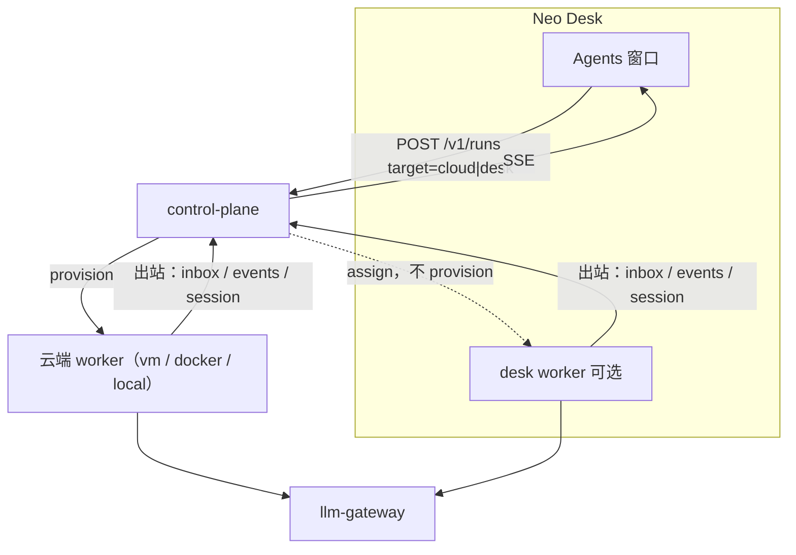
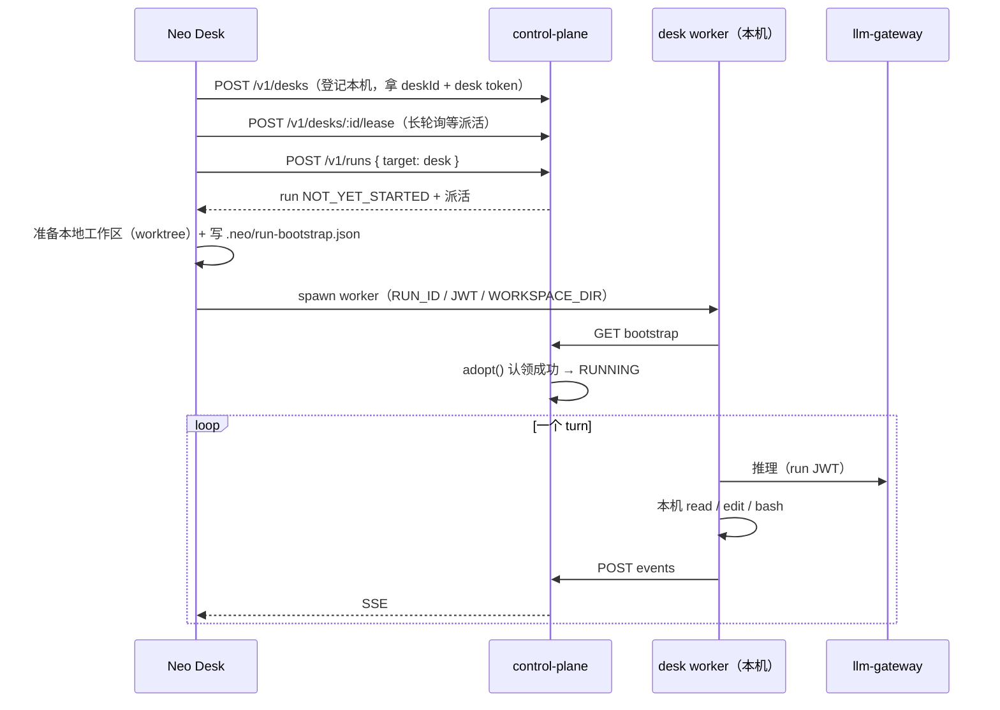

# Neo Desk 桌面端设计

目标：基于现有 `packages/web` 做桌面客户端，**UI 和「本地/云端」切换语义对齐 Cursor**，同时不破坏 [architecture.md §2](./architecture.md)。

本文是设计，不是已落地的现状。已落地的产品面见 [README](../README.md) 的「现在 main 上有什么」。

---

## 1. 结论先说

| 问题 | 答案 |
| --- | --- |
| Cursor 桌面选 Cloud 之后，loop 在哪 | Cursor 云端 |
| 那张「安全模型差异」表的作用域 | **只有 Cloud Agent 的三种 runtime**，不含本机 Agent |
| 本机 Agent（This Computer）的 loop 在哪 | **本机进程**。只有推理托管 |
| 和 Neo 现有设计冲突吗 | **有一处真冲突**，但不是「loop 在云还是在本机」，而是 **loop 和工具是否解耦** |
| 桌面端技术选型 | **Electron**。决定性理由是本地执行需要 Node 跑 pi |

---

## 2. 冲突分析

### 2.1 那张表只覆盖 Cloud Agent

[Choose where Cloud Agents run](https://cursor.com/docs/cloud-agent/self-hosted-guides/choose-runtime.md) 三列是 Managed / My Machines / Self-Hosted Pool，全部是 **Cloud Agent 的执行目标**。表上方原话：

> All three options support Privacy Mode and controlled secrets. The main difference is **where tool execution happens and who operates that execution environment**.

> Self-hosted paths run tool calls on hardware you control… **The agent loop still runs in Cursor's cloud.**

那个 `still` 是对照词：它存在的意义就是告诉自建读者「把工具搬到你机器上，不会把 loop 搬走」。本机 Agent 根本不在这张表里。

### 2.2 本机 Agent 的 loop 确实在本机

最硬的原话在 [TypeScript SDK](https://cursor.com/docs/sdk/typescript.md)，标题就叫 *Local means local agent loop, not local model*：

> "Local" describes where the agent loop and filesystem access run, not where the model runs. All inference goes through Cursor's hosted models in both modes.

同页 runtime 表：`Local | Runs the agent loop inline in your Node process. Files come from disk.`

反证也在文档里。[Remote Control](https://cursor.com/docs/cloud-agent/mobile.md) 把本机会话交给云端时用的动词是 **moves**：

> The agent loop **moves** to the cloud while its tools keep running on your machine.

要「搬过去」的东西，之前就不在那里。所以「本机 Agent 的 loop 在 IDE / `agent` 进程里」这句是对的，和图不矛盾——图说的是另一个产品。

顺带修正一处常见误读：本机 loop **不等于**不联网。推理在两种模式下都走 Cursor 托管模型。

### 2.3 真正的冲突：解耦 vs 同址

这才是要处理的。

**Cursor：loop 和工具解耦。** loop 在云（工程博客说放在 Temporal，产品文档没提这个名字），通过一条长连接把 tool call 发给执行环境。[Self-Hosted Pool](https://cursor.com/docs/cloud-agent/self-hosted-guides/pool.md) 原话：

> A worker opens a **long-lived outbound HTTPS connection** to Cursor's cloud. The agent loop, including inference and planning, runs in Cursor's cloud and **sends tool calls over this connection**.

**Neo：loop 和工具故意同址。** `architecture.md §2` 明确拒绝：

> 不要在控制面远程 RPC 每一个 `read` / `edit` / `bash`（延迟和带宽都会毁掉 coding agent）

pi 的 `createAgentSession` 在 worker 进程内直接调本地工具。要照抄 Cursor 那条「云 loop + 本机工具」，就得把 pi 的工具改成远程 RPC——正好是 §2 点名不做的事。

### 2.4 解法：把「权威」和「loop 进程位置」拆开

用户能感知的「云端权威」其实是四件事，都不要求 loop 在云：

| 感知 | 谁负责 | Neo 现状 |
| --- | --- | --- |
| 关掉电脑还能在手机/网页看同一条对话 | 会话状态在云 | 已有：事件持久化 + transcript 快照 + session JSONL 备份 |
| 跟进消息排队、当前 turn 不打断 | 跟进队列在云 | 已有：控制面 follow-up 队列 + pi `steer`/`followUp` |
| 模型密钥不落客户端 | gateway 持密钥 | 已有：worker 只有 run JWT |
| 掉线不算失败，恢复能续 | 生命周期在云 | 已有：`recoverLiveWorkers` / `detachOrQueue` |

Cursor 用「loop 放 Temporal」实现这些；Neo 用「loop 放 worker，但状态归控制面」实现同样的可观测结果。**产品语义可以对齐，实现不必照抄。**

所以桌面端的「This Computer」在 Neo 里应该是：**整个 worker（loop + 工具）跑在用户机器上，出站连控制面，会话权威仍在云。**

对照 Cursor 的 My Machines：

| | Cursor My Machines | Neo desk runtime |
| --- | --- | --- |
| loop | Cursor 云 | **用户机器**（worker 进程内） |
| 工具（bash / edit） | 用户机器 | 用户机器 |
| 推理 | 云端托管 | 云端 gateway |
| 会话权威 | Cursor 后端 | 控制面 |
| 传输 | worker 出站 HTTPS | worker 出站 HTTP（**已存在**） |
| 入站端口 | 不需要 | 不需要 |
| 密钥进客户端 | 不进 | 不进（只有 run JWT） |

唯一实质差别：turn 进行中电脑睡了，Cursor 的云 loop 还活着、Neo 的 loop 会死。但 Cursor 自己的文档也要求 **Keep this computer awake**，因为工具在你机器上——工具停了，turn 一样推进不了。Neo 这边掉线会走已有的 `detachOrQueue`，标 IDLE / 排队而不是 ERROR，用户回来发一句就继续，或者切到云端继续。差距可接受。

---

## 3. 三条不变量

桌面端不管做到哪一期，这三条不能破：

1. **loop 和工具同址。** 要么都在云端 worker，要么都在 desk worker。不做「云 loop 逐个 RPC 本机工具」。
2. **Provider Key 只在 gateway。** desk 拿到的是 run JWT，不是 DeepSeek Key。桌面设置页可以保存 Key，但保存动作是 `POST /v1/settings/llm`，值落在服务端。
3. **会话权威在控制面。** 桌面不做本地会话库。断网时只做只读缓存和待发队列，不产生「本地才有的对话」。

---

## 4. runtime 矩阵

Neo 现在的 `WORKER_RUNTIME` 是**服务端**配置（`local` / `docker` / `vm` / `firecracker` / `none`），全部在服务器侧。Cursor 的选择是**每次会话**选的。所以要新增一个维度。



新增的是 **执行目标（execution target）**，按 Run 记录，不是服务器全局：

| target | loop + 工具在哪 | 对标 Cursor |
| --- | --- | --- |
| `cloud` | 服务端 worker（现网 `vm` 两个 loop 槽） | Managed cloud agents |
| `desk` | 用户机器上的 desk worker | My Machines / Remote Control |
| `pool`（不做） | 团队机房 | Self-Hosted Pool |

契约改动很小：

```ts
// contracts/src/run.ts
export type ExecutionTarget =
  | { kind: "cloud" }
  | { kind: "desk"; deskId: string };

// Run 增加
executionTarget?: ExecutionTarget | null;
// CreateRunRequest 增加
target?: ExecutionTarget;
// RunSource 增加 "desk"
```

---

## 5. 本地 / 云端切换（对齐 Cursor 的语义）

### 5.1 目标选择器

Cursor 的 project picker 按位置分组，文档写明三种：**This Computer / Cloud / a remote machine**，另有 Recents，且新会话默认沿用上次选的目标（[help](https://cursor.com/help/ai-features/cloud-agents.md)、[changelog 3.1](https://cursor.com/changelog/3-1)）。

Neo Desk 照这个做，放在 composer 下方：

```
[ 目标 ▾ ]  [ 模式 ▾ ]  [ 模型 ▾ ]                    [ 发送 ]
   ├ 本机（This Computer）
   │    └ 最近文件夹…  / 选择文件夹…
   ├ 云端（Cloud）
   │    └ 环境 / 快照（复用现有 env + build 选择）
   └ 远程机（P3，先灰掉）
```

规则：

- 目标**按项目记忆**，新对话默认上次的选择。
- 选「本机」必须选一个 **git 仓库文件夹**（Cursor 的 Remote Control 也要求 git-backed workspace）。
- 选「云端」时仓库来自 `repoUrls`，和现在一致。
- 本机不可用（未装 desk worker / 已退出）时该项禁用并给原因，不静默回落到云端。

### 5.2 移交（handoff）

Cursor 的两条路都要抄，**包括那条警告**。

**本机 → 云端**（对标 Move to Cloud）。[help](https://cursor.com/help/ai-features/cloud-agents.md) 原话：

> "Move to Cloud" does not snapshot your local uncommitted changes… It transfers your **conversation history and context, but not dirty files or uncommitted edits.**

Neo 实现：控制面从 git 远端**干净 clone**，再用已有的 session 备份（`downloadSession`）恢复 JSONL，然后按 `cloud` target 起 worker。UI 必须在按钮旁写明「未提交的改动不会带过去，先 commit 或 stash」。

**云端 → 本机**（对标 pull back down）。desk 拉 `GET /internal/runs/:id/session` 恢复 JSONL，`git fetch` 那条 `neo/<slug>-<id>` 分支，开 worktree，起本机 worker。

两个方向都不新造协议：会话搬运用的是**已经存在的** session 备份接口。

### 5.3 状态机不变

不给桌面端加新状态。掉线复用现有语义：

```
desk worker 退出（关 App / 睡眠 / 网络断）
        │
        ▼
控制面心跳超时 → detachOrQueue
        │
        ├─ 有待发跟进 → NOT_YET_STARTED（排队）
        └─ 无待发跟进 → IDLE「本机已断开，发送即可继续」
```

**不要标 ERROR。** 这条昨天已经在 `orchestrator.ts` 修过，desk 直接复用。

---

## 6. desk runtime 怎么落

关键发现：**现有 worker 已经是纯出站的**，不需要新传输层。`packages/worker/src/channel.ts` 全部是主动 `fetch` 控制面：

| 用途 | 端点 |
| --- | --- |
| 取 JWT / 工作区 / 模型 / egress | `GET /internal/runs/:id/bootstrap` |
| 收跟进（长轮询，默认 400ms） | `POST /internal/runs/:id/inbox` |
| 上报事件 | `POST /internal/runs/:id/events` |
| 会话备份上下行 | `GET/POST /internal/runs/:id/session` |
| 受控 git | `POST /internal/runs/:id/scm/{token,commit,pull-request}` |

这就是 Cursor 描述的 worker 性质：**只要出站，不需要入站端口**。所以 desk worker = 把现有 `packages/worker` 跑在用户机器上，`RUN_ID` + JWT + `CONTROL_PLANE_URL` + `WORKSPACE_DIR` 指本地文件夹。

### 6.1 认领式 runtime

`AgentRuntime` 接口是 `provision` / `adopt` / `destroy`（`runtime/factory.ts`）。desk 是**认领型**，不由控制面拉起：



`DeskRuntime.provision()` 只登记意图并等认领（类似现有 `NoneRuntime` + 心跳），`adopt()` 在 worker 报到后返回 handle。控制面不 `docker run`、不挂 loop 槽。

### 6.2 复用清单

| 已有能力 | desk 是否改 |
| --- | --- |
| run JWT、`assertNoProviderSecrets` | 不改 |
| egress guard（worker 内 `fetch` 拦截） | 不改，但本机语义要在 UI 说清 |
| session JSONL 备份 / 恢复 | 不改 |
| 跟进队列、`steer` / `followUp` | 不改 |
| 事件 → transcript 快照 → SSE | 不改 |
| 受控 commit / PR（短寿命 token） | 不改 |
| 工作区 skills / `AGENTS.md` / hooks | 不改（读的是那个文件夹） |
| `neo_subagent` | 不改 |

### 6.3 本机执行的新风险

云端 worker 在隔离槽里；desk worker 在用户的家目录旁边。必须补：

- **工作区限定**：只允许 git 仓库文件夹，默认开 worktree，不让 `bash` 的 cwd 落在家目录根。
- **首轮确认**：第一次对某个文件夹授权时明确告知「Agent 会在这里跑命令」。Cursor 本机 Agent 有 Run Modes / 审批，云端 Agent 没有（[run-modes](https://cursor.com/docs/agent/security/run-modes.md)）。Neo 若要做审批，只在 `desk` target 做，云端保持自动执行。
- **保持唤醒**：本机 target 运行时阻止睡眠，并在 UI 标出（对标 Cursor 的 *Keep this computer awake*）。

---

## 7. UI 对齐 Cursor

先说文档边界：Cursor 的 **Agents Window 布局没有文档化**——面板清单、侧栏分组规则、状态图例都查不到。可引用的最密来源是 changelog [3.0](https://cursor.com/changelog/3-0) / [3.1](https://cursor.com/changelog/3-1) / [3.7](https://cursor.com/changelog/cloud-in-agents-window) 和 [agents-window](https://cursor.com/docs/agent/agents-window.md)。下面区分「有据」和「我们自己定」。

### 7.1 窗口形态

有据：Agents Window 是**独立窗口**（`Cmd+Shift+P → Open Agents Window` / `Open IDE`，可同时开着），是「agent-first 界面，统一 local / cloud / remote SSH」。Cursor 3.0 还**把 cloud agent 从编辑器里移除了**——云端 Agent 只在 Agents Window。

对 Neo 有利：**Neo 没有编辑器，所以 Neo Desk 直接就是 Agents Window**，不用做双形态。这条省掉了 Cursor 最复杂的一半。

### 7.2 布局

```
┌────────────────────────────────────────────────────────────┐
│ 标题栏（macOS 隐藏原生栏）                                  │
├───────────────┬────────────────────────────────────────────┤
│ 侧栏          │ 会话标签  [对话] [Diff] [终端] [产物]       │
│               ├────────────────────────────────────────────┤
│ + 新对话      │                                            │
│               │  transcript（工具卡在最终答复上面）         │
│ 置顶          │                                            │
│  · …          │                                            │
│               │                                            │
│ 进行中        ├────────────────────────────────────────────┤
│  · …          │ composer                                   │
│ 最近          │ [目标▾][模式▾][模型▾]  [上下文用量] [发送]  │
│               │                                            │
│ 项目 / 定时   │                                            │
│ 账号 / 状态   │                                            │
└───────────────┴────────────────────────────────────────────┘
```

- **侧栏置顶**：有据。[multi-agent](https://cursor.com/help/ai-features/multi-agent.md) 写了 *manage every agent from the sidebar and pin the chats you return to most*。Neo 现有 `Sidebar.tsx` 已有 run 列表和 `pulse-dot` 忙碌点，加 pin 和分组即可。
- **VM 槽轨道**：Neo 现有的，Cursor 没有对应物。保留，但目标是本机时换成「本机执行中」。
- **会话标签**：有据（3.1 修了 *File tab names… resolved within the current agent's visible tabs*，说明标签归属于某个 agent）。Neo 现有 Diff / 文件树 / 设置在抽屉里，改成标签。

### 7.3 composer 上的三个选择器

| 控件 | Cursor 有据 | Neo 现状 | 要做 |
| --- | --- | --- | --- |
| 目标 | 「Select **Cloud** in the dropdown under the agent input」；picker 按 This Computer / Cloud / remote 分组 | 无（服务端 `WORKER_RUNTIME`） | 新增，见 §5.1 |
| 模式 | Agent / Plan / Ask，`Shift+Tab` 轮换，`Cmd+.` 打开 Mode Menu | 无 | P1 加，先只做 Agent + Ask（只读） |
| 模型 | `Cmd+/` 轮换、`Cmd+Opt+/` 切换；云端「curated selection」+ 可选上下文窗口 | 在设置页里 | 移到 composer 旁 |

Neo 已经有 `ContextUsage`（按模型显示 token），Cursor 文档里没有对应控件——这块保留自己的。

### 7.4 Diff / 产物 / 终端

- **Diff**：有据，Agents Window 的卖点之一是 *review and commit changes, and manage PRs without leaving Cursor*。Neo 已有 `DiffPanel` + `POST /v1/runs/:id/commit` + `.../pull-request`，够拼出这一屏。
- **产物**：有据，*artifacts like screenshots and demo videos help you review an agent's work*。Neo 已有 `/v1/runs/:id/artifacts` 和 `neo_artifact_upload`。桌面端优势：截图/视频用系统 viewer 打开。
- **终端**：有据，云端环境准备时能看 *shared terminal session*。Neo 已有 setup 日志和 `/v1/runs/:id/diagnostics`，做成「终端」标签。

### 7.5 快捷键

按 [reference/keyboard-shortcuts](https://cursor.com/docs/reference/keyboard-shortcuts.md) 抄，注意这几个被 Cursor 从 VS Code 默认改掉了（`Cmd+/`、`Cmd+E`、`Cmd+T`）：

| 键 | 动作 | Neo 现状 |
| --- | --- | --- |
| `Cmd+T` | 新会话标签 | 无 |
| `Cmd+[` / `Cmd+]` | 上一条 / 下一条对话 | 无 |
| `Cmd+.` | 模式菜单 | 无 |
| `Cmd+/` | 轮换模型 | 无 |
| `Shift+Tab` | 轮换模式 | 无 |
| `Ctrl+Enter` | **把消息排队** | 有队列但没这个键 |
| `Cmd+Shift+Backspace` | 取消当前生成 | 有停止按钮 |
| `Cmd+W` | 关闭会话 | 无 |
| `Enter` / `Shift+Enter` | 发送 / 换行 | 已有，保留 |

Neo 的 Enter 发送不改（窄屏另有规则，见 `viewport.ts`），只补 `Ctrl+Enter` 排队。

### 7.6 并行与 worktree

- **Tiled panes**：有据（3.1 *Split your current view into panes to run and manage several agents in parallel*，且布局跨会话保留）。P3 再做。
- **Worktree**：有据，*UI-native worktrees feature… only available in the Agents Window*，配置在 `.cursor/worktrees.json`，默认每机上限 25 个。Neo 的 desk target 天然需要它——同一仓库跑两个本机 Agent 必须分开 checkout。P2 和 desk runtime 一起做。

---

## 8. 技术选型：Electron

### 8.1 决定性理由

**desk worker 要跑 pi，pi 是 Node 包。** `packages/worker` 是 TypeScript，依赖 `@earendil-works/pi-coding-agent`。Electron 自带 Node（当前 42.x 线是 Chromium 148 + Node 24.x），主进程可以直接 `fork` 现有 worker 源码，一个运行时搞定。Tauri 用系统 WebView + Rust，**不带 Node**，要把 worker 打成 SEA / `pkg` 单文件，再按 `arm64` / `x64` 分架构做 sidecar。多一条构建链和一层 stdio 桥。

其余理由，按权重：

| 理由 | 说明 |
| --- | --- |
| 渲染一致 | 自带 Chromium，三平台一致。现有 `styles.css` 不用为 WebKitGTK / WKWebView 再调 |
| 和 Cursor 同族 | Cursor 是 VS Code 血统（文档只有行为证据：Open VSX、VS Code 键位基线、VS Code 配置导入；**官方文档没写它是 Electron**）。抄键位和窗口行为时同族更省事 |
| 团队栈 | 仓库全 TypeScript，没有 Rust |
| 签名 / 自动更新 | `electron-builder` + `electron-updater` 成熟 |
| 复用为零成本 | 渲染进程直接加载 `packages/web` 的 Vite 产物 |

### 8.2 代价，接受

| 项 | Electron | Tauri |
| --- | --- | --- |
| 安装包 | 50–150MB+ | 3–15MB |
| 空闲内存 | 100–300MB | 20–100MB |
| 冷启动 | 慢一点 | 快 |

对一个要在本机跑 Node + pi + 编译测试的开发者工具，这点体积不是瓶颈——worker 自己就比壳子重。

### 8.3 什么情况下改选 Tauri

只有一种：**确定 desk 永远只做云端 Run 的查看器**，不做 This Computer。那时没有 Node 需求，Tauri 在体积、内存、启动上全赢。但要求 #2 说切换语义要对齐 Cursor，本机执行就在路线里，所以选 Electron。

### 8.4 进程与安全

```
Electron 主进程（Node）
 ├─ 窗口 / 托盘 / 通知 / 深链 neo://runs/<id>
 ├─ 凭据：safeStorage → OS keychain（不用 localStorage）
 ├─ desk 登记 + lease 长轮询
 ├─ fork desk worker（复用 packages/worker）
 └─ 阻止睡眠（本机 target 运行时）

preload（contextIsolation: true，nodeIntegration: false）
 └─ 窄接口：目标选择、文件夹授权、worker 启停、通知、打开产物

渲染进程 = packages/web（React 18 + Vite 6，几乎不改）
```

硬规则：

- 渲染进程**不碰 Node**，不在渲染里跑 pi。
- token 进 keychain，不进 `localStorage`（现在 `api.ts` 用的是 `neo.apiToken.v2`，桌面走注入）。
- Provider Key 不下发到桌面。保存 Key 仍是 `POST /v1/settings/llm`。
- `nodeIntegration: false` + `contextIsolation: true` + 白名单 IPC。

---

## 9. 包结构

```
packages/
  desk/            新增：Electron 主进程 + preload + 打包配置
  web/             复用：渲染进程（加 desk 适配层，判断有无 window.neoDesk）
  worker/          复用：desk worker 直接跑这份
  contracts/       加 ExecutionTarget、RunSource "desk"、desk 登记类型
  control-plane/   加 DeskRuntime（认领型）+ /v1/desks*
  cli/             不动
```

`packages/web` 保持能单独在浏览器跑。桌面只多注入一个可选的 `window.neoDesk`；没有它就是纯 Web，行为不变。

---

## 10. 分期

### P0：桌面壳 + 云端权威（不含本机执行）

- Electron 包现有对话页；登录进 keychain
- 托盘、系统通知（IDLE / ERROR）、深链、记住上次 Run
- composer 加目标选择器，**只有「云端」可选**，「本机」灰掉写「即将支持」
- 验收：关掉桌面用网页打开同一条 Run，transcript 一致；桌面收到完成通知

### P1：UI 对齐

- 侧栏置顶 + 分组（置顶 / 进行中 / 最近）
- 会话标签：对话 / Diff / 终端 / 产物
- 模式（Agent / Ask）+ 模型选择器移到 composer
- 快捷键表（§7.5）
- 验收：不进设置页就能看 diff、提交、开 PR；快捷键和 Cursor 一致

### P2：This Computer

- `contracts` 加 `ExecutionTarget`；`Run` 记录目标
- 控制面 `DeskRuntime`（认领型）+ `/v1/desks` 登记 + lease
- 桌面 fork `packages/worker`，工作区限定在选定 git 文件夹 + worktree
- 双向移交，含「脏文件不跟随」警告
- 掉线走 `detachOrQueue`，不报 ERROR
- 验收：本机 Run 能改本地未提交文件并跑测试；关掉桌面后该 Run 变 IDLE 而非 ERROR；切到云端能接着聊

### P3：并行

- Tiled panes、多会话并排
- 远程机（SSH）目标
- 每机 worktree 上限与清理

---

## 11. 不做的事

1. **不做云 loop + 本机工具逐调用 RPC。** 违反 §2。要本机执行就整个 worker 下来。
2. **不在桌面嵌第二份 pi 当独立产品。** desk worker 是同一份 `packages/worker`，同一套事件和会话备份。
3. **不做本地会话库。** 桌面不产生「只有本地有」的对话。
4. **不把 Provider Key 放桌面。**
5. **不复刻编辑器 / Tab / 本地 sandbox。** Neo Desk 只是 Agents Window。

---

## 12. 未定项

文档查不到的，别当事实写进实现：

- **Cursor 桌面 Cloud 面板的实际协议**。公开 API 有 SSE（`GET /v1/agents/{id}/runs/{runId}/stream`），企业网络文档提到 HTTP/2 + SSE 回落，但没有一页说「桌面面板用的是这个」。
- **云 loop 到 Cursor 托管 VM 的传输**。只有自建 worker 那条写了（出站 HTTPS、`api2.cursor.sh`、HTTP/2 帧 + 心跳）。
- **Temporal** 只在工程博客里，产品文档没提。
- **Cursor 是 Electron / VS Code fork**：只有行为证据，官方文档没写。
- **Agents Window 的面板清单、侧栏分组、状态图例**：全部没文档，§7.2 的布局是我们自己定的。
- **`&` 前缀移交带什么状态**：只说 *push your conversation*，是否同 Move to Cloud 的干净 git 语义没写。

---

## 13. 参考

- [Cloud Agents](https://cursor.com/docs/cloud-agent.md) / [capabilities](https://cursor.com/docs/cloud-agent/capabilities.md) / [security](https://cursor.com/docs/cloud-agent/security.md)
- [Choose where Cloud Agents run](https://cursor.com/docs/cloud-agent/self-hosted-guides/choose-runtime.md)（图里那张表）
- [My Machines](https://cursor.com/docs/cloud-agent/self-hosted-guides/my-machines.md) / [Self-Hosted Pool](https://cursor.com/docs/cloud-agent/self-hosted-guides/pool.md)
- [Remote Control / iOS](https://cursor.com/docs/cloud-agent/mobile.md)
- [Agents Window](https://cursor.com/docs/agent/agents-window.md) / [worktrees](https://cursor.com/docs/configuration/worktrees.md) / [plan mode](https://cursor.com/docs/agent/plan-mode.md)
- [keyboard shortcuts](https://cursor.com/docs/reference/keyboard-shortcuts.md) / [run modes](https://cursor.com/docs/agent/security/run-modes.md)
- [TypeScript SDK](https://cursor.com/docs/sdk/typescript.md)（`local` = loop 在你的 Node 进程）
- [What we've learned building cloud agents](https://cursor.com/blog/cloud-agent-lessons)（loop / 机器 / 会话三层解耦，Temporal）
- 本仓库：[architecture.md](./architecture.md) §2、[cli.md](./cli.md) §1
