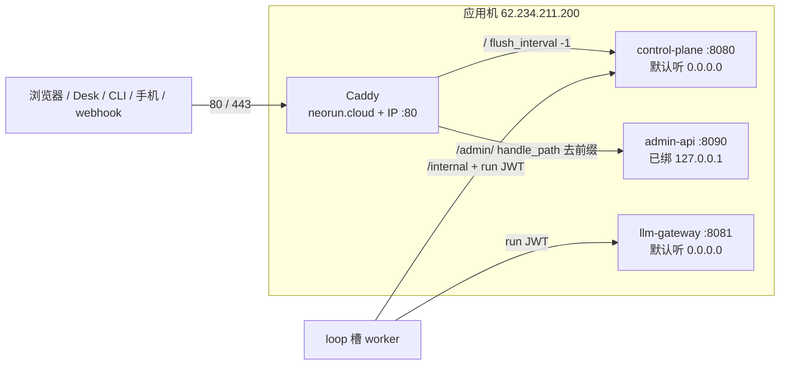

# 现网入口调研：要不要引入 Nginx

调研日期：2026-08-27。  
对象：Neo Cloud Agent **应用机边缘**（`neorun.cloud` / `62.234.211.200` 的 80/443），不是 LLM Gateway，也不是 worker 出站代理。  
目的：弄清「引入 Nginx」到底能补哪一层、和现网 Caddy 是替换还是叠床架屋，再给出能跟着做、又不把入口层做成第四个业务进程的方案。

现网操作仍以 [.cursor/skills/tencent-lighthouse-deploy/SKILL.md](../.cursor/skills/tencent-lighthouse-deploy/SKILL.md) 和 [production-domain.md](./production-domain.md) 为准。本文不改现网。

---

## 1. 一句话结论

**现在不要引入 Nginx。边缘入口已经有了，就是 Caddy。**

> **Caddy 已经在做 Nginx 会做的那几件事：TLS、路径分流、压缩、SSE 立刻刷出。**  
> **再装 Nginx，要么替换一套已经跑通的证书和路由，要么在 Caddy 前面再加一跳——4C/4G 单机、2 个 loop 槽，这两条都不值。**

架构蓝图里的 `API Gateway` 不是缺的那个 Nginx。[architecture.md](./architecture.md) 那一格落在 **Caddy（主机入口）+ `control-plane` 的 `api` 模块（鉴权 / 限流 / 路由）**。不要为了图上的名字再开一个反向代理进程。

| 该做 | 先别做 |
| --- | --- |
| 继续用 Caddy 当唯一公网入口 | 用 Nginx 换掉现网 Caddy |
| 把 control-plane / llm-gateway 绑到 `127.0.0.1`，防火墙关掉 8080/8081 | Caddy 前面再叠一层 Nginx |
| SSE / Desk 长轮询 / webhook 的超时和禁缓冲写进入口清单 | 轻量控制台「一键 HTTPS」（TAT 写 Nginx，和现栈冲突） |
| 静态资源和 1.5MiB 产物继续由 Node 出 | 为了 `X-Accel-Redirect` 或 WAF 先上 Nginx |
| 真要换入口时，一次性替换 Caddy，不要双层 | 把 Nginx 做成 monorepo 里的第四个业务进程 |

触发「再谈 Nginx」的信号见 §7。在那之前，入口层的增量价值在加固，不在换软件。

---

## 2. 现网入口已经长什么样

应用机没有 Nginx 配置、没有 `nginx` 包、仓库里也没有 `.conf`。公网只应打到 Caddy。



| 项 | 现状 | 出处 |
| --- | --- | --- |
| 对话 / `/v1` / webhook | `https://neorun.cloud/` → Caddy → `127.0.0.1:8080` | [Caddyfile.https](../.cursor/skills/tencent-lighthouse-domain/units/Caddyfile.https) |
| 管理台 | `https://neorun.cloud/admin/` → Caddy `handle_path` → `127.0.0.1:8090` | 同上；admin-web 用 [`apiPrefix()`](../packages/admin-web/src/api.ts) 识别 `/admin` |
| IP 书签 | `http://62.234.211.200/` 仍听 `:80`，运维兜底 | 同上 |
| `admin.neorun.cloud` | 308 到 `/admin/`，不单独挂后台 | 同上 |
| TLS | Let's Encrypt，Caddy 自动续，0 元 | [production-domain.md](./production-domain.md) |
| 压缩 | Caddy `encode gzip zstd`，只压 HTML/CSS/JS/JSON/SVG | Caddyfile |
| SSE | Caddy `flush_interval -1`；应用已发 `X-Accel-Buffering: no` + 15s ping | [`events/stream.ts`](../packages/control-plane/src/events/stream.ts) |
| 限流 | 控制面按 IP / 登录 / 写 / SSE；默认信 `X-Forwarded-For` / `X-Real-IP` | [`rate-limit-http.ts`](../packages/control-plane/src/security/rate-limit-http.ts) |
| 静态对话页 | control-plane 自己读 `packages/web/dist`，带 hash 的 js/css 一年 immutable | [`api/static.ts`](../packages/control-plane/src/api/static.ts) |
| 产物 | 签名 URL，单文件上限 **1.5MiB**，仍走 Node | [`artifacts.ts`](../packages/control-plane/src/artifacts/artifacts.ts) |
| 防火墙 | 22 / 80 / 443；8080/8081 **可选**对公网开 | [reference.md](../.cursor/skills/tencent-lighthouse-deploy/reference.md) |
| admin-api | systemd 已 `ADMIN_API_HOST=127.0.0.1` | `neo-admin-api.service` |
| control-plane / gateway | `server.listen(port)` **没绑 host**，等于 `0.0.0.0` | [`control-plane/src/index.ts`](../packages/control-plane/src/index.ts)、[`llm-gateway/src/index.ts`](../packages/llm-gateway/src/index.ts) |

Caddy 不是「临时顶一下」。部署 skill、域名 skill、架构总览、对话页和管理台测试都按它写死。轻量控制台一键 HTTPS 会按应用镜像 TAT 改 **Nginx**，文档已经写成禁令。

---

## 3. 蓝图里的 API Gateway 不是缺 Nginx

[architecture.md §3](./architecture.md) 画了 `clients → API Gateway → Orchestrator / LLM Gateway`。那是职责框，不是 Deployment。

| 蓝图职责 | 现在落在哪 | 不要理解成 |
| --- | --- | --- |
| 对外 TLS / 主机名 / 路径 | **Caddy** | 再买一个 Nginx |
| REST / SSE / webhook / 静态页 | **`control-plane` `api` 模块** | Kong / APISIX / OpenResty |
| 鉴权、限流、配额 | 同一进程里的 `security/` | 入口层再做一套用户限流 |
| 模型密钥与上游 | **`llm-gateway` 独立进程** | 把 `:8081` 暴露到公网 |
| 执行面出站 | 应用层 `evaluateEgress`；以后才是 iptables / 出站代理 | 用 Nginx 当 worker 的正向代理 |

[architecture.md §14](./architecture.md) 写过：egress / git proxy 是基础设施（Envoy / squid），**不是业务仓库**。反向代理同样：Caddy 已经是那一层基础设施。P0 值得拆进程的只有密钥边界（Gateway）。为入口再加一个 Nginx **systemd unit**，只有在 Caddy 真的扛不住或团队强制统一栈时才成立。

---

## 4. Nginx 能补什么、补不了什么

对照现网缺口，而不是对照「生产标配 Nginx」的印象。

### 4.1 看起来像缺口、其实已经有了

| 能力 | Nginx 常被点名 | 现网 |
| --- | --- | --- |
| HTTPS 终止 | `listen 443 ssl` + certbot | Caddy 自动申领 / 续期，已开 |
| `/` 与 `/admin/` 同域 | `location` + `rewrite` | `handle_path` + admin-web `apiPrefix` |
| 禁 SSE 缓冲 | `proxy_buffering off` | Caddy `flush_interval -1`；响应头已带 `X-Accel-Buffering: no`（给 Nginx 风格代理预留的） |
| 压缩静态资源 | `gzip` | Caddy `encode`；Node 对 HTML/JS/CSS 也会 gzip |
| 反代头 / 真实 IP | `X-Real-IP` / `X-Forwarded-For` | `RATE_LIMIT_TRUST_PROXY` 默认开，限流已经读这两个头 |
| 隐藏管理台端口 | 只反代本机 8090 | 已做；8090 不要开防火墙 |

应用层已经按「前面可能是 Nginx」写过：SSE 的 `x-accel-buffering: no` 就是 Nginx 认识的关缓冲头。这只能说明 **控制面兼容这类反代**，不能说明 **必须上 Nginx**。

### 4.2 Nginx 确实更熟的几件事

这些是真差异，但以现网体量都排不到前面。

| 能力 | 价值 | 为什么现在不够换栈 |
| --- | --- | --- |
| `X-Accel-Redirect` 让 Nginx 吐磁盘 / 对象 | 大文件不占 Node | 产物上限 1.5MiB，现网对象还在本机 `RUNS_DIR/.objects`，没有直传 S3 |
| 连接数 / `limit_req` 挡在进程外 | 慢客户端、空连接少打到 Node | 控制面已有 IP / 登录 / SSE 并发；4G 机器先会被槽和模型卡住，不会先被 HTTP 打满 |
| 带 hash 的 `/assets/*` 由入口直接 `alias` | 少一次 Node `createReadStream` | 对话页和管理台 dist 很小；Caddy 也能 `file_server`，不必为这个换软件 |
| access log / 状态码仪表 | 运维习惯 | `journalctl -u caddy` + 控制面日志够用；要仪表先接现有 `/health` |
| 团队只会 Nginx | 招人 / 交接 | 现网 Caddyfile 不到 70 行；换栈的证书和 SSE 风险更大 |
| 腾讯云生态「默认 Nginx」 | 控制台一键 HTTPS、部分镜像 | **和现栈冲突**。现网是 Ubuntu 系统镜像 + Caddy，一点会把站点改成欢迎页或坏证书 |

### 4.3 Nginx 补不了、也不该让它补的

- **鉴权与 Run 限流。** Cookie / Bearer / run JWT / SSE 租约必须留在控制面。入口只做连接级防护。
- **LLM 密钥。** `:8081` 不要进公网 `location`。worker 打内网，Desk / 浏览器不打 Gateway。
- **`/internal`。** loop 槽和本机 worker 走 `127.0.0.1:8080`。入口层不要单独开一条「内部」公网路径。
- **出站 egress。** 那是 worker 访问外网，不是 443 入站。蓝图写的是 iptables / Envoy / squid。
- **多机负载均衡。** 现在一台应用机、一个 control-plane 进程。要水平扩展，先有第二台机和共享 Redis / MySQL，再谈 upstream，而不是先装 Nginx。

---

## 5. 四种引入方式

只比较「入口层怎么摆」，不比较 OpenResty / APISIX / Kong。那些是另一张网关产品，现网用不上。

### A. Caddy 前再加 Nginx（最差）

```
用户 → Nginx:443 → Caddy:80 → :8080 / :8090
```

多一跳 TLS 或明文回环、两份路由、两份 SSE 超时。证书续期仍在 Caddy 或改到 Nginx，另一边变成僵尸。**不要做。**

### B. Nginx 换掉 Caddy（唯一说得通的换法）

```
用户 → Nginx:80/443 → 127.0.0.1:8080
                 ↘ 127.0.0.1:8090（strip /admin）
```

进程数不变（仍是一个入口 unit）。要同时接走：

1. Let's Encrypt（certbot 或 acme.sh，自己写 timer；Caddy 这份自动续没了）
2. 域名 HTTPS + IP 纯 HTTP 两套 server
3. `/admin` → `/admin/` 308，`admin.neorun.cloud` 308
4. SSE / Desk lease（默认 20s 长轮询）/ 微信与 GitHub webhook 的超时和禁缓冲
5. 部署 skill、域名 skill、`production-domain.md`、架构图、admin-web 测试文案里所有「Caddy」

收益主要是团队熟悉度，不是新能力。现网证书 2026-08-25 才稳住，为熟悉度换栈不划算。

### C. 只让 Nginx 管静态，Caddy 继续反代 API（也不要）

两份配置抢 80/443，hash 资源还要和 Vite 文件名对齐。Caddy 自己就能 `handle_path /assets/* { file_server }`。拆开没有运维收益。

### D. 不上 Nginx，把现有入口收紧（推荐）

保持 Caddy。做三件和「要不要 Nginx」无关、但比换栈更值钱的加固：

1. **control-plane / llm-gateway 听 `127.0.0.1`。** 现在 `listen(port)` 没写 host，轻量防火墙一旦放行 8080/8081，对话页和 Gateway 就裸在公网。admin-api 已经绑本机，另外两个应对齐。loop worker 在同一台机，打 `127.0.0.1:8080` / `:8081` 即可。以后上 Firecracker tap，再把 URL 改写成宿主机 IP（现有 `rewriteUrlHost`），不要为了这个把 Node 听在 `0.0.0.0` 并开防火墙。
2. **防火墙只留 22 / 80 / 443。** reference 里「8080/8081 可选直连」只给排障，不要当生产入口。
3. **入口清单写死长连接。** 无论谁当入口：SSE `proxy_read_timeout` 按小时计（15s ping 只防空闲掐断，对话可以远长于 60s）；`text/event-stream` 禁止压缩、禁止缓冲；不要对 `/v1/runs/*/events` 开 gzip。Caddy 现网的 `encode match` 已经避开了 event-stream。

---

## 6. 若以后真的替换：一份能对上现网的 Nginx 方案

只有 §7 的信号出现时才走这里。目标是 **行为对齐 Caddyfile.https**，不是借机改路径、改域名、改管理台挂载方式。

### 6.1 硬约束（验收用）

| 约束 | 失败看起来像 |
| --- | --- |
| `/` → `127.0.0.1:8080`，**不**改写路径 | 对话页 404 或 API 打到管理台 |
| `/admin/` → `127.0.0.1:8090` 且 **strip `/admin`** | 管理台静态资源 404；`apiPrefix` 仍会请求 `/admin/v1/...`，入口必须把前缀剥掉再转，或反过来改 admin-api 认带前缀——**不要两边一起改**。现网约定是入口剥前缀 |
| `/admin` 308 到 `/admin/` | cookie `Path=/admin` 对不上 |
| `admin.neorun.cloud` 308 到 `https://neorun.cloud/admin/` | 子域又冒出一套后台 |
| 域名 443 + IP `:80` 两套 | 旧书签或证书检测断掉 |
| SSE：`proxy_buffering off`、`gzip off`、读超时 ≥ 1h | 对话页卡住、工具卡片不流式、15s ping 被攒成一块 |
| Desk `POST /v1/desks/:id/lease` 读超时 ≥ 30s | 默认 `waitMs=20000` 被 60s 默认值以外的短超时掐掉 |
| **不要** `location` 到 `:8081` | Provider 路径进公网 |
| **不要**把 `/internal` 单独暴露 | worker 协议进公网（现在它和 `/v1` 同端口；绑 127.0.0.1 后公网根本打不到） |
| 证书不要走轻量「设置 HTTPS」 | TAT 按应用镜像改系统，和 Ubuntu + systemd 现栈冲突 |

`packages/admin-web` 的测试已经锁了「挂在 `/admin` 时 API 带前缀」。换入口不能破坏这条，除非同一 PR 改前端和 admin-api——现网没必要。

### 6.2 配置骨架（示意，不是现网文件）

证书用 certbot webroot 或 tls-alpn，**不要**指望 `apt install nginx` 之后自动有 `neorun.cloud` 的证。下面只写关键 `location`，省略 `ssl_certificate` 路径。

```nginx
# 示意：对齐 Caddyfile.https 的路径与 SSE，不是可直接覆盖 /etc/nginx 的成品。

map $http_upgrade $connection_upgrade {
    default upgrade;
    ""      close;
}

upstream neo_control_plane { server 127.0.0.1:8080; }
upstream neo_admin_api     { server 127.0.0.1:8090; }

# 域名 HTTPS。HTTP 只做 308，除 ACME 外不要在 :80 反代业务。
server {
    listen 443 ssl http2;
    server_name neorun.cloud www.neorun.cloud;

    client_max_body_size 8m;          # 产物 1.5MiB + JSON；不要开到 1g
    gzip on;
    gzip_types text/css application/javascript application/json image/svg+xml;
    # 不要 gzip text/event-stream

    location = /admin { return 308 /admin/; }

    location /admin/ {
        proxy_pass http://neo_admin_api/;   # 末尾斜线 = strip /admin/
        proxy_http_version 1.1;
        proxy_set_header Host $host;
        proxy_set_header X-Real-IP $remote_addr;
        proxy_set_header X-Forwarded-For $proxy_add_x_forwarded_for;
        proxy_set_header X-Forwarded-Proto $scheme;
        proxy_buffering off;
        proxy_read_timeout 3600s;
    }

    location / {
        proxy_pass http://neo_control_plane;
        proxy_http_version 1.1;
        proxy_set_header Host $host;
        proxy_set_header X-Real-IP $remote_addr;
        proxy_set_header X-Forwarded-For $proxy_add_x_forwarded_for;
        proxy_set_header X-Forwarded-Proto $scheme;
        proxy_set_header Connection $connection_upgrade;
        proxy_buffering off;            # SSE + 微信/GitHub webhook 都别攒
        proxy_cache off;
        proxy_read_timeout 3600s;
        proxy_send_timeout 3600s;
    }
}

server {
    listen 80;
    server_name neorun.cloud www.neorun.cloud;
    location /.well-known/acme-challenge/ { root /var/www/acme; }
    location / { return 308 https://$host$request_uri; }
}

server {
    listen 80;
    server_name 62.234.211.200;
    # 与现网 Caddy 的 IP 站点相同：HTTP 反代，不强制 HTTPS
    # …同上两段 location /admin/ 与 /
}

server {
    listen 443 ssl http2;
    server_name admin.neorun.cloud;
    return 308 https://neorun.cloud/admin/;
}
```

`proxy_pass http://neo_admin_api/;` 的尾斜线对应 Caddy `handle_path`。漏掉斜线，admin-api 会收到 `/admin/v1/...`，现网路由对不上。

### 6.3 落地顺序（只在决定替换之后）

1. **先绑本机、关端口。** 即使还用 Caddy，也先做 §5.D。换 Nginx 时 Node 绝不能还听 `0.0.0.0` 且防火墙放行。
2. **staging 或本机对照。** `nginx -t`，用 `curl --resolve neorun.cloud:443:127.0.0.1` 打 `/`、`/admin/`、`/health`、`/v1/runs/:id/events`（看是否立刻出现 `: ping`）。
3. **证书。** 在 Caddy 停之前把同一份 Let's Encrypt 证拷到 Nginx，或 certbot 新签。中间不要出现 443 无人听。
4. **停 Caddy、启 Nginx。** `systemctl disable --now caddy`，`enable --now nginx`。不要两个都 `listen 80/443`。
5. **改文档和 skill。** deploy / domain / `production-domain.md` / 架构图里的「Caddy」改成 Nginx；验收命令从 `systemctl is-active caddy` 换成 `nginx`。
6. **回滚预案。** 备份 `/etc/caddy/Caddyfile` 和证；Nginx 挂了就 `disable nginx && enable --now caddy`。不要重装系统，不要点控制台一键 HTTPS。

不要把 `nginx.conf` 先提交进 `units/` 却不切现网——两份入口模板会让下一次 deploy 不知道听谁的。

### 6.4 和腾讯云产品的边界

| 做法 | 和本仓库 |
| --- | --- |
| 本机 Nginx 替换 Caddy | §6，仅当 §7 触发 |
| 轻量「设置 HTTPS」 | **禁止**。官方只支持 WordPress / LAMP 等应用镜像 |
| 腾讯云付费证书塞进 Nginx | 能用，但现网 Caddy+LE 已够；不要为换栈去买证 |
| EdgeOne / CDN 套在域名前面 | 另一层，不是本机 Nginx。要上的话仍回源 Caddy，先确认 **不缓冲 SSE**、不缓存 `/v1/runs/*/events` |
| CLB / 第二台应用机 | 水平扩展问题，先有第二进程和共享存储 |

---

## 7. 什么时候才值得再谈 Nginx

出现下面**一条硬信号**再开替换 PR，不要提前「先把 conf 准备好」。

1. **入口软件本身在故障。** Caddy 续证失败且修不好、或 `flush_interval` 在某次升级后缓冲 SSE，而团队判断修 Caddy 不如换栈。
2. **运维约束。** 公司只准 Nginx、镜像/基线里没有 Caddy、审计要特定 `access_log` 格式——这是组织问题，不是产品缺口。
3. **真的有大文件要卸给入口。** 产物或 workspace 下载到几十兆以上，并且决定走 `X-Accel-Redirect` / 内部 `alias`，而不是签 S3 URL。现网 1.5MiB 和本机对象存储都还没到。
4. **一台机上要挂多个互不相让的站点，Caddyfile 已经拧巴。** 现在只有 `neorun.cloud` 两路 + IP，没有这个压力。

这些**不是**信号：

- 「生产标配 Nginx」
- 架构图上写了 API Gateway
- 想给静态资源加缓存（Caddy / Node 都能做）
- 想挡一层 CC（先关 8080/8081，再谈云 WAF）
- 想给 worker 做出站代理（那是另一份设计）

---

## 8. 建议的下一步（按收益，不是按「引入 Nginx」）

不要先画完整 `nginx.conf` 再找机会启用。

1. **加固现网监听（小改，值得单独做）。**  
   systemd / `index.ts` 让 control-plane、llm-gateway 默认 `127.0.0.1`。现网验收：本机 `curl 127.0.0.1:8080/health` 通，公网 `http://62.234.211.200:8080` 不通。loop worker 不受影响。

2. **防火墙与文档对齐。**  
   生产不要放行 8080/8081。reference 里「可选直连」改成「仅本机排障」。

3. **入口验收留一条 SSE 用例。**  
   以后谁改 Caddyfile（或真换成 Nginx），必须看到 event-stream 不被 gzip、不被缓冲。现网已经靠 `flush_interval -1` 活着，没有自动化在守。

4. **Nginx 按本文冷冻。**  
   不进 `units/`、不进 deploy.sh、不和 Caddy 双活。§7 触发后再按 §6 一次性替换。

---

## 9. 明确不做什么

1. 不在 Caddy 前面或后面再叠一层本机 Nginx。
2. 不把 Nginx 写成 `packages/` 里的服务，也不为它加 compose 依赖。本地继续 `pnpm dev` 直打 `:8080`。
3. 不用轻量控制台一键 HTTPS 来「顺便装 Nginx」。
4. 不把 `:8081` 或 `/internal` 配进公网 `location`。
5. 不在入口层复制控制面的用户限流 / JWT 校验。
6. 不把 worker egress 和入站反代做成同一个 Nginx。
7. 不为了调研结论去改现网 Caddyfile。

---

## 10. 参考

- 现网 Caddy HTTPS：[Caddyfile.https](../.cursor/skills/tencent-lighthouse-domain/units/Caddyfile.https)
- HTTP 回退模板：[Caddyfile](../.cursor/skills/tencent-lighthouse-deploy/units/Caddyfile)
- 域名与证书：[production-domain.md](./production-domain.md)、[tencent-lighthouse-domain/SKILL.md](../.cursor/skills/tencent-lighthouse-domain/SKILL.md)
- 部署与防火墙：[tencent-lighthouse-deploy/SKILL.md](../.cursor/skills/tencent-lighthouse-deploy/SKILL.md)、[reference.md](../.cursor/skills/tencent-lighthouse-deploy/reference.md)
- SSE 头与 ping：`packages/control-plane/src/events/stream.ts`（含 `X-Accel-Buffering: no`）
- 管理台前缀：`packages/admin-web/src/api.ts`、`packages/admin-web/src/api.test.ts`
- 蓝图进程边界：[architecture.md §14](./architecture.md)
- 现状拓扑：[architecture-overview.md §4](./architecture-overview.md)
