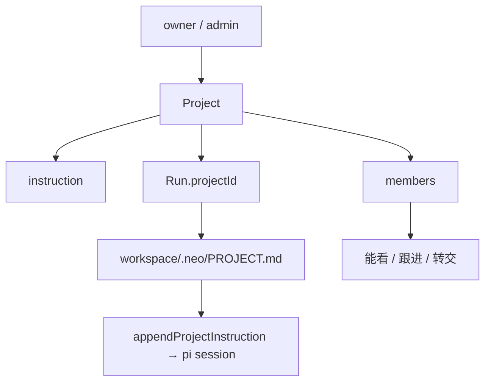

# 项目空间：现状

对话页顶栏「项目」（`/#/projects`）背后的能力。一个项目 = **共享指令 + 成员 + 带 `projectId` 的 Run**。任务仍是原来的对话，不是看板卡片。

对标调研和未做清单见 [workbuddy-project-collaboration.md](./workbuddy-project-collaboration.md)。本文只写**已经落地的行为**。

---

## 1. 一句话

项目包上下文，对话包一次 Run。成员在项目里开的对话会把指令写进工作区 `.neo/PROJECT.md`，worker 拼进 system prompt。成员能看这些 Run、跟进、转交。注册关闭，队友由 owner / admin 在项目页加账号。



---

## 2. 现在能做什么

| 能 | 不能 |
| --- | --- |
| 建项目、写团队指令、在项目里开对话 | 资产库、计划看板、项目级定时任务 |
| owner 加成员（已有账号或当场建账号+密码） | 自助注册（`POST /v1/auth/register` 仍 403） |
| 邀请链接；`invitePolicy=approve` 时先申请再通过 | UI 改邀请策略、改角色、踢人（合约有 `admin`，页面只加 `member`） |
| 成员看项目 Run、转交给其他成员 | 把个人对话「挂进」已有项目 |
| 动态（最近 40 条） | 消息中心、分享链接给非成员 |

上限：全站 **40** 个项目，每项目 **20** 人，动态留 **40** 条。邀请 **14 天**过期。

---

## 3. 数据

类型在 [`packages/contracts/src/project.ts`](../packages/contracts/src/project.ts)。`Run` 另有可选 `projectId`、`assigneeUserId`。

```ts
type ProjectRole = "owner" | "admin" | "member";
type InvitePolicy = "open" | "approve";

type Project = {
  id: string;                 // proj_<8 hex>
  name: string;
  instruction: string;
  defaultRepoUrls: string[];  // 开 Run 时若没带仓库则用这份
  invitePolicy: InvitePolicy; // 默认 open
  createdBy: string;
  members: ProjectMember[];
  invites: ProjectInvite[];
  events: ProjectEvent[];
  createdAt: string;
  updatedAt: string;
};
```

创建者自动是 `owner`。`canManageProject` = owner 或 admin：改设置、加成员、审批邀请。普通成员能看、开对话、建邀请链接、转交。

对话页新建只提交 `name` + `instruction`。`defaultRepoUrls` 和 `invitePolicy` 只在 API 里能设；页面没有表单项。

---

## 4. 指令怎么进 Agent

1. `POST /v1/runs` 带 `projectId`。调用方必须是成员，否则 400「不是项目成员」。
2. 仓库列表为空且项目有 `defaultRepoUrls` 时，用项目默认仓库。
3. 控制面在挂 worker 前写 [`writeProjectMemory`](../packages/control-plane/src/orchestrator/orchestrator.ts)：

   ```
   $RUNS_DIR/<runId>/.neo/PROJECT.md
   # <项目名>

   <instruction 或「（项目还没有写指令）」>
   ```

4. worker [`session.ts`](../packages/worker/src/session.ts) 读这份文件（没有则退回 `NEO_PROJECT_INSTRUCTION`），经 `appendProjectInstruction` 接到云端 system prompt 后面：

   ```
   # Project instructions
   The team wrote these rules for this project. Follow them.
   ```

改项目指令**不影响**已经开着的 Run；下一轮新对话才会写新的 `PROJECT.md`。

对话页从项目点「在项目里开对话」会记住 chip，之后 `POST /v1/runs` 带上该 `projectId`。Chip 钉在输入框上方。

---

## 5. 谁能看见对话

[`actorCanAccessRun`](../packages/control-plane/src/security/actor.ts)：登录用户能看一条 Run，当且仅当

- 自己是 `userId` 或 `assigneeUserId`，或
- Run 有 `projectId` 且自己是该项目成员

匿名 / service actor 仍按旧逻辑放行（测试和内部用）。

`GET /v1/projects` 只返回**自己加入的**项目。非成员 `GET /v1/projects/:id` 为 404。

`transferRun`：只有项目对话能转。对方必须已是成员。改 `userId` 和 `assigneeUserId`，并记一条 `transferred` 动态。成员在转交前就能看，转交后所有权落到对方。

成员跟进（follow-up）走原来的 Run API，不另做项目队列。

---

## 6. 加人

注册关闭。加人只有两条路：

**直接加（管理）** `POST /v1/projects/:id/members`

- 邮箱已存在：拉进项目
- 不存在：body 必须带密码，`createTeammateAccount` 建同 org 账号再加入
- 角色默认 `member`；API 可传 `admin`，页面没有选项

**邀请链接** `POST /v1/projects/:id/invites` → `{ url: "<PUBLIC_APP_URL>/#/invite/<token>" }`

- `open`：登录后 `POST /v1/invites/:token` 立刻成为 member
- `approve`：同一 POST 变成 `pending`，owner/admin 再 `POST /v1/projects/:id/invites/:token/approve`
- 已是成员则原样返回；过期 / 撤销 / 拒绝会失败

没配 `PUBLIC_APP_URL` 时 API 给的 url 没有 host，页面会用 `location.origin` 补。

---

## 7. 持久化

和定时任务同一套路：文件是热数据，SQL 镜像。

| 层 | 位置 |
| --- | --- |
| 权威热数据 | `$RUNS_DIR/.control/projects.json` |
| 镜像 | `projects(id, body JSON, updated_at)` |
| 启动 | 库非空则灌进内存；库空则把文件灌进库 |
| Run 上的 `projectId` | 跟 Run 一起进 `runs.record` JSON |

成员、邀请、动态都嵌在这一份 JSON 里，没有独立 `project_members` 表。

---

## 8. HTTP

除邀请预览外，写操作要登录用户。

| 方法 | 路径 | 谁 |
| --- | --- | --- |
| `GET` | `/v1/projects` | 自己加入的列表 |
| `POST` | `/v1/projects` | 创建，自己当 owner |
| `GET` | `/v1/projects/:id` | 成员 |
| `POST` | `/v1/projects/:id` | owner/admin 改名 / 指令 / 默认仓 / 邀请策略 |
| `POST` | `/v1/projects/:id/invites` | 成员建邀请 |
| `GET` | `/v1/invites/:token` | 预览（可未登录） |
| `POST` | `/v1/invites/:token` | 登录后加入或申请 |
| `POST` | `/v1/projects/:id/invites/:token/approve` | owner/admin |
| `POST` | `/v1/projects/:id/members` | owner/admin |
| `POST` | `/v1/runs` + `projectId` | 成员开对话 |
| `POST` | `/v1/runs/:id/transfer` | 所有者或项目成员 |

没有 `GET /v1/projects/:id/runs`：项目页拉 `/v1/runs` 再按 `projectId` 过滤。`GET /health` 带全站 `projects` 计数。

---

## 9. 代码入口

| 文件 | 职责 |
| --- | --- |
| `packages/contracts/src/project.ts` | 类型、权限、`PROJECT.md` / system prompt 文本 |
| `packages/control-plane/src/projects/store.ts` | JSON、邀请、成员、动态 |
| `packages/control-plane/src/orchestrator/orchestrator.ts` | `createRun` 继承仓库、写 memory、`transferRun` |
| `packages/control-plane/src/security/actor.ts` | 项目成员可见 Run |
| `packages/worker/src/session.ts` | 读 `PROJECT.md`，拼进 session |
| `packages/web/src/components/ProjectsPage.tsx` | `#/projects`、`#/projects/:id`、`#/invite/:token` |

---

## 10. 和调研的差距

WorkBuddy 笔记里「该跟」的后半段还没做：项目资产、计划看板、项目动态独立 API、自动化挂 `userId`/`projectId`。现在停在 **P0 项目空间**：指令注入、成员、转交。

定时任务仍是整站列表，见 [automations.md](./automations.md)。两条线没有外键。
