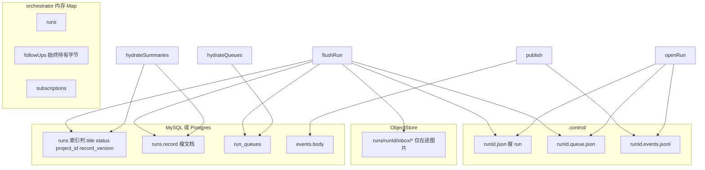

# Run 存储拆分：技术方案

配套现状见 [architecture-overview.md](./architecture-overview.md)（§11 会话、事件、Transcript；§16 存储与回退；§19 核心数据模型）与 [workspace-persistence.md](./workspace-persistence.md)。规约按《阿里巴巴 Java 开发手册（嵩山版）》七维意图等价落到 TypeScript，只落约定，不引入 eslint / prettier（与 [memory-edit-plan.md](./memory-edit-plan.md) §2 同一口径）。

基线：`origin/main` `4c0f8f4`。

一句话范围：把「对话列表行」从 `runs.record` 这个整包 JSON 里拆出来——**索引归列、跟进队列归表、图片归对象存储**。不新建 Session / Message 实体，事件流继续当对话正文。不做 AI 标题、不做按回合文件快照、不改 pi、不引入 ORM 或迁移框架。

---

## 1. 现状与目标

```
写入: flushRun
    → persistRunRecord → .control/<runId>.json（整包 PersistedRun）
    → persistHooks.onRun → metadata.saveRun → runs.record（同一份整包 JSON）

读取: 启动 hydrateFromStore → store.loadRuns() → SELECT record FROM runs（全表肥列）
    → persistRunRecord(mirror:false) 回磁盘 → reloadPersistedState() 灌内存 Map
    GET /v1/runs → listRuns() 读内存
```

已核对的事实：

- **没有 Session / Message 实体。** 一条聊天 = 一个 [`Run`](../packages/contracts/src/run.ts) + `RunEvent` 流。UI 正文由 `buildTranscriptSnapshot` 从事件编译，`{runId}.transcript.json` 只是缓存。
- [`PersistedRun`](../packages/control-plane/src/store/persist.ts) 是 `run` + `followUps` + `inbound` + `subscriptions` + `activeTurn` 一个整包，磁盘和 MySQL 存的是同一份。
- **`followUps` 数组永不裁剪。** 只从 `queued` 变 `delivered`，一直留在数组里。图片 `ImageRef.data` 是 base64 直接写在条目里 ⇒ `runs.record` 随「这条对话历史上发过的每一张图」单调变大。
- `loadRunSummaries()` 用 `JSON_EXTRACT(record, '$.run')`（Postgres 是 `record->'run'`）是权宜之计：解析量小了，**InnoDB 仍要读整行肥 JSON**，而且 JSON 列不能当排序键（`sort_buffer` 256KiB）。
- 控制面启动走的是 `loadRuns()`，**不是** summaries，所以重启要把全表肥 blob 抽一遍。
- 侧栏标题是 `preview(run.prompt)` 现算，`Run` 上没有 `title`。
- 仓库**没有任何硬删**：`deleteRun` 只置 `deletedAt`，没有 `DELETE FROM runs`。
- 已有 [`ObjectStore`](../packages/control-plane/src/objects/store.ts)（`fs` / `s3` / `memory` / `none`）与 `artifactKey(runId, name)` = `runs/<runId>/<name>`，目前只用于归档。
- `ImageRef.data` 的契约已写明「Base64 payload or object-store key」，但热路径从不产出 key。
- 迁移风格是 `migrate()` 里 `CREATE TABLE IF NOT EXISTS` + 一串 `ALTER` / `CREATE INDEX`，重复报错按信息匹配忽略。无版本化框架。

目标验收：

- `saveRun` 写入的 `record` **不含图片 base64**；队列副本按双写窗口分两步退场（§12）。
- 列表 / 摘要 SQL 写死列名，**不** `SELECT *`、**不** `ORDER BY record`、**不**靠 `JSON_EXTRACT` 当主路径。
- 控制面重启后：列表可用；带图跟进仍能 `takeInbound` 拿到原字节；GitHub CI 订阅仍能唤醒。
- 稳态启动时回填探测查询命中 0 行且**不读 `record`**。
- 伪造 `obj:` 的请求被拒；软删后 `run_queues` 行与该 Run 的 inbox 对象被回收。
- 旧肥行分批迁完后 `record_version = 2`；仓库里仍然没有 Session / Message 表。

---

## 2. 规约怎么落到本仓库

手册是 Java 视角。只列本功能会碰到的强制 / 推荐项；集合处理、线程池、Javadoc 模板、DO/DTO/VO 分层不适用，不硬套。**本功能整章命中「MySQL 数据库」，必须写进方案。**

**编程**

- 命名：英文 lowerCamelCase 函数、PascalCase 类型；禁止拼音与英文混用；禁止以 `_` / `$` 开头或结尾。SQL 列 snake_case，TS / JSON 字段 camelCase，映射只在查询边界做。
- 常量：不允许未定义字面量直接出现。`TITLE_MAX_LEN`、`INBOX_IMAGE_KEY_PREFIX`、`BACKFILL_BATCH_SIZE` 等按功能就近定义，不建全局常量类。
- 控制语句：卫语句优先，嵌套不超过 3 层。
- 注释：TSDoc 只写契约（入参、返回、抛出、不变量），不写叙述；`//` 与正文之间有且仅有一个空格。
- 日期时间：比较用 epoch / `Date.parse`，不用字符串当排序键；DB 侧用 `DATETIME(3)` / `TIMESTAMPTZ` 列。
- 单一职责：回填拆成「探测待迁行 / 迁一行 / 批循环」三个小函数，不写成一个大 `migrate` 分支。

**异常与日志**

- 禁止用异常做流程控制。`migrate` 里「列已存在」属于预期，沿用现有 try/catch + 信息匹配；**不得**裸 `catch {}` 吞掉非重复错误。
- 禁止用异常代替空值预检查：合并函数对坏 JSON 返回 `null`，不 throw。
- 镜像失败保留原始 error（沿用 `console.error("metadata saveRun failed", error)`），不改写成静默成功。
- 禁止把用户 prompt、图片 base64、对象内容打进日志；只允许打 `runId` 与 object key。

**MySQL**

- 【强制】表达查询语义的字段必须是列，禁止拿 JSON 当索引或排序键。`title` / `status` / `project_id` / `updated_at` / `deleted_at` 都是列。
- 【强制】禁止 `SELECT *`，SQL 写死列名；禁止 SELECT 用不到的大字段（列表与摘要不得把队列 JSON 读进结果集）。
- 【强制】单行不宜过大。队列与图片拆表 / 外置，不堆在 `runs.record`。
- 【强制】不得使用外键与级联。`run_queues.run_id` 在应用层对齐 `runs.id`。
- 【强制】禁止冗余索引。现网已有 `runs_updated_at`、`runs_deleted_at`，**不再新增单列 `updated_at` 索引**；列表条件恒为 `WHERE deleted_at IS NULL ORDER BY updated_at DESC`，按最左前缀新增组合索引 `idx_runs_deleted_updated (deleted_at, updated_at)`。`status` / `project_id` 是过滤维度，各建单列索引。
- 【强制】表必备三字段等价：`run_queues` = `run_id` 主键 + `created_at` + `updated_at`。
- 【强制】大表操作分批、禁止大事务。回填按标记列 + `LIMIT` 分批（§10），不在启动路径跑全表事务。
- 【强制】数据订正必须有回滚方案。见 §12，含回填前建 `runs_backup_<yyyymmdd>`。
- 【强制】禁止在索引列上包函数。反例就是拿 `JSON_EXTRACT` 当列表主路径。
- 【推荐】列表禁止左模糊。侧栏搜索仍在内存 JS 侧做，不下推成 `LIKE '%x%'`。
- 【推荐】大字段有界。队列表只装在途数据与文本，图片投递后交棒给事件流（§11）。
- 【推荐】容量。单表 500 万行 / 2GB 才谈分库分表，本项目量级远不到，只做拆列 + 拆表 + 大字段外置，不分片。

**单元测试（AIR + BCDE）**

- 增量公共函数必须有测试，文件名与被测模块同名。
- 必覆盖：瘦文档写入、标记驱动的队列合并、肥记录分批回填、图片不进 JSON、重启后 inbox 字节还原、投递后队列不留图、`obj:` 伪造被拒、软删回收、delivered 的 `source` 仍能刹住 autofix。
- 覆盖率自检，不设 CI 数字门禁；`pnpm typecheck` + `pnpm test` 是门禁。

**安全**

- 【强制】不信任客户端入参：入口拒绝客户端传入的 `obj:` 前缀，object key 只能服务端生成（§9）。
- 对象 key 禁止 `..`、禁止绝对路径，只允许 `runs/<runId>/inbox/<name>` 且 `runId` 等于当前 Run。
- 读取时二次校验归属；不匹配按「图不存在」处理，不泄漏其他 Run 的 id 是否存在。
- 敏感数据不出网：`obj:` 是内部表示，任何接口都不得把它返回给客户端。

**工程结构与设计**

- 避免过度设计：不拆 Session / Message，不拆 DO/DTO/VO 三套；不引入 ORM，不引入版本化迁移框架。
- 有现成能力就接上：图片走已有 `ObjectStore`，不自造第二套 `.objects` 读写 API。
- 前后端约定：`Run.title` 是可选字段，旧客户端忽略即可；空列表返回 `[]`；JSON 键 camelCase。

---

## 3. 原样复用 vs 必须改 vs 禁止做

**原样复用（新代码必须继承）**

- 真相模型：`Run` + `RunEvent` 流。`flushRun` / `hydrateRecord` / `reloadPersistedState` 的内存 Map 结构不动。
- 双层持久化：磁盘 `.control/` 是热路径主副本，有 `DATABASE_URL` 时 hook 镜像到 MySQL / Postgres。
- `GET /v1/runs` 继续读内存 `listRuns()`，不改成每请求打库。
- `loadRunIntoMemory` 四级回退：内存 → 本地 json → DB `loadRun` → 归档还原。
- MySQL 与 Postgres 并行实现、共用 `MetadataStore` 接口；`MysqlMetadataStore` 仍是 `PostgresMetadataStore` 的别名。
- `publishFollowUpUserMessage` 写进事件的图片仍是 base64，投递逻辑不改。

**必须改**

- `persistRunRecord` 不再把整包 `PersistedRun` 当唯一文件、唯一 `record`。
- `hydrateFromStore` 不再 `loadRuns()` 抽肥 blob，改走摘要 + 队列。
- `saveRun` 写索引列 + 瘦文档 + 队列表。
- 跟进图离开 JSON，改存 object key。
- `createRun` 写一次 `title`；`deleteRun` 回收队列行与 inbox 对象。
- 入口校验 `obj:`；`GET /v1/runs/:id/follow-ups` 出网前 resolve。

**禁止做**

- 新建 Session / Message 当第二真相源。
- 把事件流改成「从消息表还原对话」。
- AI 标题、按回合 file-history 快照（4C/4G/40G 双槽机不抄 Cursor checkpoint，见 [workspace-persistence.md](./workspace-persistence.md)）。
- 为了 S3 把 `flushRun` 整条链路改成 async。

---

## 4. 设计决策

**不建 Session / Message。** 事件流已经是正文真相且带顺序与 `seq`。再加一张消息表就有两个真相源、要处理双写不一致，而痛点从来不是「消息存哪」，是「列表行等于整包 record」。

**列表行拆成真列，但不把 `Run` 全字段列化。** `collaborators` / `contextUsage` / `pullRequests` / `executionTarget` 是嵌套结构且不参与查询，留在 `record` JSON 符合规约。只把参与查询 / 排序 / 展示的提成列：`title`、`status`、`project_id`。

**用 `record_version` 标记列，不靠「猜有没有队列键」。** 猜的做法必须先把 `record` 读出来才能判断——正是要消灭的读法，而且和「空队列」语义打架。整数标记让读侧判断与回填选行都变成索引可用的比较。

**队列进单表多 JSON 列，不是一行一条。** 这是**已知债**，写在明面上：`follow_ups` 仍是 JSON 数组，`flushRun` 是全量快照写法，所以聊到 200 轮时每加一条跟进要重写这 200 条的文本。规范做法是一对多拆行（`run_follow_ups`），一期不做，因为 orchestrator 现在是 `followUps.get(runId)` 整数组语义，拆行要改编排层读写模型，超出「止血」范围。图片外置后这一行只随文本增长（每条几百字节），量级可接受；拆行留给第三刀。

**delivered 的跟进条目必须保留。** 曾评估「只存 queued、delivered 从事件流重建」，**已否决**：`deliverGitHubWebhook` 把整个数组传给 `decideSubscriptionWake`，[`autofix.ts`](../packages/control-plane/src/subscriptions/autofix.ts) 的 `hasUserFollowUp` 读其中 `source === "user"`，语义是「用户一旦跟进过就停掉 CI autofix」的人工接管刹车。裁掉 delivered 会让刹车在投递后失效、机器人继续推提交。`autofixCount` 在订阅上，不受影响。

**图片「投递即交棒」，所以一期不需要 GC。** 排队期间 object 文件是唯一持久副本；投递那一刻 `publishFollowUpUserMessage` 把 base64 写进 `user.message` 事件，事件成为持久副本，队列里那条就丢掉 `images`、对象文件删除。结果是对象存储只装在途排队的图，天然有界。

**队列表全量 hydrate，不能懒加载。** `deliverGitHubWebhook` 是 `for (const [runId, items] of subscriptions)` 全量扫内存，懒加载会漏投 CI 唤醒。这把「图片必须离开队列」从优化升级成**前置条件**——否则全量读队列只是把肥读换了张表。

**`saveRun` 不开跨表事务。** 两条语句，顺序固定「先 `run_queues`、再 `runs`（含 `record_version = 2`）」。中途失败时 `record_version` 仍是 1，读侧继续认肥 `record`，下次 `flushRun` 自然重放。依据是磁盘为主副本、DB 为镜像，且手册禁止大事务。

**双写窗口分两步退场。** 瘦 `record` 对旧代码不是向后兼容的，直接切会让回滚静默丢排队跟进。见 §12。

---

## 5. 数据模型

**`runs` 增量列**

| 列 | 类型 | 说明 |
| --- | --- | --- |
| `title` | `VARCHAR(191) NULL` | 用户可见标题。`runIndexTitle`：已有 title 优先，否则 prompt 首行，压缩空白后截断 80，空则「未命名任务」 |
| `status` | `VARCHAR(64) NULL` | 与 `run.status` 同步，供过滤 |
| `project_id` | `VARCHAR(191) NULL` | 供项目维度过滤 |
| `record_version` | `SMALLINT NOT NULL DEFAULT 1` | `1` = 旧肥包；`2` = 瘦文档且队列已在 `run_queues` |

索引：新增 `idx_runs_deleted_updated (deleted_at, updated_at)`、`idx_runs_status`、`idx_runs_project_id`。**不新增** `updated_at` 单列索引（与现网 `runs_updated_at` 冗余）。

`title` 只在 `createRun` 写一次，跟进不重算。已核实所有建 Run 的入口都经 `createRun`（`POST /v1/runs`、[`ingress/chat.ts`](../packages/control-plane/src/ingress/chat.ts)、[`automations/runner.ts`](../packages/control-plane/src/automations/runner.ts)、交接 fork），所以一处赋值即全覆盖。

**`title` 语义前瞻**（避免二期改列）：约定**非空即不自动覆盖**。将来加 AI 标题或 `PATCH /v1/runs/:id` 重命名，都不得回头改写已有 `title`；不为此新增 `title_source` 列。

**`run_queues`（新表，无 FK）**

| 列 | 类型 | 说明 |
| --- | --- | --- |
| `run_id` | `VARCHAR(191)` PK | 应用层对齐 `runs.id` |
| `follow_ups` | `JSON(B) NOT NULL` | 图片只剩 `obj:` key；delivered 条目不留 `images` |
| `inbound` | `JSON(B) NOT NULL` | 同上 |
| `subscriptions` | `JSON(B) NOT NULL` | 无图 |
| `active_turn` | `JSON(B) NULL` | 单个在途回合 |
| `created_at` / `updated_at` | `DATETIME(3)` / `TIMESTAMPTZ` | 三字段等价要求 |

**总是写行**（含空队列）。歧义交给 `runs.record_version`，不靠 LEFT JOIN 的 NULL 去猜。软删时删行（§11）。

**合并语义（强制测）**

- `record_version = 2`：队列**只**认 `run_queues`；没有行按空队列。
- `record_version = 1`：队列**只**认 `record` 里的嵌入字段，禁止用空队列覆盖。
- LEFT JOIN 出来的全 NULL 行不得当成「已写入的空队列」——判断依据是 `record_version`，不是 NULL。

**磁盘**

- `.control/<runId>.json` — 瘦 `{ version: 1, run }`
- `.control/<runId>.queue.json` — 队列
- `.control/<runId>.events.jsonl` / `.transcript.json` / `.session/` / `.worker.json` — 不变
- 加载时旧的肥 `<runId>.json` 仍能读（合并函数兼容）

**对象存储**

- key = `runs/<runId>/inbox/<name>`，`ImageRef.data` = `obj:` + key
- 走现有 `ObjectStore`。`fs` 后端落在 `{runsDir}/.objects/`，`s3` 时同一 key
- `persistRunRecord` 今天是同步函数：`fs` 后端按同步写文件语义落盘；**禁止**为了 S3 把 `flushRun` 改成 async（不在一期范围）

**合约**

- `Run.title?: string | null`（新增可选字段）
- `ImageRef.data` 沿用既有契约「Base64 或 object-store key」

---

## 6. 分层与数据流



职责切分：

- `runs` 行 = 列表 / 排序 / 过滤的**索引**
- `runs.record` = 瘦 `{ version, run }`，只服务「还原完整 `Run` 元数据」
- `run_queues` + `.queue.json` = 跟进仓
- `ObjectStore` = 在途图片仓
- `events` / JSONL = 对话正文（不变）

**列表 SQL 的诚实边界**：一期强制 `WHERE deleted_at IS NULL ORDER BY updated_at DESC`、写死列名、结果集不带队列 JSON；但内存 `listRuns()` 仍需要较完整的 `Run`，所以 hydrate 仍读**瘦** `record`（去掉队列与图后通常是 KB 级）。二期若仍拖列表，再把侧栏用到的 `model` / `source` / `vm_slot_id` / `created_at` 列化，届时列表 SQL 完全不 `SELECT record`。

---

## 7. 读写路径

**写**：`flushRun` → 外置在途图片 → 写瘦 json + queue json → hook `saveRun`（索引列 + 瘦 record + `run_queues`）。内存 Map 始终持有字节，只有落盘那一步才换成 key。

**启动 hydrate**：

1. `loadRunSummaries()`：显式列 + 瘦 `record`，`WHERE deleted_at IS NULL ORDER BY updated_at DESC`。
2. `loadRunQueues()`：**必须全量**（订阅要全量常驻内存，§4）。
3. 合并后 `persistRunRecord(..., { mirror: false })` 回磁盘，再 `reloadPersistedState()` 灌内存。
4. 不再 `SELECT` 带队列的肥 `record`。

**加载单条**：内存优先；否则 `loadRun`（`runs` 瘦 record + `run_queues` 行）+ `loadEvents`，即现有 `loadRunIntoMemory`。加载时把 `obj:` resolve 回字节，保证 `takeInbound` 行为不变。

**归档 / 还原**：归档写瘦 record + queue + 剩余 inbox 对象；还原时先写回对象再 resolve。**禁止**把 resolve 后的 base64 打进 `record.json`。

**管理台**：继续 `loadRunSummaries()`，标题取 `title` 回退 prompt。无 `DATABASE_URL` 时 [`admin-api`](../packages/admin-api/src/data.ts) 回退 `loadPersistedRuns()`，拆成两文件后该回退必须仍能读到队列（合并逻辑收在 persist 层），列入验收。

**MySQL 与 Postgres 同改**：索引列、`run_queues`、`record_version`、分批回填必须同时落到 [`mysql.ts`](../packages/control-plane/src/store/mysql.ts) 与 [`postgres.ts`](../packages/control-plane/src/store/postgres.ts)，不许只做一边。

---

## 8. 图片读取路径

图片进事件流的时机是**投递**，不是排队。已核实链路：`enqueueFollowUp` 发的 `followup.queued` 事件**不带 images**；等 `takeInbound` → `deliverTakenFollowUps` → `publishFollowUpUserMessage` 才把 `images` 写进 `user.message` 事件。

所以对象存储不是「图的唯一去处」，它只是「已排队未投递」这个窗口的唯一副本：

| 阶段 | 图的持久副本 | 队列里留什么 |
| --- | --- | --- |
| 已排队、worker 未取 | object 文件 | `obj:` key |
| 已投递 | `user.message` 事件的 base64 | 什么都不留（丢掉 `images`） |

三条读图路径与一期口径：

1. **UI 看历史图**（Web / Desk / mobile 气泡）——`GET /v1/runs/:id/transcript`，数据来自 `user.message` 事件的 base64；`?images=href` 时走 `GET /v1/runs/:id/transcript/images/:messageId/:index`（`findTranscriptImage` + `rawTranscriptImageData`）。**一期完全不改这条路**，用户看图体验零变化。
2. **Worker 拿图**——`takeInbound` 从内存队列拿字节；重启后由 persist 层把 `obj:` resolve 回字节再进内存。worker 协议不变。
3. **队列接口**——`GET /v1/runs/:id/follow-ups` 必须在 API 层 resolve 回 base64（或按 transcript 先例给 href）。目前唯一消费者是 Desk 的 [`run-chrome.tsx`](../packages/desk/ui/project/run-chrome.tsx)，它只取 `status === "queued"`。

二期把 `RunEvent.data.images` 也改 key 时，`rawTranscriptImageData` / 图片字节端点必须同步支持从对象存储取字节，否则历史气泡会坏图——写进二期验收。

---

## 9. 安全边界：`obj:` key 只能服务端生成

现状已核实：`POST /v1/runs` 是 `const body = (await readJson(req)) as CreateRunRequest`，`input.images` 不校验就进 `inbound` 与 `RunEvent.data.images`。一旦 `obj:` 在读路径有意义，客户端传 `{"mediaType":"image/png","data":"obj:runs/<别人的 runId>/inbox/x"}` 就会被当自家 key 读盘，构成跨 Run 越权读取。

- **入口拒绝**：任何来自客户端的 `ImageRef.data` 若以 `obj:` 开头，直接判非法（400）。不做「顺手当 key 用」。
- 生效面：`POST /v1/runs`、跟进 / steer、IM 入口（`chat.ts` 自己下载图片天然是 base64，仍走同一校验）。
- **读取再校验**：resolve 只接受 `runs/<当前 runId>/inbox/<name>`；跨 Run 的 key 按「图不存在」返回，不泄漏存在性。
- **出网前 resolve**：`GET /v1/runs/:id/follow-ups` 不得把 `obj:` 返回给客户端。
- 测试：伪造 `obj:runs/<别人的 id>/inbox/x` 必须被拒且拿不到字节；跟进队列接口返回的 `images[].data` 不以 `obj:` 开头。

---

## 10. 迁移与回填

沿用 `migrate()` + `CREATE IF NOT EXISTS` + `ALTER`。**回填必须分批、可停、幂等**，不在启动路径扫肥列。

1. `CREATE TABLE IF NOT EXISTS run_queues`。
2. `ALTER` 加列（`title` / `status` / `project_id` / `record_version`）+ 组合索引；重复报错按现有信息匹配忽略。
3. **探测**：`SELECT id FROM runs WHERE record_version < 2 LIMIT 1`。**不带 `record`**；没有待迁行立刻结束，稳态启动零成本。
4. **分批**：`SELECT id, record FROM runs WHERE record_version < 2 ORDER BY id LIMIT :batch`（`BACKFILL_BATCH_SIZE` 建议 200，写成常量）。
5. **每行**：外置在途图片 → 写 `run_queues` → `UPDATE runs SET record = <瘦>, title = …, status = …, project_id = …, record_version = 2 WHERE id = ?`。
6. **顺序强制先队列后主表**；中断可重跑，已是 `2` 的行不再读。
7. 回填不阻塞服务可用：批间让出；失败只记日志并保持 `record_version = 1`，下轮再来。

回填前先建备份表，见 §12。

---

## 11. 回收与容量

仓库无硬删，`deleteRun` 只置 `deletedAt`。不显式定义回收，新表和对象文件会在 40G 机上单调增长。

**有界化设计（投递即交棒，一期不需要 GC）**

- 内存里的 `FollowUp.images` **始终是字节**（只在持久化时外置、加载时 resolve），所以 `publishFollowUpUserMessage` 拿到的仍是 base64，事件内容与今天完全一致，**无需改投递逻辑**。
- 顺序强制：**先发 `user.message` 事件**（`publish` 同步落 JSONL），**再在下一次持久化时丢弃该条的 `images` 并删对象文件**。反了会丢字节。
- 结果：对象存储只装在途排队的图，天然有界。
- 队列 JSON 仍随轮数增长，但只增长文本（每条几百字节，200 轮约几十 KB），不再是 MB 级。
- **只丢图，不丢条目**：delivered 条目本身是 autofix 刹车的输入（§4）。

**软删即回收**：`deleteRun` 时删 `run_queues` 行 + 删该 Run 剩余的 `runs/<id>/inbox/` 对象。已删对话不需要待投递队列。

**与工作区回收的口径一致**（[workspace-persistence.md](./workspace-persistence.md)）：回收只删工作区与图片对象，**不删 `.control` 对话**。

**二期注意**：`RunEvent.data.images` 也改 key 后，事件与队列共用同一 object key，交棒关系需要重新推导（对象成为唯一副本，必须补引用计数）——写进二期验收，一期不埋这个坑。

---

## 12. 发布与回滚

**破坏性结论：DDL 非破坏，DML 有一次就地改写。**

- **DDL 只增不减**：`CREATE TABLE IF NOT EXISTS` + `ALTER TABLE ADD COLUMN`。没有 `DROP COLUMN` / `DROP TABLE` / `DELETE FROM runs`。
- **DML 会就地改写 `runs.record`**，没有自动 undo。按发布切两段，把不可逆面积压到最小：
  - **release 1**：`record` 里 base64 → `obj:` key，**队列副本保留**。唯一不可逆的是「图片字节搬出 record」，而这些字节：已投递的在事件流里还有一份，未投递的在对象文件里。
  - **release 2**：才削掉 `record` 里的队列副本。此后回滚会丢排队跟进。
- **【强制】真回滚点**：回填前 `CREATE TABLE runs_backup_<yyyymmdd> AS SELECT * FROM runs`（现网量级很小，成本可忽略），稳定后人工 drop。
- 磁盘 `.control/` 与对象存储是另外两份，不随 DB 回填改写而丢。

**双写窗口（一期采用）**：release 1 的 `record` 仍保留队列副本（图片已换成 key，所以不再是 MB 级），读侧只认 `run_queues`。跑满一个发布周期确认无回滚需求后，release 2 才真正削掉副本。这样第一刀的收益（图片离开 JSON、索引列、hydrate 走摘要）当期就拿到，回滚仍然安全。

**回滚剧本**：回滚只需部署旧代码；`run_queues` 与新列留着不动（旧代码不认、也不删）。若已进入 release 2 才回滚，明确接受「丢排队跟进、不丢对话」，并在发布单里写清。图片方面：回滚后旧代码读到 `obj:` 会当 base64 用而显示坏图，因此 release 1 必须保证所有读图路径都在新代码里 resolve，且回滚窗口内不删除任何原始数据。

---

## 13. 改造前后对照

**今天：一个地方装全部。** `.control/<id>.json` 与 `runs.record` 是同一份整包：

```json
{
  "version": 1,
  "run": { "id": "…", "prompt": "帮我改首页", "status": "IDLE", "projectId": null },
  "followUps": [
    { "id": "f1", "text": "再改配色", "status": "delivered",
      "images": [{ "mediaType": "image/png", "data": "iVBORw0KGgo…（1.5MB base64）" }] }
  ],
  "inbound": [],
  "subscriptions": [],
  "activeTurn": null
}
```

`runs` 行只有 `id / user_id / org_id / record / updated_at / deleted_at`。排序只能靠 `updated_at`，标题只能从 `record` 的 `prompt` 现算；`followUps` 永不裁剪，所以这行随历史发过的每张图一起长。

**改造后：索引、队列、图片各归各位。**

`runs` 行：

```
id / user_id / org_id / title / status / project_id / record_version=2
    / record（瘦）/ updated_at / deleted_at
```

`runs.record`：

```json
{ "version": 1, "run": { "id": "…", "prompt": "帮我改首页", "status": "IDLE" } }
```

`run_queues` 行 `run_id / follow_ups / inbound / subscriptions / active_turn / created_at / updated_at`，其中排队中的条目：

```json
{ "id": "f2", "text": "再改字号", "status": "queued",
  "images": [{ "mediaType": "image/png", "data": "obj:runs/<id>/inbox/followup-f2-1" }] }
```

已投递的条目不留 `images`；字节在 `user.message` 事件里。对象存储 `.objects/runs/<id>/inbox/…` 只存在途图片。磁盘是 `<id>.json`（瘦）+ `<id>.queue.json`。

**没有变的**：`Run` 只多一个可选 `title`，不新增 Session / Message；事件流、transcript、`GET /v1/runs`、worker 协议、`loadRunIntoMemory` 四级回退全部原样；用户看图的路径不变（§8）。

---

## 14. 影响面与文件清单

**新增**

- `packages/control-plane/src/store/run-record.ts` — 纯函数：瘦文档、标记驱动合并、`runIndexTitle`、object key 构造与判定、队列解析
- `packages/control-plane/src/store/run-record.test.ts`

**修改**

- [`persist.ts`](../packages/control-plane/src/store/persist.ts) — 两文件持久化、图片外置与 resolve、加载兼容旧肥 json
- [`mysql.ts`](../packages/control-plane/src/store/mysql.ts) / [`postgres.ts`](../packages/control-plane/src/store/postgres.ts) — 索引列、`run_queues`、`record_version`、显式列查询、分批回填
- [`platform.ts`](../packages/control-plane/src/platform.ts) — hydrate 走摘要 + 全量队列
- [`orchestrator.ts`](../packages/control-plane/src/orchestrator/orchestrator.ts) — `createRun` 写 `title`；投递后丢图；`deleteRun` 回收队列行与对象
- [`server.ts`](../packages/control-plane/src/api/server.ts) — 入口拒绝 `obj:`；`follow-ups` 出网前 resolve
- [`archive.ts`](../packages/control-plane/src/objects/archive.ts) — 归档瘦 record + queue + 在途对象
- [`contracts/src/run.ts`](../packages/contracts/src/run.ts) — `Run.title?`

**UI（存储稳定后的薄改）**：Web 与管理台列表优先 `Run.title`；Desk / mobile 同期或紧随，避免只改一端。**待确认**：[`packages/cli`](../packages/cli) 列表是否展示标题，实现时先读代码再决定。

**测试**：上列单测 + `orchestrator.test.ts` 重启带图 inbox + 伪造 `obj:` 被拒 + 软删回收 + 投递后队列不留图且事件里有 base64 + delivered 的 `source` 仍能刹住 autofix（[`autofix.test.ts`](../packages/control-plane/src/subscriptions/autofix.test.ts) 已有刹车用例，需补「投递后仍刹住」）+ `pnpm typecheck` / `pnpm test`。

---

## 15. 分期

- **第一刀**：索引列 + `record_version` + `run_queues` + 跟进图对象化 + hydrate 走摘要 + 分批回填 + `obj:` 入口校验 + 软删回收 + 测试。`record` 仍留队列副本（双写窗口）。
- **第二刀**：削掉 `record` 里的队列副本；列表 SQL 完全不读 `record`；`RunEvent.data.images` 也改 key，两边共用同一 object key 后补引用计数。
- **第三刀（可选）**：跟进拆成一行一条的 `run_follow_ups`，消掉「全量快照重写」这笔债。
- **不做**：Session / Message 表、AI 标题、Cursor 式每回合 checkpoint。

---

## 附录 A：一次未评审就落地的实现给出的教训

2026-09-04 有一版实现先于评审落到分支（已关闭 PR、删除远程分支，不复用其代码）。它验证了拆分方向可行，但暴露的问题必须在正式实现里避免：

- 列表仍 `SELECT record` / `JSON_EXTRACT` 当主路径，队列去掉后行仍可能偏大。
- 自造 `{runsDir}/.objects` 读写，而不走现有 `ObjectStore`。
- 队列解析把 LEFT JOIN 的全 NULL 行当成「已写入的空队列」，会抹掉尚未回填的肥包——正式实现改为标记列驱动。
- 归档默认 resolve 图片，把 base64 又写回对象存储。
- 迁移回填在启动路径全表扫肥列，且靠「猜有没有队列键」判断。
- 客户端可伪造 `obj:` key 跨 Run 读图，入口无校验。
- `GET /v1/runs/:id/follow-ups` 会把 `obj:` 泄给客户端。
- 方案未冻结就同期改了多端 UI。
