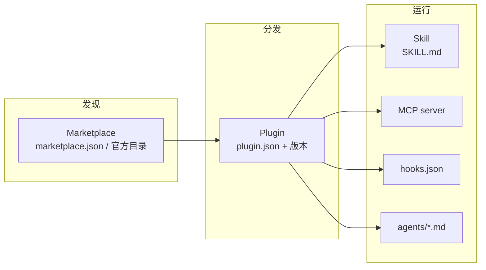
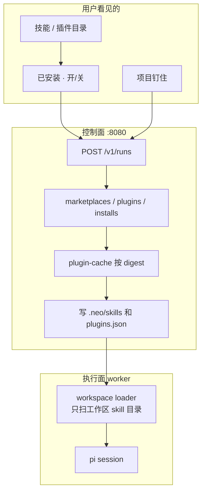

# Codex / WorkBuddy 技能与插件市场调研，以及 Neo 复刻方案

调研日期：2026-08-28。  
对象：OpenAI Codex 的 **Plugin / Marketplace**，以及腾讯云 WorkBuddy / CodeBuddy 的 **技能市场 + 插件市场**。  
目的：弄清两边「市场」到底卖什么、包怎么装、运行时怎么吃，再对照 Neo Cloud Agent 现在的工作区 Skill / 专家 `skillNames` / `environment.json` MCP，给出一份能跟着做、又不照抄官方商店审核门户和办公 Skill 的落地顺序。

本文依据官方文档整理。没有登录 ChatGPT Plugins Directory 或 WorkBuddy 客户端点过每一个按钮；文中把「官方写死的行为」和「第三方解读」分开写。

专家 / 专家团已经单独写过，见 [workbuddy-experts.md](./workbuddy-experts.md)。项目协作见 [workbuddy-project-collaboration.md](./workbuddy-project-collaboration.md)。那两份把**市场**后置。本文把市场作为发现、安装、启用、分发层单独摊开。

主要来源：

- Codex 打包：[Package your plugin](https://developers.openai.com/plugins/build/plugins)
- Codex 上架：[Submit plugins](https://developers.openai.com/plugins/deploy/submission)
- Codex 审核错误码：[Plugin submission errors](https://developers.openai.com/plugins/deploy/submission-errors)
- WorkBuddy 技能市场：[技能](https://www.codebuddy.cn/docs/workbuddy/From-Beginner-to-Expert-Guide/Function-Description/Skills-Market)
- WorkBuddy 插件系统：[插件系统](https://www.codebuddy.cn/docs/workbuddy/Plugins)
- CodeBuddy Code 插件市场：[插件市场](https://www.workbuddy.ai/docs/zh/cli/plugin-marketplaces)
- CodeBuddy Code Skills：[技能系统](https://www.workbuddy.cn/docs/cli/skills)
- 开放标准：[Agent Skills specification](https://agentskills.io/specification)
- Neo 现状：[architecture-overview.md](./architecture-overview.md)、`packages/worker/src/workspace-loader.ts`、`packages/contracts/src/environment.ts`

---

## 1. 一句话结论

Codex 和 WorkBuddy 的「市场」不是同一种东西叠了两层皮，但底层都收成同一套三层模型：

> **Skill = 一份可被 Agent 按需加载的工作手册（`SKILL.md` + 可选脚本 / 参考 / 资产）。**  
> **Plugin = 分发单元：把若干 Skill，再加上可选的 MCP / Hooks / Agents，打成一个有版本号的包。**  
> **Marketplace = 目录：告诉宿主去哪找哪些 Plugin，以及默认装不装、要不要鉴权。**

用户点「安装」，宿主把包落到本地缓存，再按启用状态喂给 Agent。官方商店（ChatGPT/Codex 统一 Plugins Directory、WorkBuddy 侧栏推荐位）只是这个目录的**运营面**，不是运行时。

对 Neo 来说，值得跟的是这套 **「控制面管目录和安装记录，创建 Run 时物化进工作区，worker 继续只扫 `.neo/skills`」**，不是审核门户、身份核验、积分、外卖日历、LSP、npm 生命周期脚本。

| 该跟 | 先别跟 |
| --- | --- |
| Skill / Plugin / Marketplace 三层分开，不要做成一种对象 | 官方公开目录的审核门户、开发者身份核验、5+3 测试用例、分国家上架 |
| 安装 = 把包拷进工作区；启用 / 关闭不卸载 | 宿主机 `~/.codex` / `~/.workbuddy` / `~/.pi` 当云端全局库 |
| Git 原生 `marketplace.json` 当互通格式（兼容 Codex / Claude / CodeBuddy） | npm registry 装插件并跑 `postinstall` |
| 官方内置目录 + 项目钉住 + 用户已安装 | 社区自助上传、评分、灵感广场、积分商品 |
| Skill 先走 Agent Skills 开放标准（`SKILL.md`） | WorkBuddy 办公向 100+ Skill（日历、外卖、Whisper） |
| MCP 插件复用现有 `environment.json` + `neo_mcp_*` | ChatGPT Apps 自定义 UI、`.app.json` connector、Commerce |
| Plugin hooks 默认不信任，要显式允许 | CodeBuddy 的 LSP 插件、斜杠命令命名空间、`!`command`` 预执行 |
| 专家 `skillNames` 引用已安装 Skill | 把 Skill 做成第二种专家，或把专家市场再做一遍 |

锁死的原则只有这一条，和 [architecture.md](./architecture.md) 一致：

> **Agent loop 仍在执行面。市场、安装、审核都在控制面。worker 不打市场 API，不读宿主机插件缓存。**

---

## 2. 先锁三层，再看两边产品

两边文档都爱把「技能」「插件」「市场」混着说。复刻时必须拆开，否则会做成第三套专家中心。



| 层 | 用户感知 | 文件 | 谁决定「这次 Run 用不用」 |
| --- | --- | --- | --- |
| Skill | 「会做某件事」 | `SKILL.md` + `scripts/` `references/` `assets/` | 模型按 `description` 触发；用户可关 |
| Plugin | 「装一个扩展」 | `.codex-plugin/plugin.json` 或等价清单 | 安装记录 + enabled |
| Marketplace | 「从哪逛」 | `.agents/plugins/marketplace.json` 等 | 管理员 / 用户添加源 |

WorkBuddy 官方对照（技能页，和专家文档同文）仍然成立，只是市场把它产品化了：

| 维度 | Skill | 专家 | 专家团 |
| --- | --- | --- | --- |
| 是什么 | 工具能力：怎么做 | 人设 + 方法论 + 工具链 | 团长拆、并行、收口 |
| 市场卖的 | 可安装的能力包 | 可召唤的角色（见专家文，市场后置） | 配方卡片 |

Skill 和专家可以叠加：装了「竞品报告」Skill，再召唤「市场分析师」专家。Neo 已经有专家对象和 `Expert.skillNames`，但 **安装库是空的**，名字引用落不到磁盘。

---

## 3. Codex：Plugin 是包，Marketplace 是目录，Directory 是商店

### 3.1 官方定义（写死的）

[Package your plugin](https://developers.openai.com/plugins/build/plugins) 把 Plugin 收成：

- 每个插件必须有 `.codex-plugin/plugin.json`。**只有这个文件能待在 `.codex-plugin/` 里。**
- 插件根目录还可以有：`skills/`、`hooks/`、`.mcp.json`、`.app.json`、`assets/`。
- 一份插件可以是 skills-only、MCP-only、或两者都有。
- 公开插件上到 **ChatGPT 和 Codex 共用的 Plugins Directory**。本地 / 仓库 marketplace 是另一条、给创作和团队分发用的源。

最小插件：

```
my-first-plugin/
  .codex-plugin/plugin.json
  skills/hello/SKILL.md
```

```json
{
  "name": "my-first-plugin",
  "version": "1.0.0",
  "description": "Reusable greeting workflow",
  "skills": "./skills/"
}
```

`SKILL.md` 就是 Agent Skills 那一套：YAML frontmatter 的 `name` / `description` + Markdown 正文。Codex 没有另造技能格式。

完整清单还带 `author`、`homepage`、`repository`、`license`、`keywords`、`mcpServers`、`apps`、`hooks`，以及 `interface`（展示名、长短描述、分类、能力标签、法律链接、默认 prompt、品牌色、图标、截图）。路径必须相对插件根、以 `./` 开头、不准逃出插件根。

### 3.2 Marketplace：JSON 目录，不是后端服务

官方写死的三处目录：

| 范围 | 路径 | 给谁 |
| --- | --- | --- |
| 仓库 | `$REPO_ROOT/.agents/plugins/marketplace.json` | 团队，跟仓库走 |
| 个人 | `~/.agents/plugins/marketplace.json` | 这个人所有仓库 |
| 兼容 | `$REPO_ROOT/.claude-plugin/marketplace.json` | 从 Claude Code 插件迁过来 |

CLI：

```
codex plugin marketplace add owner/repo
codex plugin marketplace add owner/repo --ref main
codex plugin marketplace add https://github.com/example/plugins.git --sparse .agents/plugins
codex plugin marketplace add ./local-marketplace-root
codex plugin marketplace list | upgrade | remove
```

源可以是 GitHub 短写、HTTPS / SSH Git、本地目录。`--sparse` 只对 Git 源有效。

目录条目示例（官方）：

```json
{
  "name": "local-repo",
  "interface": { "displayName": "Local Example Plugins" },
  "plugins": [
    {
      "name": "my-plugin",
      "source": { "source": "local", "path": "./plugins/my-plugin" },
      "policy": {
        "installation": "AVAILABLE",
        "authentication": "ON_INSTALL"
      },
      "category": "Productivity"
    }
  ]
}
```

`source` 还可以是：

- `url`：插件在仓库根
- `git-subdir`：插件在子目录，可带 `ref` / `sha`
- `npm`：`package` + 可选 `version` / `registry`。官方写明 **下载时不跑 lifecycle scripts**，鉴权走本机 npm 配置

`policy.installation`：`AVAILABLE` / `INSTALLED_BY_DEFAULT` / `NOT_AVAILABLE`。  
`policy.authentication`：安装时鉴权，还是第一次用时鉴权。  
解析失败的条目 **跳过该插件，不整份市场作废**。

安装缓存（桌面端官方行为）：

```
~/.codex/plugins/cache/$MARKETPLACE_NAME/$PLUGIN_NAME/$VERSION/
```

本地插件的 `$VERSION` 是 `local`。启用状态写在 `~/.codex/config.toml`。ChatGPT 读的是缓存副本，不是 marketplace 里的源路径。

工作区管理员可以把个人插件 **Publish 到 ChatGPT workspace**（按角色授权）。这 **不会** 上到公开 Directory。组织可用 `features.plugin_sharing = false` 关掉。

### 3.3 官方商店：审核门户，不是 Git 目录

[Submit plugins](https://developers.openai.com/plugins/deploy/submission) 是另一条路：

1. 组织角色要有 Apps Management 写权限
2. 个人或企业身份核验
3. 选 Skills only / With MCP
4. 填 listing、MCP URL（Universal 或少数 Template）、工具 annotation（`readOnlyHint` / `openWorldHint` / `destructiveHint`）、域名 `/.well-known/openai-apps-challenge`、Skill 包或从 MCP Scan Tools 导入快照
5. 至少 5 条正向 + 3 条负向测试
6. 选国家/地区，签政策声明
7. 审核通过后，开发者自己选发布时间
8. 上架后出现在 ChatGPT + Codex 统一 Directory

MCP 导入的 Skill 是 **提交时快照**，线上不跟服务器热更新。改了要重新 Scan + 提新版本。

第三方文（Codex Knowledge Base，2026-04/05）补充的运营数字——官方 Directory 约 12 个官方插件、社区 40+、`codex-marketplace.com` 非官方聚合——**不当作实现保证**。能交叉验证的工程事实是：自助上架「即将开放」，现在公开分发走人工审核；团队分发走 Git marketplace。

### 3.4 运行时：MCP 可关，Hooks 默认不信

- `.mcp.json` 可以是直接 server map，或包一层 `mcp_servers`
- 用户在 Codex config 里按 `plugins."<name>".mcp_servers.<id>` 开关、收窄工具、改审批
- `hooks/hooks.json` 是默认路径；清单里写了 `hooks` 就覆盖默认
- 环境变量：`PLUGIN_ROOT` / `PLUGIN_DATA`，以及兼容用的 `CLAUDE_PLUGIN_ROOT` / `CLAUDE_PLUGIN_DATA`
- **安装或启用插件不会自动信任 hooks。** 插件自带 hooks 算非托管，用户审查并信任当前定义之后才跑

这和 Neo「工作区 hooks 可以 deny 工具、宿主机 hooks 一律不加载」是同一类闸门。

### 3.5 Codex 对 Neo 真正有用的四句话

1. 包格式已经收敛到 Agent Skills + 一份 JSON 清单，不要自造 `.neo-skill` 二进制。
2. 市场是 **Git/JSON 目录**，商店是 **审核过的运营面**。先做目录，商店可以永远不做。
3. 安装有缓存和版本；启用是配置，不是再拷一份。
4. 远程 MCP 和本地脚本是两种信任级。公开商店对 MCP 要求域名核验和工具标注；本地 marketplace 靠「你自己 add 的源」。

---

## 4. WorkBuddy：消费级技能店 + IDE 级插件市场

WorkBuddy 文档站和 CodeBuddy Code CLI 文档说的是 **两套表面**。复刻时不要合成一个「又逛卡片又 `/plugin marketplace add`」的巨页。

### 4.1 技能市场（WorkBuddy 产品，给办公用户）

[技能](https://www.codebuddy.cn/docs/workbuddy/From-Beginner-to-Expert-Guide/Function-Description/Skills-Market) 官方写成：

- Skill = 一组可执行脚本和工作流，让 AI 在授权下做具体动作（发邮件、订外卖、查股价、读写文件、调第三方 API）
- 页面两栏：**技能市场**（推荐、一键安装）和 **已安装**（对话里可调用）
- 添加路径：上传本地技能包、按任务描述「查找」、按任务描述「创建」（AI 生成）
- 已安装可关闭 / 再启用，不必卸载；建议只开当前任务需要的，减少误调用
- 安装前自动安全扫描（恶意脚本、高风险行为）——英文站 [Skill Marketplace](https://www.workbuddy.ai/docs/workbuddy/From-Beginner-to-Expert-Guide/Function-Description/Skills-Market) 写得更硬
- 推荐位偏办公：Web Search、Agent Browser、Google Calendar / Drive / Search、Office 套件、Local Whisper、yt-dlp、Obsidian、Frontend Design
- 免责：第三方可能外发输入；非官方有提示词注入 / 越权 / 后门；资金和批量删改要小范围先试；复杂 Skill 积分更高

这是 **消费级应用商店**：卡片、推荐、上传 zip、AI 生成、启停。安全文案占了半页，因为 Skill 以用户身份跑本机。

### 4.2 插件系统（同一产品里的另一入口）

[插件系统](https://www.codebuddy.cn/docs/workbuddy/Plugins) 把扩展收成五类：Skill / MCP / Hook / Agent / Rule。侧栏「插件」浏览内置列表，点安装；也可以「+」添加第三方插件市场 URL。这是技能市场的上一层：一个插件可以带多种组件。

### 4.3 插件市场（CodeBuddy Code CLI，几乎是 Claude Code 的翻版）

[插件市场](https://www.workbuddy.ai/docs/zh/cli/plugin-marketplaces) 官方写成两步：**先 add 市场，再 install 某个插件@市场名**。

```
/plugin marketplace add your-org/codebuddy-plugins
/plugin install github@codebuddy-plugins-official
/plugin install commit-commands@your-org-codebuddy-plugins --scope project
/plugin disable|enable|uninstall <插件>@<市场>
/reload-plugins
```

市场源：

| 类型 | 怎么 add | 清单文件 |
| --- | --- | --- |
| GitHub | `owner/repo` | 仓库里 `.codebuddy-plugin/marketplace.json` |
| 其它 Git | HTTPS / SSH，`#v1.0.0` 钉 ref | 同上 |
| 本地 | 目录或直接点到 `marketplace.json` | 开发用 |
| HTTP URL | `https://example.com/marketplace.json` | 相对路径容易坏，官方建议改 Git |

安装作用域（官方）：

| 作用域 | 写到哪 | 和谁共享 |
| --- | --- | --- |
| 用户（默认） | 用户配置 | 这个人所有项目 |
| 项目 | `.codebuddy/settings.json` | 仓库协作者 |
| 本地 | 本机、不提交 | 仅自己、仅这个仓库 |
| 托管 | 管理员托管设置 | 不可被用户改 |

团队可在 `.codebuddy/settings.json` 写 `extraKnownMarketplaces`，成员信任仓库文件夹时提示安装。

官方市场内容分成：LSP 代码智能、外部集成 MCP（GitHub / Jira / Figma / Slack…）、开发工作流（commit-commands、pr-review-toolkit）、输出样式。**LSP 是 IDE 宿主能力，Neo 云端 worker 没有语言服务器进程模型，不要跟。**

实现原理页甚至给出了工厂类名：`DirectoryMarketplace` / `GithubMarketplace` / `HttpMarketplace` + `PluginInstaller`。安装流程：解析源 → 下载/克隆 → 读清单 → 写本地配置 → 刷缓存。插件被拷到缓存，引用插件目录外的路径会坏。清缓存命令是 `rm -rf ~/.codebuddy/plugins/cache`。

安全原话：插件和市场是高度受信任组件，能以用户权限执行任意代码；组织可用托管策略限制能 add 的市场。移除市场会卸载从该市场装的全部插件。

### 4.4 Skill 包格式（CodeBuddy / WorkBuddy Enterprise）

[技能系统](https://www.workbuddy.cn/docs/cli/skills) 和腾讯云 [Enterprise Skills](https://cloud.tencent.com/document/product/1831/134516) 口径一致，就是 Agent Skills 再加一堆宿主扩展：

```
skill-name/
  SKILL.md          # name + description 必需
  scripts/          # 可执行代码
  references/       # 按需读进上下文
  assets/           # 模板、图标
```

目录发现：

| 优先级 | 路径 |
| --- | --- |
| 项目 | `.codebuddy/skills/`、文档另写 `.agents/skills/`、`skills/` |
| 用户 | `~/.codebuddy/skills/` 或 `~/.workbuddy/skills/` |

Frontmatter 扩展（**Neo 第一期不要全吃**）：`allowed-tools`、`disable-model-invocation`、`user-invocable`、`context: fork`、`agent`、`model`、`hooks`。  
占位符：`${CODEBUDDY_PLUGIN_ROOT}` / `${CODEBUDDY_SKILL_DIR}`，以及 Claude 别名。  
`!`command`` 会在 Skill 触发时先跑 shell，输出塞进正文——云端 VM 里这是任意代码，第一期禁止。  
`context: fork` = 隔离子代理，对 Neo 就是以后映射到 `neo_subagent`，不是新 runtime。  
非内置 Skill 的 frontmatter hooks 默认不注册，要 `allowUntrustedFrontmatterHooks`。

`skillOverrides` 四态（`on` / `name-only` / `user-invocable-only` / `off`）是「不改 SKILL.md 也能关可见性」。插件带来的 Skill 不受这项管，走 `/plugin`。

### 4.5 WorkBuddy 对 Neo 真正有用的四句话

1. 消费级市场要的是 **逛、装、开/关、项目置顶**，不是 CLI 语法。
2. IDE 级市场要的是 **多源目录 + 作用域 + 缓存 + 自动更新**。Neo 只借「项目 / 用户」两档，不要做本机 local scope。
3. 包格式已经和 Codex / Claude 对齐到 `SKILL.md`；WorkBuddy 多出来的 fork / 预执行 / LSP 是宿主特性。
4. 他们自己也把安全扫描和「只启用当前任务需要的 Skill」写成产品规则——云端更该如此。

---

## 5. 开放标准：两边都在吃 Agent Skills

[agentskills.io/specification](https://agentskills.io/specification) 是 Anthropic 放出、Codex / Claude / Copilot / Cursor 都认的格式。Neo worker **已经在吃**：

`packages/worker/src/workspace-loader.ts` 扫描：

```
.pi/skills
.cursor/skills
.claude/skills
.codex/skills
.neo/skills
.agents/skills
```

规范要点（官方）：

| 字段 | 要求 |
| --- | --- |
| `name` | 必需，≤64，小写数字和连字符，不首尾连字符 |
| `description` | 必需，≤1024，写清做什么、何时用 |
| `license` / `compatibility` / `metadata` / `allowed-tools` | 可选 |

渐进披露：启动只进 name + description；触发后再读正文；`scripts/` `references/` `assets/` 按需。建议正文 <500 行。

这解释了为什么 Neo **不必自造技能运行时**：pi 的 `DefaultResourceLoader` 已经按这条标准加载工作区 Skill。缺的是把市场里的包 **变成本来就会被扫到的目录**。

---

## 6. Neo 现在已经有什么

对照代码，市场相关能力散落在四处，**没有目录、没有安装记录、没有物化**。

### 6.1 工作区 Skill：按仓库加载，不按用户

`createWorkspaceLoader` 设了 `noSkills: true`，只把 `existingWorkspaceSkillPaths(cwd)` 塞进 `additionalSkillPaths`。宿主机 `~/.pi` / `~/.cursor` / `~/.codex` **故意不读**。这是云端正确行为，市场方案不能推翻。

### 6.2 专家引用了一张空表

`Expert.skillNames` 会写进 `.neo/expert.json`，但 `readExpertWorkspace` 只用 `tools` 收窄父会话工具，**不会按名拷 Skill，也不会过滤 loader**。用户在专家编辑器里勾的名字，今天只是字符串。

### 6.3 MCP 已经是环境对象，不是插件对象

`EnvironmentJson.mcp`：`stdio` | `http`，创建 Run 时落在 `.neo/environment.json`。票据走 `/v1/settings/mcp`，不进 VM git 凭据。worker 用 `neo_mcp_list` / `neo_mcp_call`。插件若带 MCP，应该 **合并进这份已有配置**，不要在 worker 里再起一套插件 MCP 运行时。

### 6.4 Hooks 已经是工作区文件

`.cursor/hooks.json` / `.neo/hooks.json` 走 pi inline 钩子。Codex / CodeBuddy 的插件 hooks 若要跟，只能合并进这两个文件，并且默认不信任。

### 6.5 项目可以钉住 Skill

`Project.expertIds` 旁边现在有 `pluginIds`。创建 Run 时用户已启用 ∪ 项目钉住 ∪ 请求体额外 `pluginIds` 会物化进 `.neo/skills`。第 3 期的 Git 市场 / zip 导入还没做。

### 6.6 架构蓝图把「公开 extension 注册表」留在第二仓

[architecture.md](./architecture.md) §14.1：只有镜像构建仓和「第三方独立发 pi package 的公开 extension 注册表」才值得考虑第二个仓库。技能市场 **不是** 那个注册表——它不发 pi extension，只发工作区文件。不要为市场拆仓，也不要把 `packages/extensions` 的 `neo_*` 云工具开放给第三方上传。

### 6.7 缺口表

| Codex / WorkBuddy | Neo 现在 | 缺口 |
| --- | --- | --- |
| 可浏览的官方目录 | `BUNDLED_PLUGINS` + `GET /v1/plugins` + Web `#/skills` | 社区源、审核门户 |
| 一键安装 / 启停 | `plugin_installs` + enable/disable | 自动升级 digest |
| 项目置顶 Skill | `Project.pluginIds`，创建 Run 物化 | 项目级上传包 |
| Git marketplace add | 解析器已有，API 未开 | 控制面拉目录，不进 worker |
| 上传技能包 / AI 创建 | 无 | zip → 校验 → 用户插件；AI 创建更后 |
| `plugin.json` / `marketplace.json` 导入 | 控制面解析器，第 3 期才吃外部源 | 只物化 skills |
| 安装缓存带版本 | bundled 用 contracts 里的 SKILL.md digest | 对象存储或 `.control/plugin-cache/` |
| 安全扫描 | 路径逃逸 + 拒 npm | 安装时静态检查，不执行 |
| 专家绑 Skill | 缺的名字写入 `plugins.json` warnings | 不失败、不自动装 |
| 公开商店审核 | 无 | 刻意不做 |
| 积分 / LSP / Apps UI | 无 | 刻意不做 |

现网约束（方案里不要假装没有）：

- 应用机大约 2 个 VM 槽；安装不能在槽里 `git clone` 整个社区市场
- loop 必须留在 worker；控制面只编排和落盘
- 不要 fork pi；用已有 workspace loader
- Provider Key / MCP 票据继续只活在控制面或 Gateway
- 工作区磁盘小，插件缓存走对象存储或控制面盘，不要每人装一份进每个 VM 槽的 ext4

---

## 7. 跟做时的翻译（先锁语义）

不要把 Codex 的 `~/.codex/plugins/cache` 或 WorkBuddy 的 `~/.workbuddy/skills` 原样搬进云端。Neo 是多租户控制面 + 按 Run 隔离的工作区。

| 对方概念 | Neo 语义 | 落在哪 |
| --- | --- | --- |
| Skill | 工作区里一份 `SKILL.md` 目录 | 已有 loader；安装目标是 `.neo/skills/<slug>/` |
| Plugin | 带版本的包：若干 Skill ± MCP ± hooks | 新实体 `Plugin` |
| Marketplace | 一组 Plugin 的目录源 | 新实体 `Marketplace`（bundled 是内置源） |
| Plugins Directory / 技能市场 | 官方运营位 | 第一期 = `visibility=bundled` 列表，不是独立站点 |
| `codex plugin marketplace add` | 管理员或用户添加 Git/URL 源 | `POST /v1/marketplaces`，控制面拉清单 |
| `/plugin install foo@bar --scope project` | 把安装记录挂到项目 | `POST /v1/plugins/:id/install { scope, projectId }` |
| 用户作用域 | 该用户之后每条 Run 都物化 | `scope=user` |
| 项目作用域 | 该项目成员的 Run 都物化 | `scope=project` |
| 本地 / 托管作用域 | 不做 / 管理台策略 | 后置 |
| 启用 / 关闭 | 不删缓存，创建 Run 时不拷 | `Install.enabled` |
| `INSTALLED_BY_DEFAULT` | 内置插件可选默认启用 | bundled 清单上的 flag，仍要可关 |
| 安装缓存 | 控制面一份内容寻址副本 | `.control/plugin-cache/` 或对象存储 `plugins/<digest>/` |
| 物化 | 创建 Run 时写入工作区 | 和 `PROJECT.md` / `EXPERT.md` 同路 |
| Skill 上传 | 用户 zip → 校验 → 变成 `visibility=user` 的 Plugin | 第二期 |
| AI 创建 Skill | 开一条 Run 生成 `SKILL.md` 再导入 | 第三期，复用现有 Run，不新开生成器服务 |
| 专家绑 Skill | `skillNames` 解析为已安装或工作区已有 slug | 物化阶段补拷 |
| `neo_*` 云工具 | 不是插件，不许第三方市场发 | 继续只在 `packages/extensions` |

两条边界：

1. **Skill 切的是能力，专家切的是身份。** 市场卖 Skill/Plugin。召唤面继续是专家页。不要在技能市场里放「审查专家」卡片。
2. **市场不是第二种 Environment。** MCP 只是插件的可选零件，合并进已有 `environment.json`。不要为每个插件建 Environment / Build。



---

## 8. 技术方案

### 8.1 原则

1. **不新开进程，不拆第二仓。** 市场是 `contracts` 类型 + `control-plane` 存储 + 创建 Run 多拷几个目录。
2. **worker 继续只认工作区。** 和控制面项目指令、专家同一条路：编排时落盘，session 启动时读。不要让 worker 打 `/v1/plugins` 拉正文。
3. **先 Skill，后 MCP，再 hooks。** 第一期 bundled 只许 `kind=skill`。MCP 只能是 `http` 并走现有 settings 票据。`stdio` 命令、hooks、fork、`!`command`` 默认拒绝。
4. **安装时不执行。** 只做静态校验（清单、路径逃逸、体积、密钥形态、frontmatter）。脚本是落盘文件，真正跑是 Agent 后来用 bash——和仓库里已有脚本同一信任级。
5. **缓存按内容哈希，工作区按启用集。** 十个 Run 不要克隆十份 Git 市场。槽上只放这次启用的 Skill 目录。
6. **兼容导入，不兼容执行所有宿主魔法。** 能读 Codex / Claude / CodeBuddy 的 `marketplace.json` 和 `plugin.json`，只物化 `skills/`。不认识的字段进 `extra`，不要丢。
7. **官方目录内置，社区源默认关。** `GET /v1/plugins` 第一期只返回 bundled ∪ 我的 ∪ 项目的。`POST /v1/marketplaces` 可以先只给管理员。
8. **和专家、项目正交。** 一条 Run 仍是：CLOUD 提示 → 专家 Role Override → 项目指令 → 工作区 AGENTS.md / skills。市场只负责 skills 那一层从哪来。

### 8.2 数据模型

风格对齐现有 `Project` / `Expert`：控制面内存 + `.control/plugins.json`，MySQL / Postgres 用 `id + body JSON` 镜像。

#### SkillPackage（解析结果，不一定单独落表）

```ts
export type SkillPackage = {
  name: string;
  description: string;
  license?: string;
  compatibility?: string;
  allowedTools?: string[];
  body: string;
  files: Array<{ relativePath: string; digest: string; bytes: number }>;
};
```

`name` / `description` 按 Agent Skills 规范校验。`files` 必须全在技能目录内。

#### Plugin

```ts
export type PluginKind = "skill" | "mcp" | "bundle";
export type PluginVisibility = "bundled" | "user" | "project";
export type PluginSourceType = "bundled" | "git" | "url" | "upload";

export type PluginSource = {
  type: PluginSourceType;
  marketplaceId?: string;
  gitUrl?: string;
  ref?: string;
  path?: string;       // 市场根下的相对路径，必须以 ./ 开头
  digest: string;      // sha256 of canonical tree
};

export type Plugin = {
  id: string;          // plug_...；bundled 用稳定 slug，如 plug_pr-review
  slug: string;
  name: string;
  version: string;
  description: string;
  kind: PluginKind;
  category?: string;   // engineering / docs / research；不要做 20 个办公类
  keywords?: string[];
  homepage?: string;
  license?: string;
  interface?: {
    displayName?: string;
    shortDescription?: string;
    defaultPrompt?: string[];
  };
  skills: string[];    // slug 列表，对应包内 skills/
  mcpServerNames?: string[];
  visibility: PluginVisibility;
  source: PluginSource;
  ownerUserId?: string;
  projectId?: string;
  createdAt: string;
  updatedAt: string;
};
```

不把整份 `SKILL.md` 正文塞进 MySQL 行里当唯一真相。正文在 cache；表里是元数据和 digest。bundled 插件的文件放 `packages/contracts/skills/<slug>/` 或 `packages/plugins/<slug>/`，跟 `BUNDLED_EXPERTS` 一样可单测。

#### Marketplace

```ts
export type Marketplace = {
  id: string;          // mkt_official / mkt_...
  name: string;        // kebab-case
  displayName: string;
  source:
    | { type: "bundled" }
    | { type: "git"; url: string; ref?: string; sparse?: string }
    | { type: "url"; url: string }
    | { type: "local-upload" };
  autoUpdate: boolean; // bundled 默认 true；第三方默认 false
  createdBy: string;
  createdAt: string;
  updatedAt: string;
  lastSyncAt?: string;
  etag?: string;
};
```

同步结果是一批 `Plugin` 行（`visibility` 仍按安装范围走；目录里「看得到」≠「已安装」）。

#### PluginInstall

```ts
export type PluginInstallScope = "user" | "project";

export type PluginInstall = {
  id: string;
  pluginId: string;
  version: string;
  digest: string;
  scope: PluginInstallScope;
  ownerUserId?: string;
  projectId?: string;
  enabled: boolean;
  createdAt: string;
  updatedAt: string;
};
```

同一 `(pluginId, scope, owner|project)` 一条。升级改 `version` / `digest`，不另开行。

#### Run / Project / CreateRunRequest

| 字段 | 放哪 | 含义 |
| --- | --- | --- |
| `pluginIds` | `Project` | 项目钉住且默认启用 |
| `pluginIds` | `CreateRunRequest` 可选 | 这次额外启用；第一期可省略，只吃用户+项目已启用集 |
| `plugins` | `Run` 只读快照 | 实际物化的 `{ slug, version, digest }[]`，便于审计 |

校验：用户安装只能被主人的 Run 用；项目安装要项目成员；bundled 全员可见但 **默认不启用**（除非清单标了 `INSTALLED_BY_DEFAULT`，第一期建议全部手动开，避免提示词膨胀）。

### 8.3 包格式（对外兼容，对内只认一种）

安装器按下面顺序认清单，认到就停：

1. `.codex-plugin/plugin.json`
2. `.claude-plugin/plugin.json`
3. `.codebuddy-plugin/plugin.json`
4. 无清单但根下有 `skills/*/SKILL.md` 或根就是一个 Skill 目录（上传 zip 的宽松模式）

内部规范只存：

```
<plugin-root>/
  plugin.json          # Neo 正规化后的清单（从上面三种投影）
  skills/<name>/SKILL.md
  skills/<name>/...
```

`plugin.json` 正规化字段：`name`、`version`、`description`、`skills`、`mcpServers?`、`hooks?`。原清单进 `extra`。

`marketplace.json` 正规化：

```ts
export type MarketplaceFile = {
  name: string;
  interface?: { displayName?: string };
  owner?: { name?: string; email?: string };
  plugins: Array<{
    name: string;
    description?: string;
    version?: string;
    category?: string;
    source: string | { source: string; path?: string; url?: string; repo?: string; ref?: string };
    policy?: { installation?: string; authentication?: string };
  }>;
};
```

能读 Codex 的 `source.local|url|git-subdir|npm` 和 CodeBuddy 的 `source.github|url` 以及字符串相对路径。**npm 源第一期拒绝**（官方虽说不跑 lifecycle，我们现网没有「只下载不执行」的隔离 npm）。URL 型市场若条目是相对路径，同步时记警告，安装失败并提示改 Git 源——和 CodeBuddy 官方限制对齐。

### 8.4 注入路径（和项目指令、专家同构）

创建 Run 时，编排器在写 `PROJECT.md` / `EXPERT.md` 旁边：

1. 解析启用集：用户 `enabled` ∪ 项目 `enabled` ∪ 请求体额外 `pluginIds`。同 slug 时 **项目覆盖用户，请求覆盖项目**。
2. 按 digest 从 cache 取出技能树，写入：

   ```
   .neo/skills/<skill-slug>/...
   .neo/plugins.json          # 快照：装了谁、版本、digest、来源
   ```

3. 若插件声明了 `mcpServers` 且运输是 `http`：合并进工作区 `environment.json` 的 `mcp`（只写 name / url；header 里的 secret 名指向用户已保存的 settings，**不把 bearer 写进工作区**）。stdio 跳过并写 `neo_diag`。
4. hooks：第一期忽略。若以后开放，只合并进 `.neo/hooks.json`，并在 `plugins.json` 标 `hooksTrusted: false`，worker 现有逻辑已经会跑工作区 hooks——所以第一期更要丢掉，避免「装了就执行」。
5. 专家 `skillNames`：对每个名字，若工作区（含刚物化的）没有同名 Skill，写诊断警告，Run 照常开。
6. 仓库里本来就有的 `.cursor/skills` 等 **继续加载**，不覆盖。同名时工作区原文件优先（团队写在仓库里的胜过市场拷贝）。实现：先拷市场，再保证不覆盖已存在路径；或拷到 `.neo/skills` 并让 loader 按现有目录顺序让 `.cursor` 先被发现——**选「不覆盖已存在路径」更简单**。

Worker：`openPiSession` 不用改协议。现有 `WORKSPACE_SKILL_DIRS` 已包含 `.neo/skills`。日志已有 `workspace resources skills=`，再加上 `plugins=` 读 `plugins.json` 即可。

恢复 IDLE Run：文件在工作区里，重新 `openPiSession` 会再扫一遍。不要把 Skill 全文只放进环境变量。

Desk：本机工作区若用户已经有 `.cursor/skills`，不要再从云端强制覆盖。Desk Run 只物化 **项目钉住且本机没有的** Skill；用户全局安装对 Desk 默认不自动落盘，避免把云端个人包写进别人的文件夹。云端 VM Run 不受这条限制。

### 8.5 API

第一期只加薄目录、安装和同步，挂在现有鉴权上。

| 方法 | 路径 | 行为 |
| --- | --- | --- |
| `GET` | `/v1/plugins` | 查询：`q`、`category`、`projectId`。返回 bundled ∪ 已对当前用户可见的安装。项目钉住置顶 |
| `GET` | `/v1/plugins/:id` | 详情 + 技能名列表 + 渲染用的 `SKILL.md` 预览（截断） |
| `POST` | `/v1/plugins/:id/install` | `{ scope: "user" \| "project", projectId? }` |
| `POST` | `/v1/plugins/:id/enable` | `{ enabled, scope, projectId? }` |
| `DELETE` | `/v1/plugins/:id/install` | 卸安装记录，不删 bundled 定义 |
| `GET` | `/v1/marketplaces` | bundled + 当前用户/管理员添加的源 |
| `POST` | `/v1/marketplaces` | 第二期；第一期可只读 official |
| `POST` | `/v1/marketplaces/:id/sync` | 拉清单，刷新 plugin 行 |
| `POST` | `/v1/plugins/import` | 第二期：上传 zip 或贴 `SKILL.md` |
| `POST` | `/v1/runs` | 可选 `pluginIds`；默认吃启用集 |
| `PATCH` | `/v1/projects/:id` | 增加 `pluginIds` |

管理台：`/v1/admin/plugins` 改 bundled 文案、默认启用策略、下架某个 slug。代码里的 `BUNDLED_PLUGINS` 仍是出厂默认，覆盖写在 `.control/bundled-plugin-policy.json`（抄专家 `expert_policies`）。

不要做公开 `workbuddy.link` 式插件落地页。导出就是 `GET /v1/plugins/:id` 的 JSON + 技能目录。

### 8.6 内置插件（编码向，不是办公向）

不要复制 WorkBuddy 的 Calendar / 外卖 / Whisper。第一期 bundled 只放和 Cloud Agent 同域、并且 **尽量薄** 的 Skill，避免和专家文案互抄。

建议第一期 4 个 skills-only 插件（每个插件里 1 个 Skill）：

| slug | 做什么 | 不要做成 |
| --- | --- | --- |
| `pr-review` | 读 diff、按严重级出意见、不改业务 | 第二种 reviewer 专家 |
| `release-notes` | 从提交和 PR 写用户能看的说明 | 营销文案生成器 |
| `repo-scout` | 先列目录和入口再下结论 | 第二种 explorer 专家 |
| `incident-brief` | 从日志和近期提交写一页事故简报 | 值班平台 |

这些 SKILL.md 放 `packages/contracts/skills/`，和 `BUNDLED_EXPERTS` 一样可单测。专家可以 `skillNames: ["pr-review"]`，但专家卡片和技能卡片不要共用文案源——专家是身份，Skill 是步骤。

### 8.7 安全（安装时静态，运行时沿用现网）

安装 / sync 必须失败的情况：

| 检查 | 规则 |
| --- | --- |
| 路径 | 所有清单路径以 `./` 开头，`path.resolve` 后仍在包根内 |
| 体积 | 单插件解压后软顶（例如 5 MB、200 文件）；超了拒绝 |
| 清单 | `name` kebab-case；`version` 有值；至少 1 个合法 `SKILL.md` |
| Frontmatter | 符合 Agent Skills 的 name / description 约束 |
| 密钥形态 | 正文和文件里像 `sk-` / `BEGIN PRIVATE KEY` / `AKID` 的直接拒绝 |
| 宿主魔法 | `context: fork`、`hooks`、`!`command``、stdio MCP、npm source：第一期拒绝或剥掉并警告 |
| 出站 | MCP `url` 必须 HTTPS；host 进 egress 待审列表，不自动放行 `allow_all` |

安装成功但仍要在 UI 标黄的情况：Skill 声明了网络 / 第三方；`compatibility` 提到本机 GUI；描述和脚本能力明显不符。

运行时：

- Skill 脚本 = 工作区文件。egress、hooks deny、transcript 打码规则不变。
- 协作任务不注入个人 MCP 票据（项目协作文已经写过）。
- 转交 Run 时，已物化的 `.neo/skills` 跟着工作区走（这是这次任务用过的能力，不是把用户整个插件库拷走）。
- 第三方 marketplace 默认 `autoUpdate=false`。开启后也只 sync 清单，**不自动升级已安装 digest**，升级要用户点。

现网 2 槽：sync / 拉 Git 市场在控制面做，限流、超时、体积封顶。不要为装插件占 VM。

### 8.8 客户端

#### Web（`packages/web`）

- 顶栏在「专家」旁加「技能」，hash `#/skills`、`#/skills/:id`。
- 列表：官方 / 已安装；进项目时项目钉住置顶。卡片：名称、一句话、版本、是否启用、示例 prompt。
- 「安装」写 user 或 project 范围；「启用」只改 flag。
- 「用这个开对话」= 回到 composer，并确保该插件 enabled；**不**另做技能专用聊天页。
- 项目设置：多选钉住插件（管理员），和专家钉住并排。
- Composer 不必再加第五个选择器。启用集自动进 Run。若要调试，设置里放「本次额外技能」。

#### Desk / CLI / Mobile / Admin

| 宿主 | 第一期 |
| --- | --- |
| Desk | 同一 `/v1`；项目设置能钉插件；本机不落用户全局包 |
| CLI | `pnpm neo plugin ls` / `pnpm neo plugin install pr-review` / `pnpm neo plugin disable pr-review` |
| Mobile | 能看已启用列表；安装放到第二期 |
| Automation | 到点开的 Run 继承用户+项目启用集，不另做技能字段 |
| Admin | bundled 文案 / 下架 / 是否默认启用 |

IM 第一期不解析「装个技能」，避免和群文件上传冲突。

### 8.9 和现有对象的关系

| 已有对象 | 市场怎么用它 |
| --- | --- |
| 工作区 `SKILL.md` | 最高优先；市场不覆盖 |
| `Expert.skillNames` | 引用 slug；缺则警告 |
| `Project.instruction` | 不管技能 |
| `Project.expertIds` | 并列 `pluginIds` |
| `environment.json` mcp | 合并 http MCP；票据仍走 settings |
| `.neo/hooks.json` | 第一期不合并插件 hooks |
| `neo_subagent` / 专家团 | 不通过市场发团；团员仍是专家 markdown |
| `packages/extensions` | 不是市场商品 |
| Environment / Build | 不因装技能打新快照；Skill 是工作区文件，不是 rootfs |

---

## 9. 分期

原则：**先让用户能从一个官方列表把 Skill 装进下一次 Run，再让项目能钉住，最后才允许添加外部目录。** 公开商店和 AI 生成永远后置。

第 0–2 期已经落地：官方四份 bundled Skill、`/v1/plugins` 安装启停、创建 Run 物化 `.neo/skills`、`Project.pluginIds`、Web `#/skills`、CLI `plugin`。第 3 期（Git 市场 / zip）还没做。

### 第 0 期：锁语义和解析器

- `packages/contracts`：`Plugin` / `Marketplace` / `PluginInstall` / `parseSkillMd` / `parsePluginManifest` / `parseMarketplaceFile` / `BUNDLED_PLUGINS`
- 单测：Agent Skills 合法与拒绝；Codex / Claude / CodeBuddy 三种清单投影；路径逃逸；marketplace 坏条目跳过

验收：不跑 UI，`pnpm test` 里合约测过。

### 第 1 期：官方目录 + 用户安装 + 物化

- 控制面：bundled 列表、user install / enable、创建 Run 写 `.neo/skills` + `plugins.json`
- worker：日志打 `plugins=`；无安装时行为和今天完全一样
- Web `#/skills` 浏览 + 安装 + 启停
- CLI `plugin ls|install|disable`

验收：装 `pr-review` 后 `POST /v1/runs`，工作区出现 `.neo/skills/pr-review/SKILL.md`，transcript 的资源日志带上这个名字。关掉再开新 Run，文件不再出现。未登录或他人账号看不到这条安装。

### 第 2 期：项目钉住 + 专家真正用上 skillNames

- `Project.pluginIds`；项目设置 UI
- 物化合并用户 ∪ 项目；同名不覆盖仓库已有 Skill
- 专家物化：缺 Skill 写 `neo_diag`，不失败
- 管理台改 bundled 文案

验收：项目钉住 `release-notes`，成员开对话不必自己再点安装；另一个项目看不到。专家勾了 `pr-review` 但没装时，诊断里有一句警告。

### 第 3 期：外部 Git 市场 + zip 导入

- `POST /v1/marketplaces`（先管理员，再普通用户）
- sync 拉 `marketplace.json`，只导入 skills-only 条目
- `POST /v1/plugins/import` 上传 zip
- 静态扫描挡下密钥和路径逃逸

验收：管理员 add 一个只含一个 hello Skill 的公开 Git 仓库，sync 后能装、能关。带 `../` 路径或 stdio MCP 的条目出现在列表里但安装按钮不可用并写明原因。

### 刻意后置

- 公开 Plugins Directory、身份核验、5+3 测试用例、分国家上架
- 社区评分、灵感广场、积分 / Credit
- npm 源、跑 lifecycle、装任意 stdio MCP
- 插件 hooks 自动信任、`!`command`` 预执行、`context: fork` 新 runtime
- LSP、ChatGPT Apps UI、`.app.json`
- 办公向日历 / 外卖 / Whisper / yt-dlp
- AI「描述一下就生成 Skill」当独立产品（要用就开普通 Run 写文件再 import）
- 自动升级已安装 digest
- 把 `packages/extensions` 开放给第三方
- 为市场拆第二个 Git 仓库

---

## 10. 建议实现顺序（按包）

| 包 | 做什么 |
| --- | --- |
| `packages/contracts` | 类型、bundled 目录、三种清单解析、`SKILL.md` 校验 |
| `packages/control-plane` | store（抄 `experts/`）、cache、API、`createRun` 落盘、persist hook |
| `packages/worker` | 读 `plugins.json` 打日志；loader 已够用。不要为市场改 pi |
| `packages/extensions` | 不动。MCP 继续 `neo_mcp_*` |
| `packages/web` | `#/skills`、安装/启停、项目钉住 |
| `packages/cli` | `plugin` 子命令 |
| `packages/desk` | 项目钉住；本机不落用户全局包 |
| `packages/mobile` | 只读已启用 |
| `packages/admin-*` | bundled 政策 |
| `docs/` | 本文；overview 挂链；专家/协作文改「市场见本文」 |

测试（跟仓库习惯）：

- 合约：解析、逃逸、坏条目跳过、bundled slug 稳定
- 控制面：无插件回归；install 后物化；disable 后新 Run 无文件；越权 404；项目钉住对成员可见
- worker：有 `.neo/skills` 时 `getSkills()` 含该名；无 `plugins.json` 时行为不变
- Web：列表和 install 调对 API（组件测即可）

现网不要拿外部 Git 市场做压测。本地 `WORKER_RUNTIME=local` + mock gateway 足够验物化。

---

## 11. 风险

| 风险 | 为什么 | 怎么收 |
| --- | --- | --- |
| 做成第三套专家中心 | 卡片长得像 | 技能页没有「召唤」主按钮；主操作是安装 / 启用 |
| 提示词膨胀 | 启用 20 个 Skill，name+description 也会占上下文 | 默认全关；UI 提示「只开这次要用的」；软顶例如启用 ≤12 |
| 覆盖仓库 Skill | 市场拷贝冲掉团队手册 | 已存在路径不覆盖 |
| 供应链 | zip / Git 里藏 hook 或密钥 | 第一期剥 hook；静态扫密钥；不跑安装脚本 |
| 装插件占槽 | 在 VM 里 clone 市场 | 控制面 cache；槽上只拷启用集 |
| Desk 把云端包写入用户文件夹 | 污染本机仓库 | Desk 只落项目钉住且本地没有的 |
| MCP 票据进工作区 | 合并 environment.json 时写错 | 只写 name/url；secret 名走 settings |
| 和专家 skillNames 两套真相 | 一边装了一边没引用 | 物化以 install 为准；skillNames 只是额外希望列表 |
| 办公套件回流 | 推荐位会引向日历外卖 | bundled 只出编码向；导入扫描 `compatibility` |
| 公开商店范围爆炸 | 审核、法务、分发地区 | 分期名单里后置，不准偷偷做 |

---

## 12. 和旧调研的关系

[workbuddy-experts.md](./workbuddy-experts.md) 把专家**市场**后置，专家作为角色包先行。那个判断仍然成立：专家中心商店不做。本文做的是 **Skill / Plugin 目录**，不是专家上传站。

[workbuddy-project-collaboration.md](./workbuddy-project-collaboration.md) 第 10 节说项目协作第一期只用项目指令 + 项目 skills + subagent。项目 skills 当时假定「人把 `SKILL.md` 放进仓库」。本文补的是：**项目还可以钉住控制面安装的插件**，物化进 `.neo/skills`。项目协作不必等市场；市场第 2 期才接 `pluginIds`。

[desk-project-design.md](./desk-project-design.md) 把技能市场列在「不抄办公套件」。本文落地后，Desk 只跟 **项目钉住 + 同一 `/v1`**，仍然不做办公推荐位、双写、公开会话。

[architecture.md](./architecture.md) 的「公开 extension 注册表」仍然指 **pi 云工具包**，不是 SKILL.md 市场。两者不要并仓。

---

## 13. 建议的第一张产品切片

不要从审核门户或 Git 市场开干。最小切片：

1. 官方列表能看到 4 个编码向 Skill  
2. 能安装到「我的」、能关掉  
3. 开对话后工作区出现对应 `.neo/skills/<slug>/SKILL.md`  
4. 关掉后再开，不再出现  
5. 默认不装时，行为和今天完全一样  

这五步已经覆盖 Codex「装包 → 缓存 → 启用 → 宿主加载」和 WorkBuddy「市场 / 已安装 / 启停」的骨架。外部目录、zip、MCP、hooks 是放大器，不是定义。

---

## 14. 资料索引

| 主题 | 链接 |
| --- | --- |
| Codex 打包 / marketplace.json | https://developers.openai.com/plugins/build/plugins |
| Codex 上架审核 | https://developers.openai.com/plugins/deploy/submission |
| Codex 提交错误码 | https://developers.openai.com/plugins/deploy/submission-errors |
| WorkBuddy 技能市场 | https://www.codebuddy.cn/docs/workbuddy/From-Beginner-to-Expert-Guide/Function-Description/Skills-Market |
| WorkBuddy 插件系统 | https://www.codebuddy.cn/docs/workbuddy/Plugins |
| CodeBuddy 插件市场 | https://www.workbuddy.ai/docs/zh/cli/plugin-marketplaces |
| CodeBuddy Skills | https://www.workbuddy.cn/docs/cli/skills |
| WorkBuddy Enterprise Skills | https://cloud.tencent.com/document/product/1831/134516 |
| Agent Skills 规范 | https://agentskills.io/specification |
| Neo 专家方案 | [workbuddy-experts.md](./workbuddy-experts.md) |
| Neo 项目协作 | [workbuddy-project-collaboration.md](./workbuddy-project-collaboration.md) |
| Neo 现状 | [architecture-overview.md](./architecture-overview.md) |
| Neo 原则 | [architecture.md](./architecture.md) |
| 现有 Skill 加载 | `packages/worker/src/workspace-loader.ts` |
| 现有 MCP | `packages/contracts/src/environment.ts`、`packages/control-plane/src/mcp/` |
| 现有专家物化 | `packages/control-plane/src/experts/materialize.ts` |
