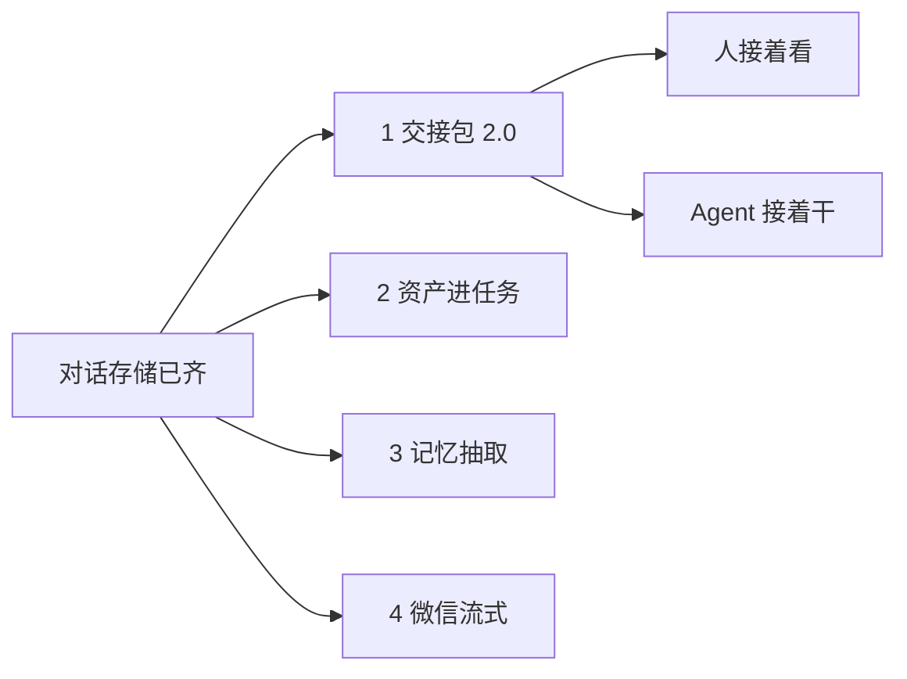

# WorkBuddy 对齐技术方案（对话存储之后）

日期：2026-09-04。  
对照基线：本仓库 `main` `98e90da`（事件图像一等存储已上线）；WorkBuddy 官方 changelog 到 **5.5.2（2026-09-03）**。  
前序调研（本文不替代，只接现状）：

- 项目协作：[workbuddy-project-collaboration.md](./workbuddy-project-collaboration.md)
- 专家：[workbuddy-experts.md](./workbuddy-experts.md)
- 技能市场：[skill-plugin-marketplace.md](./skill-plugin-marketplace.md)
- 2026-08-28 缺口：[workbuddy-feature-gap-2026-08.md](./workbuddy-feature-gap-2026-08.md)（**骨架 / 第一刀已过时**，见 §1）
- 记忆接入：[agent-memory-research.md](./agent-memory-research.md)、[memory-edit-plan.md](./memory-edit-plan.md)

本文是**实现规格**，不是再写一遍「还值得跟什么」。8 月那份缺口文的三刀里，Web 验收面和 Composer 预填已经落地。对话存储刚对齐（Run 瘦身 + 事件图 `obj:`），接下来跟的是它解锁的协作深度，不是再铺一层 UI 骨架。

---

## 0. 一句话

项目是文件夹，任务还是 Run。Agent loop 仍在执行面。  
WorkBuddy 还没对齐、且现在值得做的，只剩四刀，按这个顺序：

1. **转交真的带着对话**（交接包 2.0）
2. **资料库能选进任务**（`assetIds`）
3. **对话结束后抽个人记忆**（不占 VM 槽）
4. **微信也能中途说话**（对齐 Telegram live）

办公套件、积分、行业 Buddy、视频生成、人机双写、公开整站会话，继续不做。



---

## 1. 现在已经齐了什么（不要再做一遍）

8 月缺口文按 `26b1e76` 写。对照 `98e90da`，下面这些**已经落地**，本期禁止当新需求重开：

| 面 | 落点 |
| --- | --- |
| 产物存回项目 | Web `ArtifactsPanel` → `POST /v1/runs/:id/artifacts/:name/save-to-project` |
| HTML / 图预览 | 检查器 iframe / img + 签名 `?token=` |
| 顶栏 Inbox | `InboxBell` + `GET /v1/inbox` |
| `run.error` → 诊断 | `Transcript`「查看诊断」→ `GET /v1/runs/:id/diagnostics` |
| 每轮耗时 | assistant 气泡 `formatDuration(createdAt, updatedAt)` |
| 空态 Recipe | `BUNDLED_RECIPES` 10 张，客户端预填 |
| 项目模板 | `PROJECT_TEMPLATES` 3 个 |
| Composer `@` | 专家 / 团 / 技能写入 `expertId` / `pluginIds`（资产仍是文本） |
| 意图胶囊 | `matchIntentCapsules`，新对话、不自动开跑 |
| 侧栏按项目分组 + 批量归档 | `Sidebar` + `groupRunsByProject` + `deleted_at` |
| 对话内搜索 / 历史提问 | `TranscriptSearch`，已加载页，无 `GET /v1/search` |
| 个人记忆 CRUD + 创建时注入 | `/v1/memories` + `.neo/MEMORY.md`；**没有**结束后抽取 |
| 转交 | `POST /v1/runs/:id/transfer`：`reassign` 改归属，`fork` 新 Run + `HANDOFF.md` 摘要 |
| IM 先文件后文字 | `ingress/chat.ts` 两边都有 |
| Telegram 中途编辑 | `startTelegramLive` + `editMessageText` |

WorkBuddy **5.4.0–5.5.2** 新加的、明确不跟：积分 / 订阅页、行业 Buddy、视频生成、图片美容、微信聊天记录导入、本机 Worktree、3D / PPT、美团助手、元宝搜索、腾讯文档增强。本机 Worktree 对 Neo 没有意义——云端本来就是按 Run 隔离槽。

---

## 2. 对话存储解锁了什么

刚合上的模型（详见控制面 `event-images.ts` / `persist.ts`）：

| 事实 | 对 WorkBuddy 对齐的含义 |
| --- | --- |
| 热事件 / JSONL / MySQL `events.body` 只留 `obj:runs/<id>/events/<eventId>-<n>` | fork 复制 transcript 不再搬 JPEG base64 |
| `image_version` / `has_images` 是列 | 抽取和交接可以跳过带图行，禁止 `JSON_EXTRACT` 当查询条件 |
| `runs/<id>/events/` 与 inbox 前缀分开，inbox GC 不影响 transcript | 交接只拷 events 前缀 |
| `persistEvent` / `flushRun` 仍同步 | 交接拷贝走现有写入路径，不另开异步真相 |
| 客户端永不信任 `obj:` | 交接后的 SSE / transcript GET 仍在**响应副本**上 hydrate |
| 软删保留 events 对象 | `reassign` 不必复制；`fork` 才复制 |

没有这套存储之前，复制对话 = 复制几 MB 像素进 `events.body`。现在复制是「瘦事件行 + 少量对象文件」。

---

## 3. 铁律（守）

和对话存储同一套，本期多三条：

- 实体仍是 **Run + RunEvent**，不做 Session / Message
- Agent loop 留在执行面；记忆抽取、交接拷贝、微信推送都是控制面旁路
- `flushRun` / `persistEvent` 保持同步；现网对象层仍是应用机 `RUNS_DIR/.objects`
- 客户端永不信任 `obj:`（已有 `assertClientImages`）
- **记忆和密钥不进交接包**；`.env` / `.neo/llm-upstream.env` / SCM 文件不拷
- 抽取和 IM 推送**不占 VM 槽**；失败只记日志，不挡 `run.idle`
- 查询 / 排序走列，不把 JSON 当索引；批量 DML 带 LIMIT
- 启动不得因旁路失败而不 listen

---

## 4. 第一期：交接包 2.0

### 4.1 为什么是第一期

原调研把「对方接着干、不必重讲」写成项目协作的定义。现在 `transferRun` 还差这一截：

| 模式 | 现在 | 人看到的 | Agent 看到的 |
| --- | --- | --- | --- |
| `reassign`（云端缺省） | 改 `userId` / host，同 Run 写 `HANDOFF.md` | 原 transcript 还在（同一 `runId`） | 同一工作区，但 **没有** `.neo/HANDOFF.md` |
| `fork`（Desk 缺省） | 新 Run，prompt = 摘要前 2400 字；`HANDOFF.md` 是产物 | **没有**原对话事件 | 新槽冷启动，只能读到产物里的摘要（还不一定进工作区） |

WorkBuddy 官方写的是：转交会把原任务完整上下文（对话、调用记录、中间产物）复制到新会话。Neo 不克隆 VM 槽，也不公开外链。

### 4.2 目标模型

两种模式保留，语义拆开：

```
reassign  同一 Run，换主人。事件不复制。工作区写 .neo/HANDOFF.md。
fork      新 Run。复制瘦事件 + events/ 对象（改写 obj: key）。工作区写 .neo/HANDOFF.md。
```

`HANDOFF.md` 继续当**给人看、给模型读的摘要**（目标、已做、未做、关键产物、PR）。它不是 transcript 的替代品。

Fork 复制规则：

1. 只拷 `kind` 属于对话真相的事件：`user.message` / `message.*` / `tool.*` / `run.error` / `run.idle`。不拷 inbox、不拷限流噪声。
2. 上限：最近 **500** 条，或最近 **80** 个 user/assistant 回合，先到先停。更早的只留在源 Run，摘要里写「更早的记录在原对话」。
3. 每条事件 `persistEventImages` 已是指针：复制时 **改写** `obj:runs/<src>/events/...` → `obj:runs/<dst>/events/...`，并 `putObjectSync` 拷字节。禁止共用源 key（源 hard purge 会 concurrent 抹掉 fork）。
4. 产物：继续现有「最多 12 个非 HANDOFF 产物 → 项目 `handoffs/<src8>/` + 目标 Run artifacts」。
5. 不拷：`MEMORY.md`、用户记忆、inbox 图、`.env`、槽盘、未提交工作区。
6. 新字段 `Run.sourceRunId`（可选）。只给 UI 挂「来自转交」条。第一期**不**加 MySQL 列——不按源 Run 查询。以后要列表再加列。

工作区注入（`reassign` 和 `fork` 都做）：

- 控制面在 `writeProjectMemory` 旁边写 `.neo/HANDOFF.md`（与 `MEMORY.md` / `PROJECT.md` 同一信任域）。
- worker 不新工具。模型用现有 `read`。

### 4.3 API / UI

`POST /v1/runs/:id/transfer` 体不变：`{ toUserId, note?, mode? }`。

响应多两个只读字段（写在 Run 上即可）：

```ts
sourceRunId?: string;       // fork 才有
handoffAttachedAt?: string;
```

Web / Desk 转交表单：

- 发送前固定文案：**「对话记录会交给对方。个人记忆和密钥不会。」**
- 不另做勾选。转交这个动作就是同意。
- fork 打开后顶栏一条：「交接自 `<sourceRunId 前 8 位>`」，有权限则链到源 Run。

### 4.4 实现落点

| 新/改 | 职责 |
| --- | --- |
| `packages/control-plane/src/projects/transcript-copy.ts` | 选事件、改写 `obj:`、拷对象、`persistEvent` 进目标 |
| `packages/control-plane/src/projects/handoff.ts` | 现有 markdown + 产物；新增 `writeHandoffWorkspaceFile` |
| `orchestrator.transferRun` | fork 先 `createRun`（先不启动 worker），再 copy，再写工作区，再 inbox |
| `packages/contracts` `formatHandoffMarkdown` | 注明「完整对话已复制 / 仅摘要」 |
| Web `ProjectsPage` 转交表单 | 警告文案 |
| 单测 | 指针改写、共用 key 禁止、超上限截断、记忆不出现、reassign 不复制事件 |

`createRun` 现在会立刻占槽。fork 必须保证：**copy 完成后再 `spawn`**。做不到就先 `createRun({ start 延迟 })` 或 copy 完再 `follow-up` 空启动——实现时选现有生命周期里已经有的「创建但不跑」路径；没有就加 `createRun(..., { start: "deferred" })`，只给 transfer 用，不开放给客户端。

### 4.5 验收

1. A 在项目里把一条带图的已结束对话 `fork` 给 B。
2. B 打开新 Run：transcript 看得到原图（hydrate 后的字节，**响应里没有 `obj:`**）；检查器有 `HANDOFF.md`。
3. MySQL 目标行 `body` 只有 `obj:runs/<newId>/events/...`；`.objects` 两边各有一份，key 不共用。
4. 源 Run 软删后，B 的图还在。
5. A 的个人记忆、`.env` 不出现在目标工作区 / HANDOFF。
6. `reassign` 不新增事件行，B 看的是同一 `runId`。

不要做：克隆 loop 槽、公开分享链接、把记忆写入 HANDOFF。

---

## 5. 第二期：资产进任务

资料库闭环现在只做完了「存回」。前半句「勾选资产再开对话」还没有产品面。`writeProjectMemory` 已经把**全部**资产路径写进 `.neo/PROJECT.md`，但 Composer `@资产` 只插入 `@资产 {path}` 文本，`CreateRunRequest` 没有 `assetIds`。

### 5.1 目标模型

```ts
// CreateRunRequest
assetIds?: string[];
```

- 必须带 `projectId`；资产必须属于该项目；调用方必须能读项目。
- 控制面把选中资产物化到工作区 `.neo/assets/<path>`（现有对象存储读字节，同步写入，失败 skip + warn）。
- `PROJECT.md` 里选中的标成「本次挂上」，其余仍是清单。
- `@资产` 选中后和专家一样进 structured 字段，不只改 textarea。
- 项目资产页加「用此资产开对话」：预填 `projectId` + `assetIds`，跳回 Composer。

### 5.2 不做什么

向量检索、把整库打进 prompt、资产 RAG、`GET /v1/search`。Agent 用 `read` 读 `.neo/assets/`。

### 5.3 验收

项目里两份资产，只勾一份开 Run。工作区只有这一份进 `.neo/assets/`；`PROJECT.md` 能看出选中项。未勾的不占槽盘。

---

## 6. 第三期：记忆抽取

CRUD 和创建时 `search → MEMORY.md` 已有。[memory-edit-plan.md](./memory-edit-plan.md) 当时锁「不做自动抽取」——那是编辑切片的范围。本期单独开抽取，不改编辑契约。

### 6.1 目标模型

`run.idle` 之后控制面 `setImmediate` 抽一次（或同机短队列）。**不占槽，不走 worker。**

```
eventsForRun（瘦 body，不 resolve 图）
  → 拼 user/assistant 文本（跳过 tool 大输出，单条截断）
  → llm-gateway（run JWT 或控制面内部令牌，现有网关）
  → 解析 0..N 条短事实
  → search 去重 → addUserMemory({ source: "extract", runId })
```

约束：

| 项 | 值 |
| --- | --- |
| 触发 | `run.idle` 且 `userId` 且 Mem0 `configured` |
| 用户开关 | `GET/PATCH /v1/me` 加 `memoryExtract?: boolean`，默认 true |
| 文本 | 最近 40 个 user/assistant 回合；单条 800 字；总计 8k |
| 输出 | 最多 5 条，每条 ≤ `MEMORY_TEXT_MAX_LENGTH`（500） |
| `MemorySource` | 增 `"extract"`。UI 已有的来源徽章跟一下 |
| 密钥 | 先走现成 transcript 打码；匹配 `sk-` / `DATABASE_URL=` / 私钥头则丢弃该条 |
| 失败 | `console.warn`，不改 Run 状态，不重试超过 1 次 |
| 夜间扫全库 | 后置。现网 2 槽、抽取不该变 cron |

Gateway 抽取出站走控制面，不把 Mem0 的 Key 给 VM。侧车 `infer=false` 保持——抽取模型是我们自己，不让 Mem0 再推理一遍。

### 6.2 不做什么

项目级记忆（继续 `PROJECT.md`）、自动改专家配置、给 Agent 编辑工具、抽取历史全表回填。

### 6.3 验收

用户先记「测试用 pnpm test」。新开无项目 Run 说「按我的习惯跑测试」，`MEMORY.md` 里看得到。再跑完一条明确偏好的对话（「以后 PR 都开 draft」），idle 后设置页多一条 `source=extract`。关开关后不再新增抽取。HANDOFF / 转交包里没有这些条目。

---

## 7. 第四期：微信中途说话

Telegram 已有 `subscribe` + `editMessageText`（1.5s、3500 字）。微信公众号被动回复只能一次，现在是「已收到」+ 结束后整段 `notifyRunFinished`。

### 7.1 目标模型

有客服消息能力（`WECHAT_APP_ID` + `WECHAT_APP_SECRET` 已能换 token）时：

- 镜像 `telegram-live.ts`：`startWeChatLive(runId, openId)`
- `message.delta` 节流后发**客服文本**；平台若不能编辑，就 **短消息追加**（每 4s 一条未完成片段，idle 再发完整收口）
- 没有客服凭证：保持现状，不假装流式
- 先文件后文字已经有，不改 ingress 合并逻辑

不要在 IM 里重做 transcript，不要逐 token 打公众号（限频会封）。

### 7.2 验收

用测试号或现网测试 openId：发一张图 + 一句「这是什么颜色」。中途至少看到一条非「已收到」的更新；结束后仍有一条收口。Webhook 超时仍 < 5s（被动 XML 立刻回，live 在后台）。

---

## 8. 刻意后置

| 项 | 原因 |
| --- | --- |
| `GET /v1/search` | 客户端搜已加载 transcript 够用 |
| 自动化 `projectId` | 现网定时任务少；加字段即可，不挡上面四刀 |
| 增强提示词按钮 | 锦上添花 |
| 置顶云同步 | 现网 `localStorage` 够用；WorkBuddy 5.4.5 才做跨端置顶 |
| 资产 RAG | 文件记忆继续用手写指令 |
| Desk 工具级高风险确认 | 已有文件夹授权 + 远程 assignment 确认；云 VM 已隔离 |
| 夜间全量抽取 | 见 §6 |
| zip / git marketplace | 技能文已后置 |

---

## 9. 和现网约束

| 约束 | 含义 |
| --- | --- |
| 2 个 VM 槽 | 交接默认交已结束或可恢复的会话；抽取 / 预览 / IM 不占槽 |
| 应用机磁盘 | 对象只拷 events 前缀和 ≤12 产物；不拷槽盘 |
| 4C/4G | fork 复制同步但有条数上限；transfer 请求应在数秒内返回 |
| MySQL `events` ~15 万行 | 复制按 `run_id` 读源，不扫全表 |
| Mem0 在库机 | 抽取失败不得让 `:8080` 起不来 |
| 微信公众号 | 被动回复 5s；流式只能走客服消息 |

---

## 10. 建议怎么合

一次一个切片，各自可上线：

1. **交接包 2.0**（§4）——协作定义，且最吃刚对齐的存储
2. **资产进任务**（§5）——小、闭环、不碰事件模型
3. **记忆抽取**（§6）——旁路，可关
4. **微信 live**（§7）——入口体验，独立于存储

不要把四刀打进同一个 PR。第一期合上之前，不要开始抽取（免得 fork 复制和抽取同时扫同一份事件）。

---

## 11. 资料

| 主题 | 链接 |
| --- | --- |
| WorkBuddy 任务流转 / 结果查看 | https://www.workbuddy.cn/docs/workbuddy/Results |
| 记忆 | https://www.workbuddy.cn/docs/workbuddy/From-Beginner-to-Expert-Guide/Function-Description/Memory |
| 资料库 | https://www.workbuddy.cn/docs/workbuddy/From-Beginner-to-Expert-Guide/Function-Description/Library |
| Changelog（至 5.5.2 / 2026-09-03） | https://www.workbuddy.cn/docs/workbuddy/Changelog |
| Neo 现状 | [architecture-overview.md](./architecture-overview.md) §14 |
| 事件图像存储 | `packages/control-plane/src/store/event-images.ts` |
