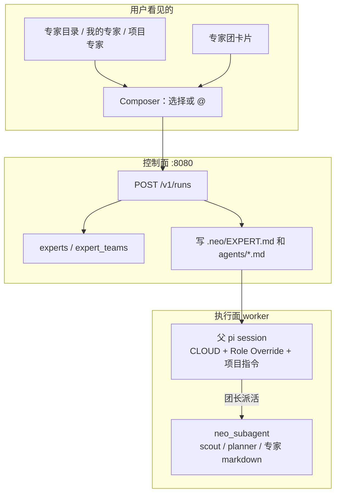

# WorkBuddy 专家调研与 Neo 技术方案

调研日期：2026-08-26。  
对象：腾讯云 WorkBuddy 的 **专家 / 专家团**（专家中心、我的专家、项目专家、`@` 召唤），不是 Skill 市场，也不是 IDE Plan Mode。  
目的：弄清它到底卖什么、底层怎么装，再对照 Neo Cloud Agent 现在的 `neo_subagent` / 项目指令 / 工作区 Skill，给出一份能跟着做、又不照抄办公套件和市场积分的落地顺序。

本文依据官方文档、更新日志和公开拆解文整理。没有登录 WorkBuddy 客户端点过每一个按钮；文中把「官方写死的行为」和「第三方解读」分开写。

项目协作那一层（项目 / 任务 / 看板 / 资产）已经写过，见 [workbuddy-project-collaboration.md](./workbuddy-project-collaboration.md)。那份文档把专家**市场**后置。本文把专家作为角色包和召唤面单独摊开。

主要来源：

- [专家（WorkBuddy 文档站）](https://www.workbuddy.cn/docs/workbuddy/From-Beginner-to-Expert-Guide/Function-Description/Expert-Center)
- [专家（CodeBuddy 文档站，同文）](https://www.codebuddy.cn/docs/workbuddy/From-Beginner-to-Expert-Guide/Function-Description/Expert-Center)
- [WorkBuddy Enterprise 专家（腾讯云文档，2026-07-20）](https://cloud.tencent.com/document/product/1831/134393)
- [专家中心（小程序 / App 精简页）](https://www.codebuddy.cn/docs/workbuddymini/features/Expert)
- [项目（项目专家置顶、选择范围）](https://www.workbuddy.cn/docs/workbuddy/From-Beginner-to-Expert-Guide/Function-Description/Project)
- [技能](https://www.workbuddy.cn/docs/workbuddy/From-Beginner-to-Expert-Guide/Function-Description/Skills-Market)
- [更新日志](https://www.workbuddy.cn/docs/workbuddy/Changelog)
- [产品页「100+ 预置领域专家」](https://www.codebuddy.cn/work/)
- 第三方拆解：[人人都是产品经理 · 专家团提示词](https://www.woshipm.com/ai/6424770.html)、[人人都是产品经理 · 五大概念](https://www.woshipm.com/ai/6448550.html)、[技术栈专栏 14 · 三层模型](https://jishuzhan.net/article/2063614638046130177)、[自定义专家字段](https://www.171host.com/790079.html)

---

## 1. 一句话结论

WorkBuddy 的专家不是「换个语气说话」，也不是「再开一个聊天窗口」。它是一层 **面向用户的 Agent 产品化**：

> **专家 = 人设 + 方法论 + 工具链，绑到一次任务上，把通用助手切成某个岗位的执行身份。**  
> **专家团 = 团长编排 + 多名专家并行/串行 + 预设工作流 + 统一收口，把多 Agent 协作收成一张卡片。**

用户不需要知道 system prompt、工具白名单、子会话、上下文隔离。点「召唤」或 `@专家名`，描述任务，就开始干活。

对 Neo 来说，值得跟的是这套 **「角色切换绑在 Run 上，协作配方叠在现有 `neo_subagent` 上」**，不是 100+ 办公专家、积分、专家市场、自我进化。

| 该跟 | 先别跟 |
| --- | --- |
| 专家是一等产品对象（不是只藏在 subagent markdown） | 专家中心市场、评分、社区上传 |
| 人设 / 方法论 / 工具链三层，缺一层就退化成换皮 | 100+ 招聘 / 法务 / PPT 办公专家 |
| 召唤 = 开一条带角色覆盖的 Run | 积分、Credit、专家团 3–5 倍计费产品化 |
| 项目专家置顶 + 个人专家 + 内置专家 | 公共分享整站专家、`workbuddy.link` |
| `@` 点名专家（项目里先做） | 专家自我学习 / 自动改配置 |
| 专家团 = 团长不干活 + 成员独立上下文 + 走现有 subagent | 成员互相直连、新编排引擎、新进程 |
| 工作区落盘 `.neo/EXPERT.md` + `.neo/agents/*.md`（和 `PROJECT.md` 同路） | 把 loop 搬到控制面去调度子专家 |

锁死的原则只有这一条，和 [architecture.md](./architecture.md) 一致：

> **Agent loop 仍在执行面。专家只是控制面对象 + 注入工作区的角色包，不另起一套远程 tool RPC。**

---

## 2. WorkBuddy 在卖什么

### 2.1 官方定义（写死的）

腾讯云文档和 CodeBuddy 文档站口径一致：

- **专家是「角色切换」机制**：用「人设 + 方法论 + 工具链」让 WorkBuddy 以特定领域专家身份执行任务。
- **专家团是「协作执行」机制**：多位专家分工，团长自动拆解、并行执行、整合交付。
- 专家本身 **不主动拿系统权限**，只处理用户主动给的对话和上传文件。绑了 Skill / MCP 才在授权下间接触达文件或外部服务。
- 专家团并行多轮模型交互，积分大约是单专家的 **3–5 倍**。

产品页补充的宣传点（营销口径，不是实现保证）：100+ 预置领域专家；上传 SOP / 知识库可建专属专家；专家能拆任务、调工具、改本地文件，交付可验收产物，而不是只给建议。

### 2.2 产品面上有四层入口

从文档、更新日志和第三方上手文可以对上这些入口：

| 入口 | 谁的 | 干什么 |
| --- | --- | --- |
| 专家中心 | 平台预置 | 按行业 / OPC / 腾讯专区浏览卡片，点召唤开对话 |
| 我的专家 | 个人 | 创建、编辑、导出 JSON、分享给好友 |
| 项目专家 | 项目成员共享 | 项目配置里挂专家；任务里选择范围 = 项目专家 + 个人专家 + 专家中心全部，**项目专家置顶** |
| 任务里 `@` | 当前任务 | 更新日志：Teams 项目自建专家与子助理 `@mention` 联想 |

召唤路径官方写成三步：打开专家中心 → 看卡片（能力、领域、任务示例；专家团还展示成员）→ 点召唤进对话 → 描述任务。

专家团路径多一句：用户只说自然语言目标，团长拆、分、跑、收回来。

### 2.3 Skill / 专家 / 专家团：官方对照

官方表（各站点同文）：

| 维度 | Skill | 专家（Agent 型） | 专家团（Team 型） |
| --- | --- | --- | --- |
| 组成关系 | 工具能力：让 AI 能做某件事 | AI 顾问：懂某个领域的角色 | AI 协作团队：拆解、并行、完整交付 |
| 怎么选 | 需要一种工具能力 | 有一个明确的单点问题 | 任务复杂，要多角色配合 |
| 一句话 | 能力 | 能力 + 经验 | 多位专家 + 协作流程 |

第三方（人人都是产品经理）补了一层更好用的翻译，**不是官方原文**，但和官方不打架：

- Connector：接到外部系统
- Skill：固化「怎么做」的流程和脚本
- 专家：固化「以谁的身份、按什么范式做」
- 专家团：固化「谁拆、谁干、怎么交」
- 灵感：别人做好的成品，抄回来再改

Skill 和专家可以叠加：市场分析师专家 + 竞品报告 Skill，比单用一个强。官方也写了专家绑 Skill / MCP 才真正能执行。

### 2.4 自定义专家：配置驱动，不是微调

官方页几乎不写创建表单字段。更新日志能确认的产品行为：

- 有自定义专家 CRUD，有头像，有默认提示词
- 切换专家要重新注入默认提示词（修过「切换后无法注入」）
- 召唤要按最新更新时间加载专家包（专家是一份可版本化的包，不是一行名字）
- 企业自建专家、插件专家、可见性（内外网）、分类（含 OPC / 腾讯专区）
- 自动化任务也能召唤专家
- 专家包解压后才可执行（和 Skill 一样，是落盘的包，不是纯云端字符串）

第三方上手文（171host）写的创建字段，当作 **建议模型**，不要当成官方 API：

| 字段 | 作用 |
| --- | --- |
| 名称 | 「电商运营专家」或「小明 – 技术助手」 |
| 角色描述 | 职能、领域、视角；越具体越稳 |
| 技能 / 行为规则 | 输出格式、限制、常用指令 |
| 导出 | JSON，可分享给同事 |

技术栈专栏 14 把「训练」说成四步，同样是解读：定义人设 → 嵌入方法论 → 绑定工具链 → 用例验证。它强调专家进化是 **改配置**，不是喂样本微调。这一点和 Neo 该怎么做完全同向：专家是手册，不是新模型。

---

## 3. 专家内部到底长什么样

官方不公开完整提示词。人人都是产品经理拆了「用户体验架构师 / ArchitectUX」和「长文档写作和改稿专家」，结构高度同构。下面标成 **第三方拆解**。

### 3.1 单专家：角色覆盖 + 工作手册

拆出来的通用骨架：

1. **Role Override**：本专家定义覆盖此前任何人格。长对话里模型容易黏在上一角色，这一段是硬重置。
2. **身份锚定**：Role / Personality / Memory 锚点 / Experience。Memory 不是向量库，是「你该记住什么成功模式」。
3. **方法论**：禁止自由发挥。ArchitectUX 写了 Foundation-First、先读项目现场（bash / grep）、四步流程（分析 → 打地基 → UX 结构 → 交接文档）。
4. **交付标准**：可验收的产物模板、成功标准、沟通风格示例。不是「写得好一点」，而是「用户能对照勾选」。
5. **能力与工具声明**：方法论某一步必须有对应工具，否则专家只会「说自己会」。
6. **持续牵引**：做完给出下一步，而不是停在一段建议。
7. **Agent Runtime**：记忆、安全、工作模式、工具规则——各专家共用的底座，叠在角色包后面。

一句话：

> **普通 Agent + 领域方法论 + 交付模板 + 工作流约束。**  
> 也可以看成「普通 Agent + 一份不肯按需加载、直接写进提示词的领域 Skill」。

这解释了为什么「问 ROE 是什么」调财务专家几乎没差别：专家吃的是 **有流程的任务**，不是知识点问答。

### 3.2 专家团：编排者，不是轮流发言

同一篇拆解把「内容创作专家团」写成调度-执行（orchestrator）：

| 规则 | 含义 |
| --- | --- |
| 团长不干活 | 只拆需求、配成员、看进度、收产出；不代写成员的专业产出 |
| 成员有 Agent ID | 中文名给人看，ID 给系统调度 |
| 任务预检 | 对照能力速查表；不匹配就拒绝派发，禁止硬派 |
| 预设 Workflow | 常见场景写死触发条件、阶段、决策点、产物规范 |
| 消息中转 | 成员之间不直连，产出回团长，团长再交给下一阶段 |
| 临时工作区 | 团长建团队目录，产出归拢，结束后删 |
| 异常 | 超时通报；同一任务失败超过阈值就停线 |
| 交付清单 | 是否调用了交付工具、图片是否收齐、有没有散落目录 |

WorkBuddy 和常见多 Agent 框架的差别：它把几种工作流 **写进团长提示词**，而不是让模型临场发明协作方式。费 token，但用户点的就是这张专家团卡片，可接受。

更新日志能交叉验证的工程事实：

- 专家团子成员是 **subagent / 子会话**，列表里要藏起来
- 修过：子会话权限继承、无产物、卡「思考中」、队列一次推光、历史回放卡顿、长输出截断、Lead 头像、成员映射、默认提示词
- 有 Auto 路由和专家身份自动注入
- 有子 agent 查看页
- 并发过高会失控，后来降过并发

这些和 Neo 现在的 `neo_subagent`（独立 sessionDir、禁嵌套、并发 2、超时 120s、事件带 `subagentId`）是同一类东西，只是 WorkBuddy 把它做成了用户能点的「专家团」。

### 3.3 三层能力模型（解读，用来验收）

技术栈专栏 14 的分层，适合当 Neo 的验收尺子：

| 层 | 内容 | 缺了会怎样 |
| --- | --- | --- |
| 人设 | 身份、口吻、背景、边界 | 还是通用助手，只是换了自称 |
| 方法论 | 步骤、决策树、质量标准 | 能答不会做，没有节奏 |
| 工具链 | Skill、MCP、脚本、工具白名单 | 只能给步骤说明，落不了地 |

第一层决定像不像，第二层决定对不对，第三层决定能不能交卷。Neo 第一期如果只做一段 system prompt、不绑工具和 Skill，就是在做换皮。

---

## 4. Neo 现在已经有什么

对照 [architecture-overview.md](./architecture-overview.md) 和当前代码，专家相关能力已经散落在三处，只是 **没有产品对象、没有召唤面**。

### 4.1 项目指令：团队规则，不是角色

`Project.instruction` 创建 Run 时写成工作区 `.neo/PROJECT.md`，worker 在 `openPiSession` 里 `appendProjectInstruction`。这是「这个项目里大家都要遵守的规则」，对所有对话生效，不切换人格。

### 4.2 工作区 Skill / AGENTS.md：按仓库加载

`packages/worker/src/workspace-loader.ts` 只扫工作区内的：

- Skill：`.pi/skills`、`.cursor/skills`、`.claude/skills`、`.codex/skills`、`.neo/skills`、`.agents/skills`
- 上下文：`AGENTS.md` / `CLAUDE.md` 等，且必须在 cwd 内

这已经覆盖 WorkBuddy 的「Skill 是能力」。缺的是 **按专家再筛一份**，以及控制面登记的项目 Skill（现在只有落在仓库里的）。

### 4.3 `neo_subagent`：编码向的隔离子会话

合约在 `packages/contracts/src/subagent.ts`，执行在 `packages/worker/src/subagent.ts`。

| 已有 | 细节 |
| --- | --- |
| 内置角色 | `scout` / `planner` / `reviewer` / `worker` |
| 项目角色 | 工作区 `.pi/agents`、`.cursor/agents`、`.neo/agents` 的 markdown（frontmatter `name` / `description` / `tools` / `model` + 正文当 system prompt） |
| 模式 | `single` / `parallel`（最多 8、并发 2）/ `chain`（`{previous}`） |
| 隔离 | 子会话独立 `sessionDir`，看不到父对话；禁止再套 `neo_subagent` |
| 工具 | 子角色可收窄工具；scout 有 `neo_browse` 没有乱 curl |
| 事件 | transcript 里能标 `subagent` / `subagentId`，Web 显示「正在执行子代理」 |

父会话的系统提示永远是 `CLOUD_SYSTEM_PROMPT`（编码云端 Agent）+ 项目指令。用户 **不能** 在开 Run 时说「这次请以安全审查专家身份干活」并真正换掉父人格。`CreateRunRequest` 只有 `prompt` / `repoUrls` / `model` / `projectId` / `mode`（`agent` \| `ask`），没有专家字段。Composer 只有目标、模式、模型三个选择器。

### 4.4 缺口表

| WorkBuddy | Neo 现在 | 缺口 |
| --- | --- | --- |
| 专家是可召唤的产品对象 | 没有 `Expert` 实体 | 控制面对象 + API + 持久化 |
| 点卡片 / `@` 开对话并切角色 | 开 Run 永远是通用编码 Agent | `CreateRunRequest.expertId` + Role Override |
| 人设 + 方法论 + 工具链 | 只有整段 system prompt（内置 subagent）或一段项目指令 | 结构化字段，并落到工具白名单 / Skill |
| 我的专家 CRUD、导出 JSON | 无 | 用户级专家表 |
| 项目专家置顶 | `Project` 只有 `instruction` / 默认仓库 | `Project.expertIds` |
| 专家团卡片 | 父 Agent 自己决定何时 `neo_subagent` | 命名配方：团长提示词 + 成员 markdown + 预设 chain/parallel |
| 专家中心分类浏览 | 无 | 第一期只做内置编码向专家，不做市场 |
| 积分 3–5 倍 | 组织月 token 配额 | 专家团只打点，不另做账务 |
| 切换专家重注入提示词 | 会话 system prompt 在 `openPiSession` 时定死 | 第一期专家跟 Run 绑定，不中途换；要换就新开 Run |

现网约束（方案里不要假装没有）：

- 应用机 2 个 VM 槽；`MAX_SUBAGENT_CONCURRENCY = 2`
- loop 必须留在 worker；控制面只编排和注入文件
- 不要 fork pi；用 worker + `packages/extensions`
- Provider Key 继续只活在 Gateway

---

## 5. 跟做时的翻译（先锁语义）

不要把 WorkBuddy 的名词原样搬进 UI。Neo 是 Cloud Agent，专家首先服务 **写代码、查仓库、出 PR**，不是办公数字员工。

| WorkBuddy | Neo 语义 | 落在哪 |
| --- | --- | --- |
| 任务 | 一次 `Run` | 已有 |
| 专家 | 一份角色包，绑到父会话 | 新实体 `Expert` |
| 召唤专家 | `POST /v1/runs` 带 `expertId` | 控制面写 `.neo/EXPERT.md`，worker 拼进 system prompt |
| 我的专家 | `visibility=user` | 控制面 JSON + MySQL/Postgres `experts` 表 |
| 项目专家 | 项目钉住的 `expertIds` | `Project` 增字段；任务选择器置顶 |
| 专家中心 | 内置编码向角色目录 | `packages/contracts` 里 `BUNDLED_EXPERTS`，不是市场 |
| 专家团 | 命名的多角色配方 | 新实体 `ExpertTeam`，执行仍走 `neo_subagent` |
| Skill | 工作区 `SKILL.md` | 已有；专家只引用名字，不新造运行时 |
| 子助理 | 项目 / 工作区 agent markdown | 已有 `loadProjectSubagents` |
| 专家包 | 落进 Run 工作区的 markdown | `.neo/EXPERT.md`、`.neo/experts/*.md`、`.neo/agents/*.md` |

两条边界：

1. **专家切的是父 Run 的人格和工具面，subagent 是父 Run 再派出去的隔离会话。** 两者都要，不要把专家做成只能被 `neo_subagent` 叫到的内部角色——那样用户永远点不到。
2. **专家团不是新 runtime。** 团长 = 带编排手册的父会话；团员 = 物化成 `.neo/agents/*.md` 之后走现有 `single` / `parallel` / `chain`。



---

## 6. 技术方案

### 6.1 原则

1. **不新开进程。** 专家是 `contracts` 类型 + `control-plane` 存储 + worker 多读两个文件。
2. **worker 继续只认工作区。** 和控制面项目指令同一条路：编排时落盘，session 启动时读。不要让 worker 再打 `/v1/experts/:id` 拉提示词。
3. **Role Override 必须显式。** 拼在 `CLOUD_SYSTEM_PROMPT` 和项目指令之间，写明覆盖默认「Neo Cloud Agent」自称。
4. **工具链是白名单，不是愿望清单。** `tools` 只能是 `sessionToolNames` 的子集；`skillNames` 只能引用工作区已有 Skill。没有工具的专家可以先上线，但 UI 要标「只会给建议」。
5. **专家跟 Run 走，不跟会话中途热切换。** WorkBuddy 为「切换专家丢提示词 / 丢草稿」修了一长串 bug。Neo 第一期：一条 Run 一个 `expertId` / `expertTeamId`。换角色 = 新开 Run（可从同一项目、同一仓库）。
6. **专家团走现有 subagent。** 不写第二套并发池，不让成员互相调。现网 2 槽 + 并发 2 已经是硬顶。

### 6.2 数据模型

风格对齐现有 `Project`：控制面内存 + `.control/experts.json`，MySQL / Postgres 用 `id + body JSON` 镜像（`projects` / `automations` 已是这个形状）。

#### Expert

```ts
export type ExpertVisibility = "bundled" | "user" | "project";
export type ExpertKind = "agent" | "team"; // team 用 ExpertTeam，这里只标卡片类型

export type Expert = {
  id: string;                  // exp_...；bundled 用稳定 slug，如 exp_reviewer
  slug: string;                // reviewer / security / ux-architect
  name: string;                // 展示名
  title?: string;              // 「安全审查」——卡片副标题
  description: string;         // 一句能力
  industry?: string;           // 筛选：engineering / docs / research；不要做 20 个办公行业
  persona: string;             // 人设 + Role Override 正文
  methodology: string;         // 步骤、决策、禁止事项
  deliverables: string;        // 验收标准和输出模板
  tools?: string[];            // 父会话工具白名单；缺省 = 全量
  skillNames?: string[];       // 希望加载的工作区 Skill 名；缺的只警告不失败
  model?: string;              // 可选，覆盖 Run.model
  examplePrompts?: string[];   // 卡片示例
  visibility: ExpertVisibility;
  ownerUserId?: string;        // user 专家
  projectId?: string;          // project 专家
  createdAt: string;
  updatedAt: string;
};
```

`persona + methodology + deliverables` 渲染成一份 markdown，就是 Role Override 正文。不要只存一个 `systemPrompt` 大字段——编辑器要分三栏，否则用户只会贴一段「你是某某」。

工作区文件专家（仓库里的）继续用现有 agent markdown，并 **升格可读**：

```markdown
---
name: security
description: 只做安全审查，不改业务功能
tools: read, grep, find, ls, bash
kind: expert
---
# Role Override
...
```

`kind: expert` 可选。没有它的 `.neo/agents/*.md` 仍只当 subagent，不出现在召唤目录——避免把内部 scout 配方暴露成产品专家。

#### ExpertTeam

```ts
export type ExpertTeamWorkflow = {
  id: string;
  name: string;
  when: string;                 // 触发说明，写进团长提示词
  mode: "parallel" | "chain";
  steps: Array<{ agent: string; task: string }>; // agent = 成员 slug；chain 可用 {previous}
};

export type ExpertTeam = {
  id: string;                   // team_...
  slug: string;
  name: string;
  description: string;
  lead: { name: string; persona: string; methodology: string };
  memberSlugs: string[];        // 引用 Expert.slug；必须能解析
  workflows?: ExpertTeamWorkflow[];
  visibility: ExpertVisibility;
  ownerUserId?: string;
  projectId?: string;
  createdAt: string;
  updatedAt: string;
};
```

团长提示词由控制面组装，强制写进这些规则（从 WorkBuddy 拆解收成 Neo 自己的句子）：

- 你是团长，不代替成员写专业产出
- 派活前对照成员 description 做预检，对不上就告诉用户，不要硬派
- 只用 `neo_subagent`；parallel 或 chain；成员之间不直连
- 成员产出必须经你汇总；冲突时点名差异，不要默默改
- 有预设 workflow 且用户意图匹配时，优先走配方，不要临场发明第三种协作

#### Run / Project / CreateRunRequest

| 字段 | 放哪 | 含义 |
| --- | --- | --- |
| `expertId` | `Run`、`CreateRunRequest` | 父会话角色；与 `expertTeamId` 互斥 |
| `expertTeamId` | 同上 | 父会话是团长，成员落成 agents |
| `expertIds` | `Project` | 项目钉住的专家，选择器置顶 |
| `expertTeamIds` | `Project` | 项目钉住的团 |

校验：用户专家只能被主人用；项目专家要项目成员；bundled 全员可见。Desk / CLI / Mobile / Automation 同一套字段，不要为 Web 单开。

### 6.3 注入路径（和项目指令同构）

创建 Run 时，编排器在现有 `write PROJECT.md` 旁边：

1. 解析 `expertId` / `expertTeamId`（请求体，或项目默认——第一期不做隐式默认，避免用户不知道被切了角色）。
2. 写 `.neo/EXPERT.md`：标题、三层正文、工具和 Skill 声明。
3. 若是专家团：再写 `.neo/EXPERT_TEAM.md`（团长手册 + workflow 原文），并把每个成员渲染成 `.neo/agents/<slug>.md`。
4. 可选：若 `skillNames` 指向控制面登记的项目 Skill（第二期），把缺失的 Skill 目录拷进 `.neo/skills/`。第一期只引用工作区已有的。
5. `Run.model` 若专家声明了 `model` 且用户没显式选，用专家的。

Worker `openPiSession`：

```
CLOUD_SYSTEM_PROMPT
+ Role Override（读 .neo/EXPERT.md 或 EXPERT_TEAM.md）
+ Project instructions（读 .neo/PROJECT.md）
+ 工作区 AGENTS.md / skills（现有 loader）
```

`appendExpertRole` 放进 `packages/contracts`，和 `appendProjectInstruction` 并列。正文必须以「覆盖默认身份」起头，避免模型仍自称 Neo Cloud Agent。

父会话 `tools`：若专家带了 `tools`，在 `sessionToolNames` 上做交集。专家团团长 **必须保留** `neo_subagent`，否则团是空壳。Ask 模式继续只读；专家白名单再和 Ask 只读集相交。

子会话：`availableSubagents` 已经会扫 `.neo/agents`。专家团成员因此自动出现在 `neo_subagent` 的 Agents 列表里，**不用改工具协议**。

恢复 IDLE Run：文件在工作区里，重新 `openPiSession` 会再读一遍。不要把专家全文只放进环境变量。

### 6.4 API

第一期只加薄 CRUD 和列表，挂在现有鉴权上。

| 方法 | 路径 | 行为 |
| --- | --- | --- |
| `GET` | `/v1/experts` | 查询：`q`、`industry`、`projectId`。返回 bundled ∪ 我的 ∪（项目成员可见的项目专家）。项目专家置顶 |
| `POST` | `/v1/experts` | 建个人专家；body 为三层字段，不是任意 system prompt 文件上传 |
| `GET` | `/v1/experts/:id` | 详情 + 渲染后的 markdown（给预览） |
| `PATCH` | `/v1/experts/:id` | 主人或项目管理员 |
| `DELETE` | `/v1/experts/:id` | 同上；bundled 不可删 |
| `GET` | `/v1/expert-teams` | 同列表规则 |
| `POST` | `/v1/expert-teams` | 第二期；第一期可以只有 bundled 团 |
| `POST` | `/v1/runs` | 增加 `expertId?` / `expertTeamId?` |

导出导入第一期做成 `GET /v1/experts/:id` 的 JSON，和项目一样不搞独立文件格式市场。仓库专家用 markdown 提交即可。

管理台第一期 **不要** 做专家运营页。bundled 专家跟代码走，走 PR，不走 `/admin`。

### 6.5 内置专家（编码向，不是办公向）

不要复制 WorkBuddy 的招聘 / 法务 / PPT。第一期 bundled 只放和 Cloud Agent 同域的角色，并且尽量 **复用已有 subagent 文案**，避免两套「reviewer」互相漂移。

建议第一期 5 个专家 + 2 个团：

| slug | 类型 | 从哪来 | 父会话工具 |
| --- | --- | --- | --- |
| `explorer` | 专家 | 扩写 `scout`：侦察仓库和公开页 | 只读 + `neo_browse` |
| `planner` | 专家 | 现有 planner | 只读 |
| `reviewer` | 专家 | 现有 reviewer | 只读 + 只读 bash |
| `implementer` | 专家 | 现有 worker + 编码交付清单 | 全量（无嵌套团则保留 subagent） |
| `security` | 专家 | 新写：威胁模型、密钥、注入、依赖 | 只读 + 只读 bash |
| `ship-change` | 团 | 团长 + planner → implementer → reviewer（chain） | 团长保留 subagent |
| `investigate` | 团 | 团长 + explorer 并行若干区 + planner 收口 | 同上 |

`scout` 这个内部名字可以继续给 `neo_subagent` 用；产品卡片用 `explorer` / 「侦察」，避免用户看见 scout。

这些定义放 `packages/contracts/src/expert.ts`，和 `BUNDLED_SUBAGENTS` 一样可单测。团员 slug 必须能 `resolveExpert`。

### 6.6 客户端

#### Web（`packages/web`）

- 顶栏在「项目 / 定时任务」旁加「专家」，hash `#/experts`、`#/experts/:id`。
- 列表：内置 / 我的；进项目上下文时项目专家置顶。卡片：名称、一句话、示例、是否绑了工具。
- 「召唤」= 预填 composer 的 `expertId` 并回到对话，**不**另做专家专用聊天页。
- Composer 第四个选择器「专家」，选项含「默认（Neo）」。选团时同一选择器，或分组 `optgroup`。
- 项目设置页：多选钉住专家（管理员）。
- 进行中：沿用现有 subagent 步骤条；团长 Run 的标题旁显示专家 / 团名字。
- `@` 第一期可以只做静态联想（已加载的专家 slug / name），选中后写入 `expertId`。不要第一期就做全文搜索服务。

#### Desk / CLI / Mobile / Automation

| 宿主 | 第一期 |
| --- | --- |
| Desk | 和 Web 同一 `/v1`；项目工作台设置里能钉专家 |
| CLI | `pnpm neo --expert reviewer` / `--team ship-change` |
| Mobile | 选择器能选 bundled；创建个人专家可第二期 |
| Automation | `CreateAutomationRequest` 可带 `expertId`，到点开的 Run 继承 |

IM（Telegram / 微信）第一期不解析 `@专家`，避免和群 @人冲突。

### 6.7 权限、安全、配额

- 用户专家：仅主人 CRUD；可在自己的项目 Run 里用。
- 项目专家：成员可用，管理员改；转交 Run 时专家配置跟着 Run 走（已经物化进工作区），不要把「我的专家」私人文案泄漏给接手人——若专家 `visibility=user`，转交前把 `EXPERT.md` 留在工作区（这是这次任务的角色，不是把专家目录拷走）。
- 协作任务里不要注入个人 MCP 票据。专家的 `skillNames` 若指向需要连接器的 Skill，没有项目级凭据就降级并写进 `neo_diag`。
- Transcript 打码规则不变。专家正文不要放密钥。
- 配额：专家团按实际子会话计 token，沿用现有组织月配额。UI 在选团时提示「会开多个子会话，更耗额度」。不做积分商品。
- 并发：专家团 workflow 的 parallel 步数仍受 `MAX_SUBAGENT_CONCURRENCY = 2` 和 `MAX_SUBAGENT_TASKS = 8` 限制。配方里写 5 路并行也只会两两跑。现网 2 槽时，**不要**让团长再开新 Run。

### 6.8 和现有对象的关系（避免再做一个运行时）

| 已有对象 | 专家怎么用它 |
| --- | --- |
| `Project.instruction` | 团队规则，永远在角色之下；专家不能取消项目指令 |
| `AGENTS.md` | 仓库规范，继续加载 |
| 工作区 Skill | 专家按名引用 |
| `.neo/agents/*.md` | 专家团成员和「只当子代理的角色」 |
| `neo_subagent` | 团长唯一派活工具 |
| `mode=ask` | 与专家正交：Ask + reviewer 合法 |
| `environment.json` MCP | 第三期再让专家声明 `mcpServerNames` |
| Automation | 只多一个 `expertId` |

不要把专家做成第二种 Project，也不要做成第二种 Skill。

---

## 7. 分期

原则：**先让用户能点一个角色开对话，再让用户能存自己的角色，最后才把团做成卡片。** 市场永远后置。

### 第 0 期：锁语义和合约

- `packages/contracts`：`Expert` / `ExpertTeam` / `appendExpertRole` / `renderExpertMarkdown` / `BUNDLED_EXPERTS`
- `CreateRunRequest` + `Run` 增加可选 `expertId` / `expertTeamId`
- 单测：渲染、互斥、Role Override 覆盖默认自称、bundled slug 稳定

验收：不跑 UI，`pnpm test` 里合约测过。

### 第 1 期：召唤内置专家（最小可用）

- 控制面：解析 bundled `expertId`，写 `.neo/EXPERT.md`，可选收窄 tools
- worker：拼 Role Override
- Web Composer 选择器 + 对话标题展示专家名
- CLI `--expert`

验收：`POST /v1/runs { expertId: "exp_reviewer", prompt, repoUrls }` 后，transcript 里模型按审查清单说话，且不改业务文件（工具白名单卡住）。默认不选专家时行为和今天完全一样。

### 第 2 期：我的专家 + 项目钉住 + `@`

- `experts` 存储（文件 + DB body）
- `/v1/experts` CRUD
- Web `#/experts` 三栏编辑器（人设 / 方法论 / 交付）+ 工具多选 + Skill 多选
- 项目设置钉住；列表置顶
- Composer `@` 联想

验收：用户建「发布说明专家」，钉到项目，在项目里开对话自动能选到；另一成员看得到项目专家，看不到对方的个人专家。

### 第 3 期：专家团配方

- `BUNDLED_TEAMS`：`ship-change`、`investigate`
- 创建 Run 写 `EXPERT_TEAM.md` + 成员 agent 文件
- 团长提示词带预检和 workflow
- Web 选择器分组；subagent 步骤条已够用，只补团名

验收：选 `ship-change`，用户说「给登录加上限流」。团长走 chain：planner 出步骤 → implementer 改代码 → reviewer 出分级意见。父会话自己不写业务代码。并发不超过 2。

### 刻意后置

- 专家市场、评分、社区上传、分享落地页
- 办公向 100+ 专家、灵感广场
- 积分 / Credit / 专家团倍率商品
- 中途热切换专家（换 Run）
- 成员互调、新编排引擎、控制面代跑 subagent
- 专家自动改自己的方法论
- 管理台专家运营、按行业运营位
- 个人连接器票据进协作任务
- 专家绑定任意 MCP 服务器（等项目级连接器先有）

---

## 8. 建议实现顺序（按包）

| 包 | 做什么 |
| --- | --- |
| `packages/contracts` | 类型、bundled 目录、渲染、`appendExpertRole`、Run 字段 |
| `packages/control-plane` | store（抄 `projects/`）、API、`createRun` 落盘、persist hook |
| `packages/worker` | 读 `EXPERT.md` / `EXPERT_TEAM.md`，tools 交集，日志打 `expert=` |
| `packages/extensions` | 不必新工具；团长继续 `neo_subagent`。可选：把 bundled 成员和 `BUNDLED_SUBAGENTS` 的合并规则写清楚 |
| `packages/web` | 专家页、Composer 选择器、`@`、项目钉住 |
| `packages/cli` | `--expert` / `--team` |
| `packages/desk` | 复用 `/v1`；设置页钉住 |
| `packages/mobile` | 选择 bundled |
| `packages/admin-*` | 不做 |
| `docs/` | 本文；overview 挂链；协作调研改「后置 → 见本文」 |

测试（跟仓库习惯）：

- 合约单测：渲染、互斥、覆盖默认身份
- 控制面：无专家回归；bundled 注入文件；越权读别人的 user 专家 404
- worker：有 `EXPERT.md` 时 system prompt 含 Role Override；tools 被收窄；团成员出现在 `availableSubagents`
- Web：composer 带 `expertId`（组件测即可，不必 e2e）

现网 2 槽不要拿专家团做压测。本地 `WORKER_RUNTIME=local` + mock gateway 足够验注入和 chain。

---

## 9. 风险

| 风险 | 为什么 | 怎么收 |
| --- | --- | --- |
| 只做换皮 | 用户觉得「跟没选一样」 | 验收必须看到方法论步骤和工具白名单生效 |
| 和项目指令打架 | 两段都要求「你是谁」 | 固定顺序：角色覆盖 → 项目规则 → 仓库 AGENTS.md；角色管身份，项目管团队约束 |
| 和内置 subagent 重名 | 两份 reviewer | bundled 专家 slug 与 subagent name 对齐，文案单一来源 |
| 专家团打爆槽位 | 团长再开 Run 或并行过多 | 团长只准 `neo_subagent`，不准 `POST /v1/runs`；并发沿用 2 |
| 提示词膨胀 | 三层 + runtime + 项目指令 | 单专家正文设软顶（例如 8k 字符），超了创建失败；不要把 CLOUD_SYSTEM_PROMPT 再抄进每个专家 |
| 热切换 | WorkBuddy 为此修了大量 bug | 第一期绑定 Run |
| 做成办公套件 | 和 Neo 定位冲突 | bundled 只出编码向；办公专家让用户自己建 |

---

## 10. 和旧调研的关系

[workbuddy-project-collaboration.md](./workbuddy-project-collaboration.md) 第 10 节写过：项目协作第一期只用项目指令 + 项目 skills + 现有 subagent，不必做专家市场。那个判断 **仍然成立**——市场不做。

现在要补的是：**专家作为召唤面和角色包**，不是市场。项目协作继续包上下文；专家包的是身份。两者叠在同一次 Run 上，不互相替代。

Desk 方案 [desk-project-design.md](./desk-project-design.md) 把专家中心列在「不抄办公套件」里。本文落地后，Desk 只跟 **选择器 + 项目钉住**，仍然不做市场、双写、公开会话。

---

## 11. 资料索引

| 主题 | 链接 |
| --- | --- |
| 专家 / 专家团（官网） | https://www.workbuddy.cn/docs/workbuddy/From-Beginner-to-Expert-Guide/Function-Description/Expert-Center |
| 腾讯云 Enterprise 专家 | https://cloud.tencent.com/document/product/1831/134393 |
| 项目（专家选择范围） | https://www.workbuddy.cn/docs/workbuddy/From-Beginner-to-Expert-Guide/Function-Description/Project |
| 技能 | https://www.workbuddy.cn/docs/workbuddy/From-Beginner-to-Expert-Guide/Function-Description/Skills-Market |
| 更新日志 | https://www.workbuddy.cn/docs/workbuddy/Changelog |
| 产品页 | https://www.codebuddy.cn/work/ |
| 专家团提示词拆解 | https://www.woshipm.com/ai/6424770.html |
| 五大概念 | https://www.woshipm.com/ai/6448550.html |
| 三层模型 / 「训练」 | https://jishuzhan.net/article/2063614638046130177 |
| 自定义专家字段 | https://www.171host.com/790079.html |
| Neo 项目协作调研 | [workbuddy-project-collaboration.md](./workbuddy-project-collaboration.md) |
| Neo 现状总览 | [architecture-overview.md](./architecture-overview.md) |
| Neo 原则 | [architecture.md](./architecture.md) |
| 现有 subagent 合约 | `packages/contracts/src/subagent.ts` |
| 现有项目注入 | `packages/contracts/src/project.ts`、`packages/worker/src/session.ts` |
