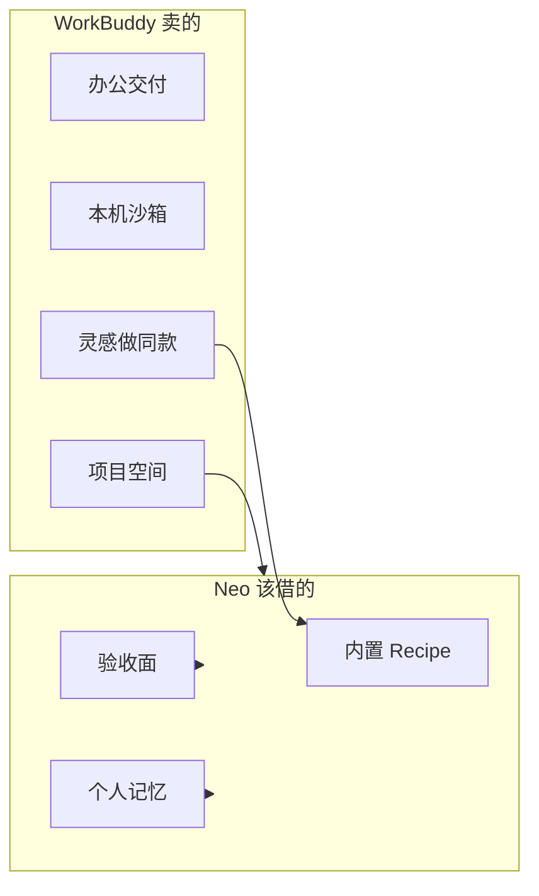

# WorkBuddy 对标报告：还值得跟什么

> **2026-09-04 注：** 本文按 `26b1e76` 写。Web 验收面、Inbox、Recipe / 胶囊、侧栏分组、对话内搜索、记忆 CRUD 已落地，§6「第一刀」不要再当待办。对话存储对齐之后的实现规格见 [workbuddy-alignment-plan.md](./workbuddy-alignment-plan.md)。WorkBuddy 官方 changelog 已到 5.5.2，新增积分 / 行业 Buddy / 视频生成等继续不跟。

调研日期：2026-08-28。  
对象：腾讯云 WorkBuddy（桌面 + Web + 小程序，文档站「从入门到精通」这一支，不是 CodeBuddy IDE Plan Mode）。  
对照基线：本仓库 `main`（`26b1e76` 一带），项目 / 专家 / 技能骨架已经落地。  
目的：不再复述「要不要做项目、专家、技能市场」——那三份已经写过，也已经跟过一轮。这次按 **现在 Neo 实际有什么**，看 WorkBuddy 还有哪些功能值得借，哪些继续后置。

本文依据官方文档和更新日志整理，没有登录 WorkBuddy 客户端点过每一个按钮。官方写死的行为和第三方解读分开写。

旧调研（深挖用，本文不替代）：

- 项目协作：[workbuddy-project-collaboration.md](./workbuddy-project-collaboration.md)（2026-08-22）
- 专家 / 专家团：[workbuddy-experts.md](./workbuddy-experts.md)（2026-08-26）
- 技能 / 插件市场：[skill-plugin-marketplace.md](./skill-plugin-marketplace.md)（2026-08-28）

官方 changelog 最新一版是 **5.3.14（2026-08-17）**。8 月 7 日到 17 日连发 5.3.11–5.3.14，旧项目文没单独摊开的，主要是灵感「做同款」、长期记忆页、对话耗时、IM 流式、资料库闭环打磨。

---

## 1. 一句话结论

WorkBuddy 还值得跟的，不再是「再抄一遍项目 / 专家 / 技能骨架」，而是两刀：

1. **验收面**：人不用离开当前 Run，就能预览产物、把产物存回项目、在对话里搜、出错时跳诊断。
2. **第二次打开还认得你**：个人记忆、内置 recipe（薄灵感）、Composer 里 `@` / 意图胶囊、转交时把上下文打包而不是只改 `userId`。

办公套件、积分、锁屏远程、腾讯文档双写、公开整站会话、社区灵感广场，继续不做。

| 该跟（按收益） | 先别跟 |
| --- | --- |
| 个人记忆（夜间抽取 + 可编辑 + 注入） | 人机双写 / 腾讯文档内核 |
| Web 产物预览 + 保存到项目 | `workbuddy.link` 发布站、CSV/HTML 协同 |
| 转交交接包（摘要 + transcript + artifacts） | 公开分享整段会话 |
| Composer `@` 引用 + 意图胶囊 | 连接器公共 OAuth 票据全员共用 |
| 站内 Inbox | 锁屏远程 / Claw 控本机 |
| 对话内搜索、每轮耗时、出错跳诊断 | Credit / 积分 / 夜间折扣产品化 |
| 内置 Recipe（8–12 条编码向「做同款」） | 社区灵感广场、分享口令增长环 |
| 项目模板 | 专家市场、100+ 办公专家 |
| IM 流式 + 先文件后文字 | 日历 / 外卖 / Whisper 办公 Skill |
| 任务批量归档、按项目分组 | SSO / VPC / 企业智能体门面 |

---

## 2. 双方不是同一类产品

WorkBuddy 是腾讯云的 **企业 AI 办公工作台**：桌面客户端默认在用户电脑的工作空间里干活，外面再套沙箱和二次确认；云端项目会话存在，但「数据本地执行不上传」仍是企业安全卖点。连接器对接 QQ 邮箱、腾讯文档、乐享、会议、TAPD、腾讯网盘。5.0.0 把 Teams 做成系统能力；8 月还在打磨灵感、资料库、企微流式。

Neo 是 **Cursor Cloud Agent 克隆**：控制面编排隔离 VM，pi-coding-agent 在槽里跑，LLM 走网关。现网 4C/4G、**2 个 VM 槽**。产品面已经有对话、项目、专家、技能目录、自动化、Desk、CLI、Mobile P0、Telegram / 微信入口。

所以跟 WorkBuddy，仍然是跟 **人 + Agent 怎么共事、怎么验收、怎么把上下文留下来**，不是把 Neo 改成办公助手。

---

## 3. 骨架已经对齐了什么

8 月 22 日那份项目文写「Neo 还没有项目」。现在不对了。`main` 上已经有：

| WorkBuddy | Neo 现在 | 完成度 |
| --- | --- | --- |
| 项目 / 任务两层 | `Project` + `Run.projectId`，Web / Desk 都有入口 | 骨架齐 |
| 项目指令自动注入 | `.neo/PROJECT.md`，资产清单一并写进去 | 齐 |
| 邀请 + 审批 / 免审 | `invitePolicy`、邀请链接、成员 `owner/admin/member` | 齐 |
| 分享 / 转交 / 多人进同一任务 | `collaborators`、跟进入队、`POST /v1/runs/:id/transfer` | API 齐，转交还是改归属，不是交接包 |
| 计划看板 | `ProjectTodo`，卡片可绑 Run | API + Desk 工作台；Web 看板偏薄 |
| 项目资产 | `ProjectAsset`、`save-to-project` | API + Desk 有按钮；**Web 对话页没有** |
| 项目动态 | `project_events` | 有 |
| 消息中心 | `GET /v1/inbox` | **API 有，Web 没有入口** |
| 自动化（个人级定时） | `Automation`，`source: automation` | 齐；没有挂 `projectId` 的产品面 |
| 专家 / 专家团 | `Expert` / `ExpertTeam`，Composer 下拉，项目钉住 | 召唤面齐；`@` 点名还没有 |
| 技能市场薄版 | `GET /v1/plugins`、安装 / 启停、项目 `pluginIds` | 官方目录齐；Git 市场 / zip 上传后置 |
| 连接器 | GitHub、通知 webhook、`environment.json` MCP | 够用；不要抄腾讯办公连接器 |
| 结果区：文件 / 变更 / 产物 | `FileTree` / `DiffPanel` / `ArtifactsPanel` / 终端 | 有列表和 diff；**没有 HTML 预览** |
| 粘贴图片、Ask/Agent | Composer 已有 | 齐 |
| IM 入口 | Telegram / 微信公众号开 Run，做完可推回 | 能开对话；**不是流式** |

`docs/workbuddy-experts.md` §4.4 的缺口表已经过时（那时还没有 `Expert` 实体）。专家还缺的是 `@` 和项目置顶排序，不是「从零做专家」。

---

## 4. WorkBuddy 完整产品面（2026-08）

按官方文档站能点到的模块收一表，避免只盯着已经跟过的三块。

| 模块 | 官方在卖什么 | 对 Neo 的意义 |
| --- | --- | --- |
| 创建任务 | 一句话 + 工作空间 + `@` 引用 + 粘贴/上传 | Composer 上下文，不只是 prompt 框 |
| 任务管理 | 状态、搜索筛选、置顶、按空间分组、批量归档/删除、打开文件夹 | 对话列表还偏「时间线」 |
| 任务对话 | 追问、中断、对话内搜索、历史提问跳转、顶栏分享 | 长 transcript 不可检索 |
| 结果查看 | 文件树 / 变更 / 产物 / **内置浏览器**；产物分享、上传云端 | 验收闭环，Cloud Agent 最该齐 |
| 项目 | 指令 / 专家 / Skill / 连接器 / 资产 / 看板 / 三种任务协作 | 骨架已跟 |
| 资料库 | 人与 Agent 同权限；添加到任务 → 干活 → 存回；MD 审阅 | 闭环比网盘重要；协同编辑不做 |
| 专家 / 专家团 | 角色切换；团长拆解并行 | 已跟，召唤面再补 `@` |
| 技能 / 插件 | 市场 + 已安装启停；插件 = Skill/MCP/Hook/Agent/Rule | 薄目录已跟 |
| 连接器 | 公共授权 vs 个人授权；协作任务禁用个人票据 | 原则可借，腾讯办公连接器不借 |
| 默认权限 / 沙箱 | 默认确认高风险；完全放开要二次确认；改前备份 | Desk 本机路径该借；云 VM 已有隔离 |
| 记忆 | 每晚抽个人偏好/事实，可编辑/关闭/从别的 AI 导入 | **Neo 没有用户级记忆** |
| 灵感 | 成品陈列；「做同款」预填 Prompt + Skill + 专家 | 内置 recipe 值得跟，社区广场后置 |
| 人机双写 | 腾讯文档内核改 Word/Excel/PPT/MD，选区精调 | 明确不做 |
| 企微 / 微信助理 | 远程下发；5.3.11 起流式、先文件后文字 | 入口已有，体验未齐 |
| 企业智能体 | 欢迎语、推荐问题、身份配置 | 空态欢迎语可薄做；企业门面不做 |

---

## 5. 8 月更新里，旧调研没单独摊开的

来源：[更新日志](https://www.workbuddy.cn/docs/workbuddy/Changelog)，5.3.11–5.3.14。

| 版本 | 功能 | 要不要跟 |
| --- | --- | --- |
| 5.3.11 | 企微/微信逐字流式 | 跟。Neo IM 现在是整段回推，等待感差 |
| 5.3.11 | 先发文件后补文字 | 跟。微信里很常见 |
| 5.3.11 | 对话流显示每轮运行时间 | 跟。便宜，增加「它在干活」的信任 |
| 5.3.11 | 任务批量删除 / 归档 | 跟。对话多了之后侧栏会烂 |
| 5.3.11 | 出错时「检查网络」跳诊断 | 跟。Neo 已有 `GET /v1/runs/:id/diagnostics`，Web 出错时没入口 |
| 5.3.11 | 资料库 deeplink、已安装技能搜索 | 小；技能页已有列表，deeplink 后做 |
| 5.3.11 | Teams 邀请链接免审 | 已有 `invitePolicy=open` |
| 5.3.11 | 「显示文件变更过程详情」开关 | 可选。transcript 已经拆工具行 |
| 5.3.12 | 灵感分享口令 | 不跟（增长环，不是 Cloud Agent） |
| 5.3.12 | 弱网 / 休眠后续聊 | Desk 本机路径可参考；云端已有 session 备份 |
| 5.3.13 | 灵感「一键做同款」 | **薄跟**：内置 recipe，不是社区广场 |
| 5.3.13 | 资料库上传成功跳转、已存在不重复传 | 跟。资产回写的基本礼貌 |
| 5.3.14 | 自动化高峰期错峰 | 现网定时任务少，后做 |
| 5.3.14 | 多任务同时提问串话 | 教训：并发 Run 的 transcript 必须按 `runId` 隔离（Neo 已是） |
| 5.3.14 | 子 Agent 沙箱永久等待 | 教训：subagent 必须有超时（Neo `neo_subagent` 已有 120s） |
| 5.3.3（7 月，旧文提过但没当产品切片） | 意图识别胶囊推荐 Skill / Plugin / Connector | **跟**。Composer 空态最值钱的一刀 |
| 5.3.3 | 个性化页本地长期记忆展示与编辑 | 和「记忆」页合并跟 |
| 5.3.3 | 企业智能体欢迎语 + 推荐问题 | 空态可借文案形态，不做企业门面 |
| 5.3.3 | 安全中心改文件前自动备份 | Desk 可借；云端靠 git |
| 5.3.3 | 项目计划富文本 / 评论贴图 | 看板第二期，不挡验收面 |

---

## 6. 值得跟的功能（按优先级）

下面每条都写成：WorkBuddy 官方行为 → Neo 现在 → 为什么值得跟 → 建议的薄切片。不是实现规格。

### P0-1. 个人记忆

官方 [记忆](https://www.workbuddy.cn/docs/workbuddy/From-Beginner-to-Expert-Guide/Function-Description/Memory)：

- 每晚从当天会话抽事实、偏好、人物关系、跟进事项
- 仅本人可见；设置里查看 / 用对话编辑 / 清空 / 一键关闭
- 用的时候两路：拼进系统提示 + 检索「上周做过什么」
- 支持从别的 AI 用提示词导出再贴回来
- 抽取不向用户扣积分

Neo 现在只有项目指令，以及用户自己上传的 `MEMORY.md` 资产。没有用户级自动记忆，新开一条不带项目的 Run 就是失忆。

**为什么跟：** Cloud Agent 用户会反复开「修 CI / 写 RFC / 开 PR」。记住「默认开 draft PR」「测试用 `pnpm test`」「不要动 `packages/contracts` 以外的公开 API」，比再做一个专家卡片更影响每天的手感。WorkBuddy 自己也把个人记忆和项目资料库一起注入任务。

**薄切片：**

1. `user_memories`：若干条 `{ id, text, source, updatedAt }`
2. 设置页能增删改、总开关
3. 创建 Run 时把相关条目拼进系统提示最前面（先全量，条数上限比如 30；检索后做）
4. 夜间或 Run 结束后用网关跑一次抽取（失败就跳过，不要挡对话）
5. 不要把记忆写进可转交的 transcript；转交只带项目指令和这次任务摘要

不要做：跨用户共享记忆、自动改专家配置、从会话里抽密钥。

### P0-2. Web 验收面：预览 + 存回项目

官方 [结果查看](https://www.workbuddy.cn/docs/workbuddy/Results) 右侧四栏：工作空间文件、变更、产物、**内置浏览器**。HTML / 原型生成后自动打开预览。产物预览里可以分享，也可以「上传到云端」。5.3.13：上传成功跳转资料库，已在库里的不重复传。

Neo Web 有文件树、diff、产物列表（点开下载）、终端。Desk 已经能 `save-to-project`。Web 对话页 **没有** 这个按钮，也 **没有** 产物 HTML 预览。

**为什么跟：** 并行协作的前提是「产物留在项目里」。现在 Desk 能存、Web 不能，Web 仍是主对话面。没有预览，用户只能下载再打开，Cloud Agent 的交付感停在「模型说做完了」。

**薄切片：**

1. Web 产物行加「保存到项目」（复用已有 API）
2. `text/html` / `image/*` 在右侧用 iframe / img 预览，不要新开内置浏览器内核
3. 保存成功后跳到项目资产并高亮；同 `path` 则覆盖并记更新人
4. Agent 权限继续跟当前用户：没有项目读权限就不挂资产进 VM

不要做：`workbuddy.link`、在线表格、HTML 多人光标。

### P0-3. 转交交接包

官方任务流转打包：任务产物、自动进度摘要、标题/描述/处理人/状态/截止日期、附加附件。安全说明写得更重：会把 **原任务完整上下文（对话、调用记录、中间产物）复制到新会话**。他们为「转交后白屏 / 日期丢失」修过一串 bug。

Neo `transferRun` 现在是：

- 云端默认 `reassign`：改 `userId` / `assigneeUserId` / host
- Desk 默认 `fork`：新 Run 的 prompt = 原 `run.id` + note + 原 prompt 前 800 字
- Inbox 一条通知

没有复制 transcript，没有挂 artifacts，没有工作区快照，没有系统写的进度摘要。

**为什么跟：** 「对方接着干、不必重讲仓库和目标」是项目协作的定义，不是改一行归属。现网只有 2 个槽，交接包更该做成 **可恢复的会话**，而不是两个人同时占槽。

**薄切片：**

1. 转交时控制面写一份 `HANDOFF.md`（目标、已做、未做、关键文件、PR 链接）
2. 复制打码后的 transcript 或挂只读引用
3. 把本次 artifacts 挂到新 Run / 项目资产
4. 文案写明「对话记录会交给对方」
5. 默认不拷 `.env` / `.neo/llm-upstream.env` / SCM 文件

不要做：转交时克隆整个 VM 槽；公开链接给项目外的人。

### P0-4. Composer `@` + 意图胶囊

官方创建任务：`@` 引用文件、文档、规则。5.3.3 还加了输入框意图胶囊，推荐内置 Skill / Plugin / Connector。专家页和更新日志都把任务里 `@专家` 当成正路。

Neo Composer 是下拉：目标、Ask/Agent、模型、专家。没有 `@`。Desk 输入框有 `/` `@` 联想雏形，Web 没有。技能页和专家页是另开的目录，和当前要说的那句话是断开的。

**为什么跟：** 用户已经有专家和技能，却还要离开输入框去目录页点「召唤」。WorkBuddy 的手感是「在要干活的地方把角色和资料点进来」。

**薄切片：**

1. Web Composer 输入 `@` 出分组：项目专家置顶、专家团、已启用 Skill、当前项目资产、最近文件
2. 选中后写入 Run 的 `expertId` / `pluginIds` / 资产 reference，不要只插一段看不见的隐藏文本
3. 输入超过约 12 个字后，根据关键词出 1–3 个胶囊（「像是要开 PR → 挂 ship-change 专家团」「像是查日志 → 挂 diag skill」）
4. 点胶囊 = 预填，不自动开跑

不要做：现场 AI 创建 Skill、连接器 OAuth 弹窗、斜杠命令命名空间。

### P1-1. 站内 Inbox

官方消息中心聚合：项目邀请、审批、转交、动态。更新日志修过「消息中心不弹项目申请」——说明这是协作的主入口，不是装饰。

Neo `GET /v1/inbox` 已经返回邀请 / 转交等，测试也在用。Web / Mobile **没有铃铛**。第二个账号被拉进项目或接到转交，只能自己去项目页碰运气。

**薄切片：** 顶栏未读数 + 下拉列表 + 点开跳 Run / 项目。复用现有 notify，不新开 IM。

### P1-2. 对话内搜索 + 历史提问跳转

官方任务对话顶栏：对话内搜索、历史提问、分享、右侧详情。长会话里这是刚需。

Neo transcript 按时间拆行，能分页，不能搜。跟进多了之后「上周那次说要改鉴权」只能手翻。

**薄切片：** 当前 Run 的 transcript 客户端搜索（标题 + 正文），命中滚动定位。历史提问 = 过滤 `role=user`。不要上独立搜索服务。

### P1-3. 每轮耗时 + 出错跳诊断

5.3.11：对话流显示每轮运行时间；出错出「检查网络」。

Neo 侧栏时间是 `createdAt/updatedAt` 的时钟，不是这一轮跑了多久。诊断 API 已有，Web 只在设置/诊断意识强的人会找。

**薄切片：** 每个 assistant 回合显示 `12s` / `3m`；`run.error` 卡片带「查看诊断」。现成 `GET /v1/runs/:id/diagnostics`。

### P1-4. 内置 Recipe（薄灵感）

官方 [灵感](https://www.workbuddy.cn/docs/workbuddy/From-Beginner-to-Expert-Guide/Function-Description/Ispiration) 自己把三层说清楚了：

| 模块 | 回答的问题 |
| --- | --- |
| Skill | 能做什么 |
| 专家 | 谁来做 |
| 灵感 | 用这些能力实际做出了什么 |

「做同款」= 预填 Prompt + 加载 Skill + 专家，零配置开跑。5.3.13 又加了套版复刻网页。

Neo 新用户打开的是空 Composer。专家页和技能页是目录，不是作品。空白页成本高。

**薄切片：** 空态 8–12 张编码向卡片，例如「修 CI 红」「写 RFC」「审查 PR」「补测再开 draft PR」。点卡片 = 预填 prompt + `expertId` / `pluginIds`，可改再发送。卡片活在 `packages/contracts`，和 bundled 专家同一处。

不要做：社区投稿、红心收藏、分享口令、Ardot 画布、营销落地页套版。

### P1-5. 项目模板

官方新建项目可选模板，预填指令、连接器、Skill、专家。

Neo 新建项目是空名称 + 空指令。团队第二次建「和上次一样的规范」只能手抄。

**薄切片：** 3 个内置模板：`code-review`、`ship-change`、`incident`。选中后写入 `instruction` + `expertIds` + `pluginIds`。不要做模板市场。

### P1-6. IM 流式 + 先文件后文字

5.3.11：企微/微信助理逐字流式；先发文件后补说明，一次发起。

Neo 入口是「发一句开新对话，做完推回来」。对得上 WorkBuddy 一年前的远程下发，对不上现在的助理手感。

**薄切片：** 微信 / Telegram 跟进走现有 SSE 事件，分段 `editMessage` / 连续短消息（按平台能力选一种）；附件 webhook 先建 Run 或挂到待发，下一句文字再启动。不要在 IM 里重做完整 transcript。

### P1-7. 任务列表：批量归档、按项目分组

官方侧栏分「任务」和「空间」；5.3.11 批量删除 / 归档；可按状态和日期筛。

Neo 侧栏是时间倒序 + 本地置顶。项目页另有该项目的 Run 列表。对话一多，两个入口对不上。

**薄切片：** 侧栏按项目分组（未归项目一栏）；多选归档；搜索标题。已归档任务可真正删除，MySQL 走 `deleted_at` 软删除。

### P2. 可以排后面、但不要忘

| 功能 | 说明 |
| --- | --- |
| 资产「添加到任务」 | 资料库闭环的前半句。现在是创建 Run 时把资产清单写进 `PROJECT.md`。产品面上要能从资产勾选再开对话 |
| 空态欢迎语 + 推荐问题 | 企业智能体的薄形态。登录后第一屏 3 个问题，点了就是 Recipe |
| Desk 高风险确认 | 默认权限：批量删除 / 工作区外路径 / 网络要人点。云 VM 不必再做一套「完全放开本机」 |
| 增强提示词 | changelog 海外版修过。可做成「扩写当前输入」按钮，结果进 textarea，不自动发送 |
| 自动化挂项目 | 官方自动化是创建者私有，跑出来的任务可以进项目。Neo 先加可选 `projectId`，列表仍按创建者过滤 |
| 快捷键云同步 | 5.3.3 有。Neo `shortcuts.ts` 是本机。多端后再做 |
| 资料库 deeplink / 技能本地搜索 | 小体验，顺手做 |

---

## 7. 明确不跟（重申，避免范围膨胀）

这些官方有、8 月还在修，但和 Cloud Agent 不是一条产品：

- 腾讯文档人机双写、选区精调、Office 变体预览
- MD / CSV / HTML 三件套在线协同、`workbuddy.link` 发布站
- 锁屏远程、整理本机桌面、开机自启、龙虾管家
- Credit / 积分 / 模型夜间折扣 / 排队升档弹窗
- 专家中心市场、社区上传、100+ 招聘法务 PPT 专家
- 办公 Skill：日历、外卖、Whisper、QQ 邮箱扫码
- 公共授权连接器票据云端共享（协作任务禁用个人票据这条 **原则** 要留：项目级 GitHub / 通知可以共享，用户 PAT 和 Provider Key 不行）
- 公开分享整段会话、灵感口令增长环
- Ardot 设计画布、ImageGen/VideoGen、元宝搜索
- SSO / 按部门 Credit / VPC 专享 / 企业智能体门面
- Python 连接器运行时、Wedata 图表卡片
- 自定义工作流引擎、本机待办 SQLite

---

## 8. 建议怎么跟：三刀，不新开大系统

原则还是旧文那句：**项目是文件夹，任务还是 Run。** 控制面加表和注入，worker 继续只吃工作区文件。

### 第一刀：Web 验收面（做完就能感觉齐）

1. 产物「保存到项目」
2. HTML / 图片预览
3. 顶栏 Inbox
4. `run.error` → 诊断
5. 每轮耗时

不改 worker，不改槽位。验收：Web 跑完一条带 HTML 产物的 Run，能预览，能存进项目，第二个成员在资产里看得到。

### 第二刀：第二次打开还认得你

1. 个人记忆（设置 CRUD + 创建 Run 注入 + 结束后抽取）
2. Composer `@`（专家 / 技能 / 资产）
3. 空态 8–12 张 Recipe + 3 个项目模板
4. 意图胶囊（规则即可，不必上分类模型）

验收：关浏览器再开，新对话里能看到「你上次说测试用 pnpm test」；空态点「审查 PR」会带上 reviewer 专家。

### 第三刀：协作收口

1. 转交交接包（`HANDOFF.md` + transcript 引用 + artifacts）
2. 侧栏按项目分组 + 批量归档
3. 对话内搜索
4. IM 流式（微信优先）

验收：A 把进行中的对话交给 B，B 打开能看到摘要和产物，不用重讲仓库。

### 刻意后置

Git marketplace add、zip 上传 Skill、资产 RAG 向量检索、Desk 完全放开确认框、自动化错峰、增强提示词。

---

## 9. 和现网约束怎么相处

| 约束 | 对跟做的含义 |
| --- | --- |
| 2 个 VM 槽 | 记忆抽取、Recipe、预览都不要占槽。转交默认交已结束或可恢复的会话 |
| Agent loop 在执行面 | 记忆、Recipe、Inbox、胶囊都是控制面对象 + 注入文件 |
| 应用机磁盘小 | 资产和交接包走对象存储，不进 loop ext4 |
| 转交会带上对话史 | 继续打码；记忆和密钥不进交接包 |
| 旧专家缺口表已过时 | 不要按 `workbuddy-experts.md` §4.4 再做一遍 Expert 实体 |

---

## 10. 资料索引

| 主题 | 链接 |
| --- | --- |
| 简介 | https://www.workbuddy.cn/docs/workbuddy/Overview |
| 创建任务 | https://www.workbuddy.cn/docs/workbuddy/Create-Task |
| 任务管理 | https://www.workbuddy.cn/docs/workbuddy/Task-Management |
| 任务对话 | https://www.workbuddy.cn/docs/workbuddy/Conversation |
| 结果查看 | https://www.workbuddy.cn/docs/workbuddy/Results |
| 项目 | https://www.workbuddy.cn/docs/workbuddy/From-Beginner-to-Expert-Guide/Function-Description/Project |
| 资料库 | https://www.workbuddy.cn/docs/workbuddy/From-Beginner-to-Expert-Guide/Function-Description/Library |
| 专家 | https://www.workbuddy.cn/docs/workbuddy/From-Beginner-to-Expert-Guide/Function-Description/Expert-Center |
| 技能 | https://www.workbuddy.cn/docs/workbuddy/From-Beginner-to-Expert-Guide/Function-Description/Skills-Market |
| 插件 | https://www.workbuddy.cn/docs/workbuddy/Plugins |
| 连接器 | https://www.workbuddy.cn/docs/workbuddy/From-Beginner-to-Expert-Guide/Function-Description/Connector |
| 权限与沙箱 | https://www.workbuddy.cn/docs/workbuddy/From-Beginner-to-Expert-Guide/Function-Description/Permission-Modes |
| 记忆 | https://www.workbuddy.cn/docs/workbuddy/From-Beginner-to-Expert-Guide/Function-Description/Memory |
| 灵感 | https://www.workbuddy.cn/docs/workbuddy/From-Beginner-to-Expert-Guide/Function-Description/Ispiration |
| 人机双写 | https://www.workbuddy.cn/docs/workbuddy/From-Beginner-to-Expert-Guide/Function-Description/Knowledge-Base/Cowriting |
| 更新日志（至 5.3.14 / 2026-08-17） | https://www.workbuddy.cn/docs/workbuddy/Changelog |
| Neo 现状 | [architecture-overview.md](./architecture-overview.md) |
| 项目协作旧调研 | [workbuddy-project-collaboration.md](./workbuddy-project-collaboration.md) |
| 专家旧调研 | [workbuddy-experts.md](./workbuddy-experts.md) |
| 技能市场旧调研 | [skill-plugin-marketplace.md](./skill-plugin-marketplace.md) |
